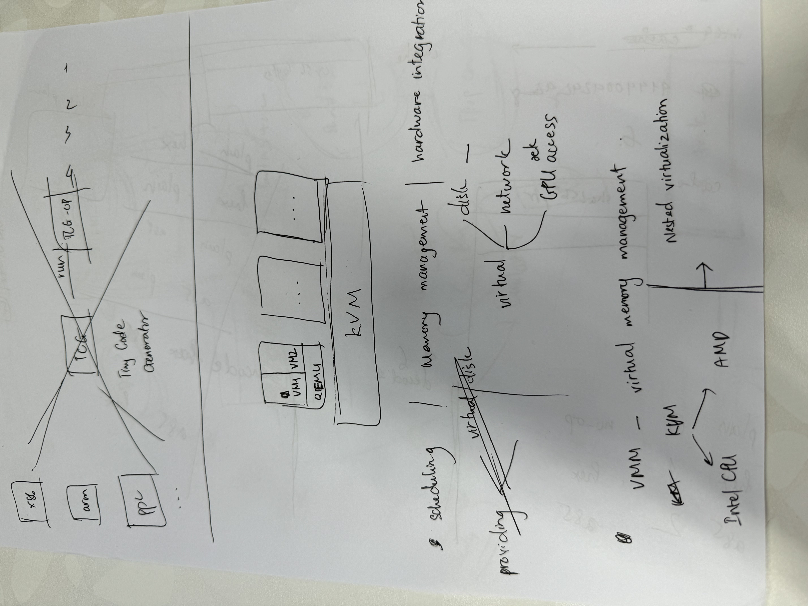
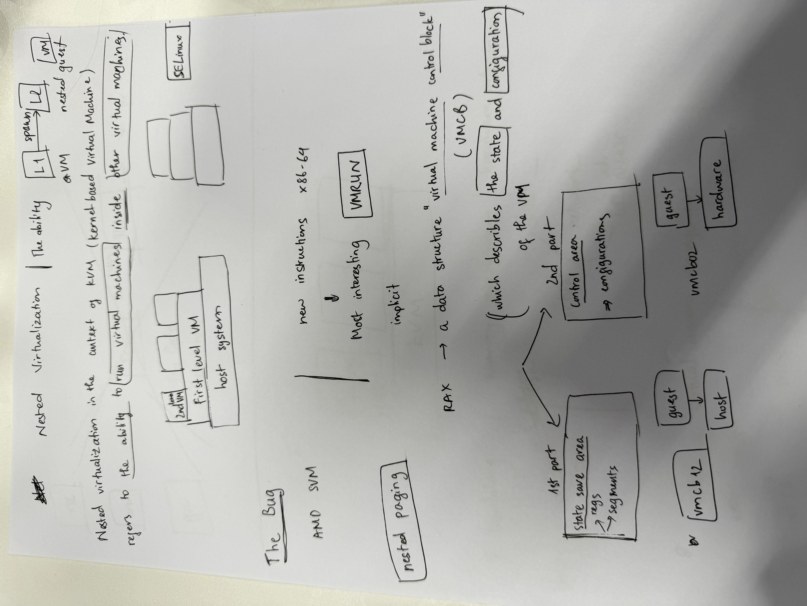
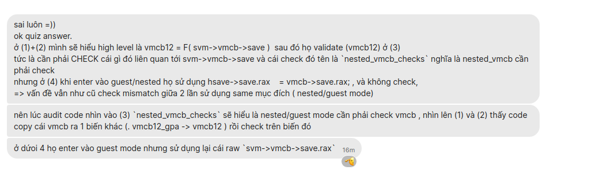

# Table of Content

# Case study 1: KVM 

Blog 
    - https://googleprojectzero.blogspot.com/2021/06/an-epyc-escape-case-study-of-kvm.html

References:
    - https://github.com/torvalds/linux/blob/d67978318827d06f1c0fa4c31343a279e9df6fde/arch/x86/kvm/svm/nested.c#L837

About the blog:

The answer:

**Practice is a key**