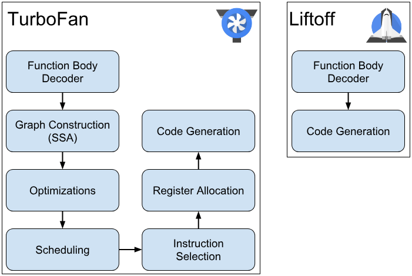

# Table of Contents


# How to run tests on V8

```bash

tools/dev/gm.py x64.release mjsunit/regress/regress-123

# If you have already built V8, you can run the tests manually:
./tools/run-tests.py --outdir=out/release mjsunit

```

# WebAssembly compilation pipeline

- https://v8.dev/docs/wasm-compilation-pipeline

## Issues
  - https://chromium-review.googlesource.com/c/v8/v8/+/5383483
  - 

## Liftoff

- Liftoff is a baseline compiler that compiles WebAssembly lazily, meaning only when they are called for the first time. It is a one-pass compiler that generates machine code quickly but with limited optimizations. Once a function is compiled by Liftoff, the machine code is registered with the WebAssembly module for immedicate future use.


## TurboFan

- TurboFan is an optimizing compiler used for functions that are called frequently, known as "hot" functions. It is a multi-pass compiler that allows for more complex optimizations and better register allocations, resulting in faster code. When a function becomes hot, it is re-compiled with TurboFan in the background, and the new optimized code replaces the Liftoff code.



# Testing

## JSToJSWrapper

```js
// https://source.chromium.org/chromium/chromium/src/+/main:v8/src/builtins/js-to-js.tq;drc=9cb985225493804ee5ad1352ef89c6e414f1a909;l=143
transitioning javascript builtin JSToJSWrapper(
    js-implicit context: NativeContext, receiver: JSAny, target: JSFunction)(
    ...arguments): JSAny {
  const functionData = target.shared_function_info.wasm_js_function_data;
  //...

  // The normal return sequence of Torque-generated JavaScript builtins does not
  // consider the case where the caller may push additional "undefined"
  // parameters on the stack, and therefore does not generate code to pop these
  // additional parameters. Here we calculate the actual number of parameters on
  // the stack. This number is the number of actual parameters provided by the
  // caller, which is `arguments.length`, or the number of declared arguments,
  // if not enough actual parameters were provided, i.e.
  // `SharedFunctionInfo::length`.
  let popCount = arguments.length;
  const declaredArgCount = paramCount;
  if (declaredArgCount > popCount) {
    popCount = declaredArgCount;
  }
  // Also pop the receiver.
  PopAndReturn(popCount + 1, result);
}
// ================
--- Disassembly: ---
kind = BUILTIN
name = JSToJSWrapper
compiler = turbofan
address = 0x3588002652e1

Instructions (size = 10824)
0x7fff7fd91f00     0  55                   push rbp
0x7fff7fd91f01     1  4889e5               REX.W movq rbp,rsp
0x7fff7fd91f04     4  56                   push rsi
0x7fff7fd91f05     5  57                   push rdi
0x7fff7fd91f06     6  50                   push rax
0x7fff7fd91f07     7  4881ec80000000       REX.W subq rsp,0x80
0x7fff7fd91f0e     e  4989e2               REX.W movq r10,rsp
0x7fff7fd91f11    11  4883ec08             REX.W subq rsp,0x8
0x7fff7fd91f15    15  4883e4f0             REX.W andq rsp,0xf0
0x7fff7fd91f19    19  4c891424             REX.W movq [rsp],r10
0x7fff7fd91f1d    1d  488975d8             REX.W movq [rbp-0x28],rsi
0x7fff7fd91f21    21  48897dd0             REX.W movq [rbp-0x30],rdi
0x7fff7fd91f25    25  488945e0             REX.W movq [rbp-0x20],rax
0x7fff7fd91f29    29  488bfe               REX.W movq rdi,rsi
0x7fff7fd91f2c    2c  be32000000           movl rsi,0x32
0x7fff7fd91f31    31  498b95381b0000       REX.W movq rdx,[r13+0x1b38] (root (builtins_constants_table))
0x7fff7fd91f38    38  8b92df060000         movl rdx,[rdx+0x6df]
0x7fff7fd91f3e    3e  4903d6               REX.W addq rdx,r14
0x7fff7fd91f41    41  4c8bc6               REX.W movq r8,rsi
0x7fff7fd91f44    44  498b85181e0000       REX.W movq rax,[r13+0x1e18] (external reference (check_object_type))
0x7fff7fd91f4b    4b  40f6c40f             testb rsp,0xf
0x7fff7fd91f4f    4f  7401                 jz 0x7fff7fd91f52  (JSToJSWrapper)
0x7fff7fd91f51    51  cc                   int3l
0x7fff7fd91f52    52  4c8d150a000000       REX.W leaq r10,[rip+0xa]
0x7fff7fd91f59    59  4d895578             REX.W movq [r13+0x78],r10
0x7fff7fd91f5d    5d  49896d70             REX.W movq [r13+0x70],rbp
0x7fff7fd91f61    61  ffd0                 call rax
0x7fff7fd91f63    63  49c7457000000000     REX.W movq [r13+0x70],0x0
0x7fff7fd91f6b    6b  488b2424             REX.W movq rsp,[rsp]
0x7fff7fd91f6f    6f  493b65a0             REX.W cmpq rsp,[r13-0x60] (external value (StackGuard::address_of_jslimit()))
0x7fff7fd91f73    73  0f86d2250000         jna 0x7fff7fd9454b  (JSToJSWrapper)
0x7fff7fd91f79    79  4c8bc5               REX.W movq r8,rbp
0x7fff7fd91f7c    7c  4c8945b0             REX.W movq [rbp-0x50],r8
0x7fff7fd91f80    80  f645d001             testb [rbp-0x30],0x1
0x7fff7fd91f84    84  0f84d8250000         jz 0x7fff7fd94562  (JSToJSWrapper)
0x7fff7fd91f8a    8a  4c8b4dd0             REX.W movq r9,[rbp-0x30]
0x7fff7fd91f8e    8e  418b7913             movl rdi,[r9+0x13]
0x7fff7fd91f92    92  4903fe               REX.W addq rdi,r14
0x7fff7fd91f95    95  4989e2               REX.W movq r10,rsp
0x7fff7fd91f98    98  4883ec08             REX.W subq rsp,0x8
0x7fff7fd91f9c    9c  4883e4f0             REX.W andq rsp,0xf0
0x7fff7fd91fa0    a0  4c891424             REX.W movq [rsp],r10
0x7fff7fd91fa4    a4  48897dd0             REX.W movq [rbp-0x30],rdi
0x7fff7fd91fa8    a8  be3e010000           movl rsi,0x13e
0x7fff7fd91fad    ad  498b95381b0000       REX.W movq rdx,[r13+0x1b38] (root (builtins_constants_table))
0x7fff7fd91fb4    b4  8b521b               movl rdx,[rdx+0x1b]
0x7fff7fd91fb7    b7  4903d6               REX.W addq rdx,r14
0x7fff7fd91fba    ba  498b85181e0000       REX.W movq rax,[r13+0x1e18] (external reference (check_object_type))
0x7fff7fd91fc1    c1  40f6c40f             testb rsp,0xf
0x7fff7fd91fc5    c5  7401                 jz 0x7fff7fd91fc8  (JSToJSWrapper)
0x7fff7fd91fc7    c7  cc                   int3l
0x7fff7fd91fc8    c8  4c8d150a000000       REX.W leaq r10,[rip+0xa]
0x7fff7fd91fcf    cf  4d895578             REX.W movq [r13+0x78],r10
0x7fff7fd91fd3    d3  49896d70             REX.W movq [r13+0x70],rbp
0x7fff7fd91fd7    d7  ffd0                 call rax
0x7fff7fd91fd9    d9  49c7457000000000     REX.W movq [r13+0x70],0x0
0x7fff7fd91fe1    e1  488b2424             REX.W movq rsp,[rsp]
0x7fff7fd91fe5    e5  4c8b45d0             REX.W movq r8,[rbp-0x30]
0x7fff7fd91fe9    e9  458b4003             movl r8,[r8+0x3]
0x7fff7fd91fed    ed  41baffffffff         movl r10,0xffffffff
0x7fff7fd91ff3    f3  4d3bc2               REX.W cmpq r8,r10
0x7fff7fd91ff6    f6  760d                 jna 0x7fff7fd92005  (JSToJSWrapper)
0x7fff7fd91ff8    f8  ba02000000           movl rdx,0x2
0x7fff7fd91ffd    fd  41ff95d8550000       call [r13+0x55d8]
0x7fff7fd92004   104  cc                   int3l
0x7fff7fd92005   105  41c1e809             shrl r8, 9
0x7fff7fd92009   109  41c1e003             shll r8, 3
0x7fff7fd9200d   10d  41baffffffff         movl r10,0xffffffff
0x7fff7fd92013   113  4d3bc2               REX.W cmpq r8,r10
0x7fff7fd92016   116  760d                 jna 0x7fff7fd92025  (JSToJSWrapper)
0x7fff7fd92018   118  ba02000000           movl rdx,0x2
0x7fff7fd9201d   11d  41ff95d8550000       call [r13+0x55d8]
0x7fff7fd92024   124  cc                   int3l
0x7fff7fd92025   125  49b9ffffffffffffd17f REX.W movq r9,0x7fd1ffffffffffff
0x7fff7fd9202f   12f  4d8b9d104f0000       REX.W movq r11,[r13+0x4f10] (external reference (Isolate::trusted_pointer_table_base_address()))
0x7fff7fd92036   136  4f230c03             REX.W andq r9,[r11+r8*1]
0x7fff7fd9203a   13a  4989e2               REX.W movq r10,rsp
0x7fff7fd9203d   13d  4883ec08             REX.W subq rsp,0x8
0x7fff7fd92041   141  4883e4f0             REX.W andq rsp,0xf0
0x7fff7fd92045   145  4c891424             REX.W movq [rsp],r10
0x7fff7fd92049   149  4c894dc0             REX.W movq [rbp-0x40],r9
0x7fff7fd9204d   14d  be0c020000           movl rsi,0x20c
0x7fff7fd92052   152  498b95381b0000       REX.W movq rdx,[r13+0x1b38] (root (builtins_constants_table))
0x7fff7fd92059   159  8b92375b0000         movl rdx,[rdx+0x5b37]
0x7fff7fd9205f   15f  4903d6               REX.W addq rdx,r14
0x7fff7fd92062   162  498bf9               REX.W movq rdi,r9
0x7fff7fd92065   165  498b85181e0000       REX.W movq rax,[r13+0x1e18] (external reference (check_object_type))
0x7fff7fd9206c   16c  40f6c40f             testb rsp,0xf
0x7fff7fd92070   170  7401                 jz 0x7fff7fd92073  (JSToJSWrapper)
0x7fff7fd92072   172  cc                   int3l
0x7fff7fd92073   173  4c8d150a000000       REX.W leaq r10,[rip+0xa]
0x7fff7fd9207a   17a  4d895578             REX.W movq [r13+0x78],r10
0x7fff7fd9207e   17e  49896d70             REX.W movq [r13+0x70],rbp
0x7fff7fd92082   182  ffd0                 call rax
0x7fff7fd92084   184  49c7457000000000     REX.W movq [r13+0x70],0x0
0x7fff7fd9208c   18c  488b2424             REX.W movq rsp,[rsp]
0x7fff7fd92090   190  488b7dc0             REX.W movq rdi,[rbp-0x40]
0x7fff7fd92094   194  448b47ff             movl r8,[rdi-0x1]
0x7fff7fd92098   198  4d03c6               REX.W addq r8,r14
0x7fff7fd9209b   19b  4989e2               REX.W movq r10,rsp
0x7fff7fd9209e   19e  4883ec08             REX.W subq rsp,0x8
0x7fff7fd920a2   1a2  4883e4f0             REX.W andq rsp,0xf0
0x7fff7fd920a6   1a6  4c891424             REX.W movq [rsp],r10
0x7fff7fd920aa   1aa  4c8945d0             REX.W movq [rbp-0x30],r8
0x7fff7fd920ae   1ae  befe000000           movl rsi,0xfe
0x7fff7fd920b3   1b3  498b95381b0000       REX.W movq rdx,[r13+0x1b38] (root (builtins_constants_table))
0x7fff7fd920ba   1ba  8b5233               movl rdx,[rdx+0x33]
0x7fff7fd920bd   1bd  4903d6               REX.W addq rdx,r14
0x7fff7fd920c0   1c0  498bf8               REX.W movq rdi,r8
0x7fff7fd920c3   1c3  498b85181e0000       REX.W movq rax,[r13+0x1e18] (external reference (check_object_type))
0x7fff7fd920ca   1ca  40f6c40f             testb rsp,0xf
0x7fff7fd920ce   1ce  7401                 jz 0x7fff7fd920d1  (JSToJSWrapper)
0x7fff7fd920d0   1d0  cc                   int3l
0x7fff7fd920d1   1d1  4c8d150a000000       REX.W leaq r10,[rip+0xa]
0x7fff7fd920d8   1d8  4d895578             REX.W movq [r13+0x78],r10
0x7fff7fd920dc   1dc  49896d70             REX.W movq [r13+0x70],rbp
0x7fff7fd920e0   1e0  ffd0                 call rax
0x7fff7fd920e2   1e2  49c7457000000000     REX.W movq [r13+0x70],0x0
0x7fff7fd920ea   1ea  488b2424             REX.W movq rsp,[rsp]
0x7fff7fd920ee   1ee  4c8b45d0             REX.W movq r8,[rbp-0x30]
0x7fff7fd920f2   1f2  450fb74007           movzxwl r8,[r8+0x7]
0x7fff7fd920f7   1f7  41baffffffff         movl r10,0xffffffff
0x7fff7fd920fd   1fd  4d3bc2               REX.W cmpq r8,r10
0x7fff7fd92100   200  760d                 jna 0x7fff7fd9210f  (JSToJSWrapper)
0x7fff7fd92102   202  ba02000000           movl rdx,0x2
0x7fff7fd92107   207  41ff95d8550000       call [r13+0x55d8]
0x7fff7fd9210e   20e  cc                   int3l
0x7fff7fd9210f   20f  4181f8b5000000       cmpl r8,0xb5
0x7fff7fd92116   216  0f855a240000         jnz 0x7fff7fd94576  (JSToJSWrapper)
0x7fff7fd9211c   21c  4989e2               REX.W movq r10,rsp
0x7fff7fd9211f   21f  4883ec08             REX.W subq rsp,0x8
0x7fff7fd92123   223  4883e4f0             REX.W andq rsp,0xf0
0x7fff7fd92127   227  4c891424             REX.W movq [rsp],r10
0x7fff7fd9212b   22b  be38020000           movl rsi,0x238
0x7fff7fd92130   230  498b95381b0000       REX.W movq rdx,[r13+0x1b38] (root (builtins_constants_table))
0x7fff7fd92137   237  8b923b5b0000         movl rdx,[rdx+0x5b3b]
0x7fff7fd9213d   23d  4903d6               REX.W addq rdx,r14
0x7fff7fd92140   240  488b7dc0             REX.W movq rdi,[rbp-0x40]
0x7fff7fd92144   244  498b85181e0000       REX.W movq rax,[r13+0x1e18] (external reference (check_object_type))
0x7fff7fd9214b   24b  40f6c40f             testb rsp,0xf
0x7fff7fd9214f   24f  7401                 jz 0x7fff7fd92152  (JSToJSWrapper)
0x7fff7fd92151   251  cc                   int3l
0x7fff7fd92152   252  4c8d150a000000       REX.W leaq r10,[rip+0xa]
0x7fff7fd92159   259  4d895578             REX.W movq [r13+0x78],r10
0x7fff7fd9215d   25d  49896d70             REX.W movq [r13+0x70],rbp
0x7fff7fd92161   261  ffd0                 call rax
0x7fff7fd92163   263  49c7457000000000     REX.W movq [r13+0x70],0x0
0x7fff7fd9216b   26b  488b2424             REX.W movq rsp,[rsp]
0x7fff7fd9216f   26f  4c8b45c0             REX.W movq r8,[rbp-0x40]
0x7fff7fd92173   273  458b4013             movl r8,[r8+0x13]
0x7fff7fd92177   277  41baffffffff         movl r10,0xffffffff
0x7fff7fd9217d   27d  4d3bc2               REX.W cmpq r8,r10
0x7fff7fd92180   280  760d                 jna 0x7fff7fd9218f  (JSToJSWrapper)
0x7fff7fd92182   282  ba02000000           movl rdx,0x2
0x7fff7fd92187   287  41ff95d8550000       call [r13+0x55d8]
0x7fff7fd9218e   28e  cc                   int3l
0x7fff7fd9218f   28f  4d8b8de0010000       REX.W movq r9,[r13+0x1e0]
0x7fff7fd92196   296  4d0bc1               REX.W orq r8,r9
0x7fff7fd92199   299  4989e2               REX.W movq r10,rsp
0x7fff7fd9219c   29c  4883ec08             REX.W subq rsp,0x8
0x7fff7fd921a0   2a0  4883e4f0             REX.W andq rsp,0xf0
0x7fff7fd921a4   2a4  4c891424             REX.W movq [rsp],r10
0x7fff7fd921a8   2a8  4c894dc8             REX.W movq [rbp-0x38],r9
0x7fff7fd921ac   2ac  33f6                 xorl rsi,rsi
0x7fff7fd921ae   2ae  498b95381b0000       REX.W movq rdx,[r13+0x1b38] (root (builtins_constants_table))
0x7fff7fd921b5   2b5  8b9217060000         movl rdx,[rdx+0x617]
0x7fff7fd921bb   2bb  4903d6               REX.W addq rdx,r14
0x7fff7fd921be   2be  4c8945d0             REX.W movq [rbp-0x30],r8
0x7fff7fd921c2   2c2  498bf8               REX.W movq rdi,r8
0x7fff7fd921c5   2c5  498b85181e0000       REX.W movq rax,[r13+0x1e18] (external reference (check_object_type))
0x7fff7fd921cc   2cc  40f6c40f             testb rsp,0xf
0x7fff7fd921d0   2d0  7401                 jz 0x7fff7fd921d3  (JSToJSWrapper)
0x7fff7fd921d2   2d2  cc                   int3l
0x7fff7fd921d3   2d3  4c8d150a000000       REX.W leaq r10,[rip+0xa]
0x7fff7fd921da   2da  4d895578             REX.W movq [r13+0x78],r10
0x7fff7fd921de   2de  49896d70             REX.W movq [r13+0x70],rbp
0x7fff7fd921e2   2e2  ffd0                 call rax
0x7fff7fd921e4   2e4  49c7457000000000     REX.W movq [r13+0x70],0x0
0x7fff7fd921ec   2ec  488b2424             REX.W movq rsp,[rsp]
0x7fff7fd921f0   2f0  4989e2               REX.W movq r10,rsp
0x7fff7fd921f3   2f3  4883ec08             REX.W subq rsp,0x8
0x7fff7fd921f7   2f7  4883e4f0             REX.W andq rsp,0xf0
0x7fff7fd921fb   2fb  4c891424             REX.W movq [rsp],r10
0x7fff7fd921ff   2ff  be3a020000           movl rsi,0x23a
0x7fff7fd92204   304  498b95381b0000       REX.W movq rdx,[r13+0x1b38] (root (builtins_constants_table))
0x7fff7fd9220b   30b  8b923f5b0000         movl rdx,[rdx+0x5b3f]
0x7fff7fd92211   311  4903d6               REX.W addq rdx,r14
0x7fff7fd92214   314  488b7dd0             REX.W movq rdi,[rbp-0x30]
0x7fff7fd92218   318  498b85181e0000       REX.W movq rax,[r13+0x1e18] (external reference (check_object_type))
0x7fff7fd9221f   31f  40f6c40f             testb rsp,0xf
0x7fff7fd92223   323  7401                 jz 0x7fff7fd92226  (JSToJSWrapper)
0x7fff7fd92225   325  cc                   int3l
0x7fff7fd92226   326  4c8d150a000000       REX.W leaq r10,[rip+0xa]
0x7fff7fd9222d   32d  4d895578             REX.W movq [r13+0x78],r10
0x7fff7fd92231   331  49896d70             REX.W movq [r13+0x70],rbp
0x7fff7fd92235   335  ffd0                 call rax
0x7fff7fd92237   337  49c7457000000000     REX.W movq [r13+0x70],0x0
0x7fff7fd9223f   33f  488b2424             REX.W movq rsp,[rsp]
0x7fff7fd92243   343  4c8b45d0             REX.W movq r8,[rbp-0x30]
0x7fff7fd92247   347  458b4007             movl r8,[r8+0x7]
0x7fff7fd9224b   34b  41baffffffff         movl r10,0xffffffff
0x7fff7fd92251   351  4d3bc2               REX.W cmpq r8,r10
0x7fff7fd92254   354  760d                 jna 0x7fff7fd92263  (JSToJSWrapper)
0x7fff7fd92256   356  ba02000000           movl rdx,0x2
0x7fff7fd9225b   35b  41ff95d8550000       call [r13+0x55d8]
0x7fff7fd92262   362  cc                   int3l
0x7fff7fd92263   363  4c0b45c8             REX.W orq r8,[rbp-0x38]
0x7fff7fd92267   367  4989e2               REX.W movq r10,rsp
0x7fff7fd9226a   36a  4883ec08             REX.W subq rsp,0x8
0x7fff7fd9226e   36e  4883e4f0             REX.W andq rsp,0xf0
0x7fff7fd92272   372  4c891424             REX.W movq [rsp],r10
0x7fff7fd92276   376  498b95381b0000       REX.W movq rdx,[r13+0x1b38] (root (builtins_constants_table))
0x7fff7fd9227d   37d  8b9217060000         movl rdx,[rdx+0x617]
0x7fff7fd92283   383  4903d6               REX.W addq rdx,r14
0x7fff7fd92286   386  4c8945a0             REX.W movq [rbp-0x60],r8
0x7fff7fd9228a   38a  498bf8               REX.W movq rdi,r8
0x7fff7fd9228d   38d  33f6                 xorl rsi,rsi
0x7fff7fd9228f   38f  498b85181e0000       REX.W movq rax,[r13+0x1e18] (external reference (check_object_type))
0x7fff7fd92296   396  40f6c40f             testb rsp,0xf
0x7fff7fd9229a   39a  7401                 jz 0x7fff7fd9229d  (JSToJSWrapper)
0x7fff7fd9229c   39c  cc                   int3l
0x7fff7fd9229d   39d  4c8d150a000000       REX.W leaq r10,[rip+0xa]
0x7fff7fd922a4   3a4  4d895578             REX.W movq [r13+0x78],r10
0x7fff7fd922a8   3a8  49896d70             REX.W movq [r13+0x70],rbp
0x7fff7fd922ac   3ac  ffd0                 call rax
0x7fff7fd922ae   3ae  49c7457000000000     REX.W movq [r13+0x70],0x0
0x7fff7fd922b6   3b6  488b2424             REX.W movq rsp,[rsp]
0x7fff7fd922ba   3ba  f645a001             testb [rbp-0x60],0x1
0x7fff7fd922be   3be  0f84c9220000         jz 0x7fff7fd9458d  (JSToJSWrapper)
0x7fff7fd922c4   3c4  4989e2               REX.W movq r10,rsp
0x7fff7fd922c7   3c7  4883ec08             REX.W subq rsp,0x8
0x7fff7fd922cb   3cb  4883e4f0             REX.W andq rsp,0xf0
0x7fff7fd922cf   3cf  4c891424             REX.W movq [rsp],r10
0x7fff7fd922d3   3d3  be06000000           movl rsi,0x6
0x7fff7fd922d8   3d8  498b95381b0000       REX.W movq rdx,[r13+0x1b38] (root (builtins_constants_table))
0x7fff7fd922df   3df  8b92435b0000         movl rdx,[rdx+0x5b43]
0x7fff7fd922e5   3e5  4903d6               REX.W addq rdx,r14
0x7fff7fd922e8   3e8  488b7da0             REX.W movq rdi,[rbp-0x60]
0x7fff7fd922ec   3ec  498b85181e0000       REX.W movq rax,[r13+0x1e18] (external reference (check_object_type))
0x7fff7fd922f3   3f3  40f6c40f             testb rsp,0xf
0x7fff7fd922f7   3f7  7401                 jz 0x7fff7fd922fa  (JSToJSWrapper)
0x7fff7fd922f9   3f9  cc                   int3l
0x7fff7fd922fa   3fa  4c8d150a000000       REX.W leaq r10,[rip+0xa]
0x7fff7fd92301   401  4d895578             REX.W movq [r13+0x78],r10
0x7fff7fd92305   405  49896d70             REX.W movq [r13+0x70],rbp
0x7fff7fd92309   409  ffd0                 call rax
0x7fff7fd9230b   40b  49c7457000000000     REX.W movq [r13+0x70],0x0
0x7fff7fd92313   413  488b2424             REX.W movq rsp,[rsp]
0x7fff7fd92317   417  488b7da0             REX.W movq rdi,[rbp-0x60]
0x7fff7fd9231b   41b  448b47ff             movl r8,[rdi-0x1]
0x7fff7fd9231f   41f  4d03c6               REX.W addq r8,r14
0x7fff7fd92322   422  4989e2               REX.W movq r10,rsp
0x7fff7fd92325   425  4883ec08             REX.W subq rsp,0x8
0x7fff7fd92329   429  4883e4f0             REX.W andq rsp,0xf0
0x7fff7fd9232d   42d  4c891424             REX.W movq [rsp],r10
0x7fff7fd92331   431  4c8945c8             REX.W movq [rbp-0x38],r8
0x7fff7fd92335   435  498b95381b0000       REX.W movq rdx,[r13+0x1b38] (root (builtins_constants_table))
0x7fff7fd9233c   43c  8b5233               movl rdx,[rdx+0x33]
0x7fff7fd9233f   43f  4903d6               REX.W addq rdx,r14
0x7fff7fd92342   442  498bf8               REX.W movq rdi,r8
0x7fff7fd92345   445  befe000000           movl rsi,0xfe
0x7fff7fd9234a   44a  498b85181e0000       REX.W movq rax,[r13+0x1e18] (external reference (check_object_type))
0x7fff7fd92351   451  40f6c40f             testb rsp,0xf
0x7fff7fd92355   455  7401                 jz 0x7fff7fd92358  (JSToJSWrapper)
0x7fff7fd92357   457  cc                   int3l
0x7fff7fd92358   458  4c8d150a000000       REX.W leaq r10,[rip+0xa]
0x7fff7fd9235f   45f  4d895578             REX.W movq [r13+0x78],r10
0x7fff7fd92363   463  49896d70             REX.W movq [r13+0x70],rbp
0x7fff7fd92367   467  ffd0                 call rax
0x7fff7fd92369   469  49c7457000000000     REX.W movq [r13+0x70],0x0
0x7fff7fd92371   471  488b2424             REX.W movq rsp,[rsp]
0x7fff7fd92375   475  488b7dc8             REX.W movq rdi,[rbp-0x38]
0x7fff7fd92379   479  440fb74707           movzxwl r8,[rdi+0x7]
0x7fff7fd9237e   47e  41baffffffff         movl r10,0xffffffff
0x7fff7fd92384   484  4d3bc2               REX.W cmpq r8,r10
0x7fff7fd92387   487  760d                 jna 0x7fff7fd92396  (JSToJSWrapper)
0x7fff7fd92389   489  ba02000000           movl rdx,0x2
0x7fff7fd9238e   48e  41ff95d8550000       call [r13+0x55d8]
0x7fff7fd92395   495  cc                   int3l
0x7fff7fd92396   496  4989e2               REX.W movq r10,rsp
0x7fff7fd92399   499  4883ec08             REX.W subq rsp,0x8
0x7fff7fd9239d   49d  4883e4f0             REX.W andq rsp,0xf0
0x7fff7fd923a1   4a1  4c891424             REX.W movq [rsp],r10
0x7fff7fd923a5   4a5  4c8945d0             REX.W movq [rbp-0x30],r8
0x7fff7fd923a9   4a9  498b95381b0000       REX.W movq rdx,[r13+0x1b38] (root (builtins_constants_table))
0x7fff7fd923b0   4b0  8b5233               movl rdx,[rdx+0x33]
0x7fff7fd923b3   4b3  4903d6               REX.W addq rdx,r14
0x7fff7fd923b6   4b6  befe000000           movl rsi,0xfe
0x7fff7fd923bb   4bb  498b85181e0000       REX.W movq rax,[r13+0x1e18] (external reference (check_object_type))
0x7fff7fd923c2   4c2  40f6c40f             testb rsp,0xf
0x7fff7fd923c6   4c6  7401                 jz 0x7fff7fd923c9  (JSToJSWrapper)
0x7fff7fd923c8   4c8  cc                   int3l
0x7fff7fd923c9   4c9  4c8d150a000000       REX.W leaq r10,[rip+0xa]
0x7fff7fd923d0   4d0  4d895578             REX.W movq [r13+0x78],r10
0x7fff7fd923d4   4d4  49896d70             REX.W movq [r13+0x70],rbp
0x7fff7fd923d8   4d8  ffd0                 call rax
0x7fff7fd923da   4da  49c7457000000000     REX.W movq [r13+0x70],0x0
0x7fff7fd923e2   4e2  488b2424             REX.W movq rsp,[rsp]
0x7fff7fd923e6   4e6  4533c0               xorl r8,r8
0x7fff7fd923e9   4e9  817dd0c6000000       cmpl [rbp-0x30],0xc6
0x7fff7fd923f0   4f0  410f94c0             setzl r8l
0x7fff7fd923f4   4f4  4533c9               xorl r9,r9
0x7fff7fd923f7   4f7  817dd0bd000000       cmpl [rbp-0x30],0xbd
0x7fff7fd923fe   4fe  410f94c1             setzl r9l
0x7fff7fd92402   502  4c8945c0             REX.W movq [rbp-0x40],r8
0x7fff7fd92406   506  450bc8               orl r9,r8
0x7fff7fd92409   509  0f8495210000         jz 0x7fff7fd945a4  (JSToJSWrapper)
0x7fff7fd9240f   50f  4989e2               REX.W movq r10,rsp
0x7fff7fd92412   512  4883ec08             REX.W subq rsp,0x8
0x7fff7fd92416   516  4883e4f0             REX.W andq rsp,0xf0
0x7fff7fd9241a   51a  4c891424             REX.W movq [rsp],r10
0x7fff7fd9241e   51e  be06020000           movl rsi,0x206
0x7fff7fd92423   523  498b95381b0000       REX.W movq rdx,[r13+0x1b38] (root (builtins_constants_table))
0x7fff7fd9242a   52a  8b92475b0000         movl rdx,[rdx+0x5b47]
0x7fff7fd92430   530  4903d6               REX.W addq rdx,r14
0x7fff7fd92433   533  488b7da0             REX.W movq rdi,[rbp-0x60]
0x7fff7fd92437   537  498b85181e0000       REX.W movq rax,[r13+0x1e18] (external reference (check_object_type))
0x7fff7fd9243e   53e  40f6c40f             testb rsp,0xf
0x7fff7fd92442   542  7401                 jz 0x7fff7fd92445  (JSToJSWrapper)
0x7fff7fd92444   544  cc                   int3l
0x7fff7fd92445   545  4c8d150a000000       REX.W leaq r10,[rip+0xa]
0x7fff7fd9244c   54c  4d895578             REX.W movq [r13+0x78],r10
0x7fff7fd92450   550  49896d70             REX.W movq [r13+0x70],rbp
0x7fff7fd92454   554  ffd0                 call rax
0x7fff7fd92456   556  49c7457000000000     REX.W movq [r13+0x70],0x0
0x7fff7fd9245e   55e  488b2424             REX.W movq rsp,[rsp]
0x7fff7fd92462   562  4989e2               REX.W movq r10,rsp
0x7fff7fd92465   565  4883ec08             REX.W subq rsp,0x8
0x7fff7fd92469   569  4883e4f0             REX.W andq rsp,0xf0
0x7fff7fd9246d   56d  4c891424             REX.W movq [rsp],r10
0x7fff7fd92471   571  498b95381b0000       REX.W movq rdx,[r13+0x1b38] (root (builtins_constants_table))
0x7fff7fd92478   578  8b928f000000         movl rdx,[rdx+0x8f]
0x7fff7fd9247e   57e  4903d6               REX.W addq rdx,r14
0x7fff7fd92481   581  488b7da0             REX.W movq rdi,[rbp-0x60]
0x7fff7fd92485   585  be06000000           movl rsi,0x6
0x7fff7fd9248a   58a  498b85181e0000       REX.W movq rax,[r13+0x1e18] (external reference (check_object_type))
0x7fff7fd92491   591  40f6c40f             testb rsp,0xf
0x7fff7fd92495   595  7401                 jz 0x7fff7fd92498  (JSToJSWrapper)
0x7fff7fd92497   597  cc                   int3l
0x7fff7fd92498   598  4c8d150a000000       REX.W leaq r10,[rip+0xa]
0x7fff7fd9249f   59f  4d895578             REX.W movq [r13+0x78],r10
0x7fff7fd924a3   5a3  49896d70             REX.W movq [r13+0x70],rbp
0x7fff7fd924a7   5a7  ffd0                 call rax
0x7fff7fd924a9   5a9  49c7457000000000     REX.W movq [r13+0x70],0x0
0x7fff7fd924b1   5b1  488b2424             REX.W movq rsp,[rsp]
0x7fff7fd924b5   5b5  4989e2               REX.W movq r10,rsp
0x7fff7fd924b8   5b8  4883ec08             REX.W subq rsp,0x8
0x7fff7fd924bc   5bc  4883e4f0             REX.W andq rsp,0xf0
0x7fff7fd924c0   5c0  4c891424             REX.W movq [rsp],r10
0x7fff7fd924c4   5c4  498b95381b0000       REX.W movq rdx,[r13+0x1b38] (root (builtins_constants_table))
0x7fff7fd924cb   5cb  8b5233               movl rdx,[rdx+0x33]
0x7fff7fd924ce   5ce  4903d6               REX.W addq rdx,r14
0x7fff7fd924d1   5d1  488b7dc8             REX.W movq rdi,[rbp-0x38]
0x7fff7fd924d5   5d5  befe000000           movl rsi,0xfe
0x7fff7fd924da   5da  498b85181e0000       REX.W movq rax,[r13+0x1e18] (external reference (check_object_type))
0x7fff7fd924e1   5e1  40f6c40f             testb rsp,0xf
0x7fff7fd924e5   5e5  7401                 jz 0x7fff7fd924e8  (JSToJSWrapper)
0x7fff7fd924e7   5e7  cc                   int3l
0x7fff7fd924e8   5e8  4c8d150a000000       REX.W leaq r10,[rip+0xa]
0x7fff7fd924ef   5ef  4d895578             REX.W movq [r13+0x78],r10
0x7fff7fd924f3   5f3  49896d70             REX.W movq [r13+0x70],rbp
0x7fff7fd924f7   5f7  ffd0                 call rax
0x7fff7fd924f9   5f9  49c7457000000000     REX.W movq [r13+0x70],0x0
0x7fff7fd92501   601  488b2424             REX.W movq rsp,[rsp]
0x7fff7fd92505   605  837dc000             cmpl [rbp-0x40],0x0
0x7fff7fd92509   609  7517                 jnz 0x7fff7fd92522  (JSToJSWrapper)
0x7fff7fd9250b   60b  498b95381b0000       REX.W movq rdx,[r13+0x1b38] (root (builtins_constants_table))
0x7fff7fd92512   612  8b924b5b0000         movl rdx,[rdx+0x5b4b]
0x7fff7fd92518   618  4903d6               REX.W addq rdx,r14
0x7fff7fd9251b   61b  e8604c84ff           call 0x7fff7f5d7180  (AbortCSADcheck)
0x7fff7fd92520   620  cc                   int3l
0x7fff7fd92521   621  cc                   int3l
0x7fff7fd92522   622  4989e2               REX.W movq r10,rsp
0x7fff7fd92525   625  4883ec08             REX.W subq rsp,0x8
0x7fff7fd92529   629  4883e4f0             REX.W andq rsp,0xf0
0x7fff7fd9252d   62d  4c891424             REX.W movq [rsp],r10
0x7fff7fd92531   631  be30020000           movl rsi,0x230
0x7fff7fd92536   636  498b95381b0000       REX.W movq rdx,[r13+0x1b38] (root (builtins_constants_table))
0x7fff7fd9253d   63d  8b92af2a0000         movl rdx,[rdx+0x2aaf]
0x7fff7fd92543   643  4903d6               REX.W addq rdx,r14
0x7fff7fd92546   646  488b7da0             REX.W movq rdi,[rbp-0x60]
0x7fff7fd9254a   64a  498b85181e0000       REX.W movq rax,[r13+0x1e18] (external reference (check_object_type))
0x7fff7fd92551   651  40f6c40f             testb rsp,0xf
0x7fff7fd92555   655  7401                 jz 0x7fff7fd92558  (JSToJSWrapper)
0x7fff7fd92557   657  cc                   int3l
0x7fff7fd92558   658  4c8d150a000000       REX.W leaq r10,[rip+0xa]
0x7fff7fd9255f   65f  4d895578             REX.W movq [r13+0x78],r10
0x7fff7fd92563   663  49896d70             REX.W movq [r13+0x70],rbp
0x7fff7fd92567   667  ffd0                 call rax
0x7fff7fd92569   669  49c7457000000000     REX.W movq [r13+0x70],0x0
0x7fff7fd92571   671  488b2424             REX.W movq rsp,[rsp]
0x7fff7fd92575   675  4989e2               REX.W movq r10,rsp
0x7fff7fd92578   678  4883ec08             REX.W subq rsp,0x8
0x7fff7fd9257c   67c  4883e4f0             REX.W andq rsp,0xf0
0x7fff7fd92580   680  4c891424             REX.W movq [rsp],r10
0x7fff7fd92584   684  498b95381b0000       REX.W movq rdx,[r13+0x1b38] (root (builtins_constants_table))
0x7fff7fd9258b   68b  8b924f5b0000         movl rdx,[rdx+0x5b4f]
0x7fff7fd92591   691  4903d6               REX.W addq rdx,r14
0x7fff7fd92594   694  488b7da0             REX.W movq rdi,[rbp-0x60]
0x7fff7fd92598   698  be30020000           movl rsi,0x230
0x7fff7fd9259d   69d  498b85181e0000       REX.W movq rax,[r13+0x1e18] (external reference (check_object_type))
0x7fff7fd925a4   6a4  40f6c40f             testb rsp,0xf
0x7fff7fd925a8   6a8  7401                 jz 0x7fff7fd925ab  (JSToJSWrapper)
0x7fff7fd925aa   6aa  cc                   int3l
0x7fff7fd925ab   6ab  4c8d150a000000       REX.W leaq r10,[rip+0xa]
0x7fff7fd925b2   6b2  4d895578             REX.W movq [r13+0x78],r10
0x7fff7fd925b6   6b6  49896d70             REX.W movq [r13+0x70],rbp
0x7fff7fd925ba   6ba  ffd0                 call rax
0x7fff7fd925bc   6bc  49c7457000000000     REX.W movq [r13+0x70],0x0
0x7fff7fd925c4   6c4  488b2424             REX.W movq rsp,[rsp]
0x7fff7fd925c8   6c8  4c8b45a0             REX.W movq r8,[rbp-0x60]
0x7fff7fd925cc   6cc  418b781b             movl rdi,[r8+0x1b]
0x7fff7fd925d0   6d0  4903fe               REX.W addq rdi,r14
0x7fff7fd925d3   6d3  4989e2               REX.W movq r10,rsp
0x7fff7fd925d6   6d6  4883ec08             REX.W subq rsp,0x8
0x7fff7fd925da   6da  4883e4f0             REX.W andq rsp,0xf0
0x7fff7fd925de   6de  4c891424             REX.W movq [rsp],r10
0x7fff7fd925e2   6e2  48897d88             REX.W movq [rbp-0x78],rdi
0x7fff7fd925e6   6e6  bed8010000           movl rsi,0x1d8
0x7fff7fd925eb   6eb  498b95381b0000       REX.W movq rdx,[r13+0x1b38] (root (builtins_constants_table))
0x7fff7fd925f2   6f2  8b521b               movl rdx,[rdx+0x1b]
0x7fff7fd925f5   6f5  4903d6               REX.W addq rdx,r14
0x7fff7fd925f8   6f8  498b85181e0000       REX.W movq rax,[r13+0x1e18] (external reference (check_object_type))
0x7fff7fd925ff   6ff  40f6c40f             testb rsp,0xf
0x7fff7fd92603   703  7401                 jz 0x7fff7fd92606  (JSToJSWrapper)
0x7fff7fd92605   705  cc                   int3l
0x7fff7fd92606   706  4c8d150a000000       REX.W leaq r10,[rip+0xa]
0x7fff7fd9260d   70d  4d895578             REX.W movq [r13+0x78],r10
0x7fff7fd92611   711  49896d70             REX.W movq [r13+0x70],rbp
0x7fff7fd92615   715  ffd0                 call rax
0x7fff7fd92617   717  49c7457000000000     REX.W movq [r13+0x70],0x0
0x7fff7fd9261f   71f  488b2424             REX.W movq rsp,[rsp]
0x7fff7fd92623   723  f6458801             testb [rbp-0x78],0x1
0x7fff7fd92627   727  0f848e1f0000         jz 0x7fff7fd945bb  (JSToJSWrapper)
0x7fff7fd9262d   72d  4c8b4588             REX.W movq r8,[rbp-0x78]
0x7fff7fd92631   731  418b7803             movl rdi,[r8+0x3]
0x7fff7fd92635   735  4c8bcf               REX.W movq r9,rdi
0x7fff7fd92638   738  41d1f9               sarl r9, 1
0x7fff7fd9263b   73b  4d63c9               REX.W movsxlq r9,r9
0x7fff7fd9263e   73e  4d8bd9               REX.W movq r11,r9
0x7fff7fd92641   741  49c1fb3f             REX.W sarq r11, 63
0x7fff7fd92645   745  4989e2               REX.W movq r10,rsp
0x7fff7fd92648   748  4883ec08             REX.W subq rsp,0x8
0x7fff7fd9264c   74c  4883e4f0             REX.W andq rsp,0xf0
0x7fff7fd92650   750  4c891424             REX.W movq [rsp],r10
0x7fff7fd92654   754  4c894dc0             REX.W movq [rbp-0x40],r9
0x7fff7fd92658   758  4c895dc8             REX.W movq [rbp-0x38],r11
0x7fff7fd9265c   75c  be02000000           movl rsi,0x2
0x7fff7fd92661   761  498b95381b0000       REX.W movq rdx,[r13+0x1b38] (root (builtins_constants_table))
0x7fff7fd92668   768  8b521b               movl rdx,[rdx+0x1b]
0x7fff7fd9266b   76b  4903d6               REX.W addq rdx,r14
0x7fff7fd9266e   76e  498b85181e0000       REX.W movq rax,[r13+0x1e18] (external reference (check_object_type))
0x7fff7fd92675   775  40f6c40f             testb rsp,0xf
0x7fff7fd92679   779  7401                 jz 0x7fff7fd9267c  (JSToJSWrapper)
0x7fff7fd9267b   77b  cc                   int3l
0x7fff7fd9267c   77c  4c8d150a000000       REX.W leaq r10,[rip+0xa]
0x7fff7fd92683   783  4d895578             REX.W movq [r13+0x78],r10
0x7fff7fd92687   787  49896d70             REX.W movq [r13+0x70],rbp
0x7fff7fd9268b   78b  ffd0                 call rax
0x7fff7fd9268d   78d  49c7457000000000     REX.W movq [r13+0x70],0x0
0x7fff7fd92695   795  488b2424             REX.W movq rsp,[rsp]
0x7fff7fd92699   799  4c8b45c8             REX.W movq r8,[rbp-0x38]
0x7fff7fd9269d   79d  49c1e83e             REX.W shrq r8, 62
0x7fff7fd926a1   7a1  4c8b4d88             REX.W movq r9,[rbp-0x78]
0x7fff7fd926a5   7a5  458b5907             movl r11,[r9+0x7]
0x7fff7fd926a9   7a9  41baffffffff         movl r10,0xffffffff
0x7fff7fd926af   7af  4d3bda               REX.W cmpq r11,r10
0x7fff7fd926b2   7b2  760d                 jna 0x7fff7fd926c1  (JSToJSWrapper)
0x7fff7fd926b4   7b4  ba02000000           movl rdx,0x2
0x7fff7fd926b9   7b9  41ff95d8550000       call [r13+0x55d8]
0x7fff7fd926c0   7c0  cc                   int3l
0x7fff7fd926c1   7c1  4c8b65c0             REX.W movq r12,[rbp-0x40]
0x7fff7fd926c5   7c5  4d01e0               REX.W addq r8,r12
0x7fff7fd926c8   7c8  4d63e3               REX.W movsxlq r12,r11
0x7fff7fd926cb   7cb  49c1f802             REX.W sarq r8, 2
0x7fff7fd926cf   7cf  4d39e0               REX.W cmpq r8,r12
0x7fff7fd926d2   7d2  0f824a1e0000         jc 0x7fff7fd94522  (JSToJSWrapper)
0x7fff7fd926d8   7d8  4d8bf8               REX.W movq r15,r8
0x7fff7fd926db   7db  4d29e7               REX.W subq r15,r12
0x7fff7fd926de   7de  4983ff01             REX.W cmpq r15,0x1
0x7fff7fd926e2   7e2  0f823a1e0000         jc 0x7fff7fd94522  (JSToJSWrapper)
0x7fff7fd926e8   7e8  4983ef01             REX.W subq r15,0x1
0x7fff7fd926ec   7ec  4d3bc7               REX.W cmpq r8,r15
0x7fff7fd926ef   7ef  0f82041e0000         jc 0x7fff7fd944f9  (JSToJSWrapper)
0x7fff7fd926f5   7f5  498d442401           REX.W leaq rax,[r12+0x1]
0x7fff7fd926fa   7fa  4d2bc7               REX.W subq r8,r15
0x7fff7fd926fd   7fd  4c3bc0               REX.W cmpq r8,rax
0x7fff7fd92700   800  0f82f31d0000         jc 0x7fff7fd944f9  (JSToJSWrapper)
0x7fff7fd92706   806  4d8d4701             REX.W leaq r8,[r15+0x1]
0x7fff7fd9270a   80a  4c897dc8             REX.W movq [rbp-0x38],r15
0x7fff7fd9270e   80e  4c896580             REX.W movq [rbp-0x80],r12
0x7fff7fd92712   812  4c899d78ffffff       REX.W movq [rbp-0x88],r11
0x7fff7fd92719   819  488945c0             REX.W movq [rbp-0x40],rax
0x7fff7fd9271d   81d  4c894598             REX.W movq [rbp-0x68],r8
0x7fff7fd92721   821  498bc0               REX.W movq rax,r8
0x7fff7fd92724   824  e8d7010100           call 0x7fff7fda2900  (WasmAllocateZeroedFixedArray)
0x7fff7fd92729   829  48894590             REX.W movq [rbp-0x70],rax
0x7fff7fd9272d   82d  a801                 test al,0x1
0x7fff7fd9272f   82f  0f849a1e0000         jz 0x7fff7fd945cf  (JSToJSWrapper)
0x7fff7fd92735   835  8b7803               movl rdi,[rax+0x3]
0x7fff7fd92738   838  4c8bc7               REX.W movq r8,rdi
0x7fff7fd9273b   83b  41d1f8               sarl r8, 1
0x7fff7fd9273e   83e  4d63c0               REX.W movsxlq r8,r8
0x7fff7fd92741   841  4989e2               REX.W movq r10,rsp
0x7fff7fd92744   844  4883ec08             REX.W subq rsp,0x8
0x7fff7fd92748   848  4883e4f0             REX.W andq rsp,0xf0
0x7fff7fd9274c   84c  4c891424             REX.W movq [rsp],r10
0x7fff7fd92750   850  4c8945a8             REX.W movq [rbp-0x58],r8
0x7fff7fd92754   854  498b95381b0000       REX.W movq rdx,[r13+0x1b38] (root (builtins_constants_table))
0x7fff7fd9275b   85b  8b521b               movl rdx,[rdx+0x1b]
0x7fff7fd9275e   85e  4903d6               REX.W addq rdx,r14
0x7fff7fd92761   861  be02000000           movl rsi,0x2
0x7fff7fd92766   866  498b85181e0000       REX.W movq rax,[r13+0x1e18] (external reference (check_object_type))
0x7fff7fd9276d   86d  40f6c40f             testb rsp,0xf
0x7fff7fd92771   871  7401                 jz 0x7fff7fd92774  (JSToJSWrapper)
0x7fff7fd92773   873  cc                   int3l
0x7fff7fd92774   874  4c8d150a000000       REX.W leaq r10,[rip+0xa]
0x7fff7fd9277b   87b  4d895578             REX.W movq [r13+0x78],r10
0x7fff7fd9277f   87f  49896d70             REX.W movq [r13+0x70],rbp
0x7fff7fd92783   883  ffd0                 call rax
0x7fff7fd92785   885  49c7457000000000     REX.W movq [r13+0x70],0x0
0x7fff7fd9278d   88d  488b2424             REX.W movq rsp,[rsp]
0x7fff7fd92791   891  48837da800           REX.W cmpq [rbp-0x58],0x0
0x7fff7fd92796   896  7729                 ja 0x7fff7fd927c1  (JSToJSWrapper)
0x7fff7fd92798   898  4d8b85381b0000       REX.W movq r8,[r13+0x1b38] (root (builtins_constants_table))
0x7fff7fd9279f   89f  458b809f000000       movl r8,[r8+0x9f]
0x7fff7fd927a6   8a6  4d03c6               REX.W addq r8,r14
0x7fff7fd927a9   8a9  4150                 push r8
0x7fff7fd927ab   8ab  6a04                 push 0x4
0x7fff7fd927ad   8ad  b802000000           movl rax,0x2
0x7fff7fd927b2   8b2  498b9d18470000       REX.W movq rbx,[r13+0x4718] (external reference (Runtime::GlobalPrint))
0x7fff7fd927b9   8b9  33f6                 xorl rsi,rsi
0x7fff7fd927bb   8bb  e88007acff           call 0x7fff7f852f40  (CEntry_Return1_ArgvOnStack_NoBuiltinExit)
0x7fff7fd927c0   8c0  cc                   int3l
0x7fff7fd927c1   8c1  4d8d4669             REX.W leaq r8,[r14+0x69]
0x7fff7fd927c5   8c5  488b5d90             REX.W movq rbx,[rbp-0x70]
0x7fff7fd927c9   8c9  44894307             movl [rbx+0x7],r8
0x7fff7fd927cd   8cd  4c634de0             REX.W movsxlq r9,[rbp-0x20]
0x7fff7fd927d1   8d1  4983e901             REX.W subq r9,0x1
0x7fff7fd927d5   8d5  41bb01000000         movl r11,0x1
0x7fff7fd927db   8db  4c894dd0             REX.W movq [rbp-0x30],r9
0x7fff7fd927df   8df  4531e4               xorl r12,r12
0x7fff7fd927e2   8e2  eb74                 jmp 0x7fff7fd92858  (JSToJSWrapper)
0x7fff7fd927e4   8e4  660f1f840000000000   nop
0x7fff7fd927ed   8ed  660f1f840000000000   nop
0x7fff7fd927f6   8f6  660f1f840000000000   nop
0x7fff7fd927ff   8ff  90                   nop
0x7fff7fd92800   900  4c8b9d68ffffff       REX.W movq r11,[rbp-0x98]
0x7fff7fd92807   907  4e8d049d07000000     REX.W leaq r8,[r11*4+0x7]
0x7fff7fd9280f   90f  488b5d90             REX.W movq rbx,[rbp-0x70]
0x7fff7fd92813   913  4183f903             cmpl r9,0x3
0x7fff7fd92817   917  750d                 jnz 0x7fff7fd92826  (JSToJSWrapper)
0x7fff7fd92819   919  ba3c000000           movl rdx,0x3c
0x7fff7fd9281e   91e  41ff95d8550000       call [r13+0x55d8]
0x7fff7fd92825   925  cc                   int3l
0x7fff7fd92826   926  46890c03             movl [rbx+r8*1],r9
0x7fff7fd9282a   92a  41f6c101             testb r9,0x1
0x7fff7fd9282e   92e  7415                 jz 0x7fff7fd92845  (JSToJSWrapper)
0x7fff7fd92830   930  49c7c40000fcff       REX.W movq r12,0xfffc0000
0x7fff7fd92837   937  4c23e3               REX.W andq r12,rbx
0x7fff7fd9283a   93a  41f6042404           testb [r12],0x4
0x7fff7fd9283f   93f  0f85ce200000         jnz 0x7fff7fd94913  (JSToJSWrapper)
0x7fff7fd92845   945  4983c301             REX.W addq r11,0x1
0x7fff7fd92849   949  4c8ba570ffffff       REX.W movq r12,[rbp-0x90]
0x7fff7fd92850   950  4983c401             REX.W addq r12,0x1
0x7fff7fd92854   954  4c8b4dd0             REX.W movq r9,[rbp-0x30]
0x7fff7fd92858   958  488b5588             REX.W movq rdx,[rbp-0x78]
0x7fff7fd9285c   95c  488b45c0             REX.W movq rax,[rbp-0x40]
0x7fff7fd92860   960  4c8b7db0             REX.W movq r15,[rbp-0x50]
0x7fff7fd92864   964  4c3b65c8             REX.W cmpq r12,[rbp-0x38]
0x7fff7fd92868   968  0f8da4050000         jge 0x7fff7fd92e12  (JSToJSWrapper)
0x7fff7fd9286e   96e  4c899d68ffffff       REX.W movq [rbp-0x98],r11
0x7fff7fd92875   975  4c89a570ffffff       REX.W movq [rbp-0x90],r12
0x7fff7fd9287c   97c  4d39e1               REX.W cmpq r9,r12
0x7fff7fd9287f   97f  7617                 jna 0x7fff7fd92898  (JSToJSWrapper)
0x7fff7fd92881   981  4d3be1               REX.W cmpq r12,r9
0x7fff7fd92884   984  0f832d200000         jnc 0x7fff7fd948b7  (JSToJSWrapper)
0x7fff7fd9288a   98a  4d8d4f18             REX.W leaq r9,[r15+0x18]
0x7fff7fd9288e   98e  4f8b0ce1             REX.W movq r9,[r9+r12*8]
0x7fff7fd92892   992  4c894de0             REX.W movq [rbp-0x20],r9
0x7fff7fd92896   996  eb08                 jmp 0x7fff7fd928a0  (JSToJSWrapper)
0x7fff7fd92898   998  4d8d5669             REX.W leaq r10,[r14+0x69]
0x7fff7fd9289c   99c  4c8955e0             REX.W movq [rbp-0x20],r10
0x7fff7fd928a0   9a0  4c8d048500000000     REX.W leaq r8,[rax*4+0x0]
0x7fff7fd928a8   9a8  4f8d44a008           REX.W leaq r8,[r8+r12*4+0x8]
0x7fff7fd928ad   9ad  468b4402ff           movl r8,[rdx+r8*1-0x1]
0x7fff7fd928b2   9b2  41baffffffff         movl r10,0xffffffff
0x7fff7fd928b8   9b8  4d3bc2               REX.W cmpq r8,r10
0x7fff7fd928bb   9bb  760d                 jna 0x7fff7fd928ca  (JSToJSWrapper)
0x7fff7fd928bd   9bd  ba02000000           movl rdx,0x2
0x7fff7fd928c2   9c2  41ff95d8550000       call [r13+0x55d8]
0x7fff7fd928c9   9c9  cc                   int3l
0x7fff7fd928ca   9ca  4c8945a8             REX.W movq [rbp-0x58],r8
0x7fff7fd928ce   9ce  448b4303             movl r8,[rbx+0x3]
0x7fff7fd928d2   9d2  4989e2               REX.W movq r10,rsp
0x7fff7fd928d5   9d5  4883ec08             REX.W subq rsp,0x8
0x7fff7fd928d9   9d9  4883e4f0             REX.W andq rsp,0xf0
0x7fff7fd928dd   9dd  4c891424             REX.W movq [rsp],r10
0x7fff7fd928e1   9e1  4c8945b8             REX.W movq [rbp-0x48],r8
0x7fff7fd928e5   9e5  498bf8               REX.W movq rdi,r8
0x7fff7fd928e8   9e8  be02000000           movl rsi,0x2
0x7fff7fd928ed   9ed  498b95381b0000       REX.W movq rdx,[r13+0x1b38] (root (builtins_constants_table))
0x7fff7fd928f4   9f4  8b521b               movl rdx,[rdx+0x1b]
0x7fff7fd928f7   9f7  4903d6               REX.W addq rdx,r14
0x7fff7fd928fa   9fa  498b85181e0000       REX.W movq rax,[r13+0x1e18] (external reference (check_object_type))
0x7fff7fd92901   a01  40f6c40f             testb rsp,0xf
0x7fff7fd92905   a05  7401                 jz 0x7fff7fd92908  (JSToJSWrapper)
0x7fff7fd92907   a07  cc                   int3l
0x7fff7fd92908   a08  4c8d150a000000       REX.W leaq r10,[rip+0xa]
0x7fff7fd9290f   a0f  4d895578             REX.W movq [r13+0x78],r10
0x7fff7fd92913   a13  49896d70             REX.W movq [r13+0x70],rbp
0x7fff7fd92917   a17  ffd0                 call rax
0x7fff7fd92919   a19  49c7457000000000     REX.W movq [r13+0x70],0x0
0x7fff7fd92921   a21  488b2424             REX.W movq rsp,[rsp]
0x7fff7fd92925   a25  4c8b45b8             REX.W movq r8,[rbp-0x48]
0x7fff7fd92929   a29  41d1f8               sarl r8, 1
0x7fff7fd9292c   a2c  4d63c0               REX.W movsxlq r8,r8
0x7fff7fd9292f   a2f  4c8b9d68ffffff       REX.W movq r11,[rbp-0x98]
0x7fff7fd92936   a36  4d3bd8               REX.W cmpq r11,r8
0x7fff7fd92939   a39  0f835b1b0000         jnc 0x7fff7fd9449a  (JSToJSWrapper)
0x7fff7fd9293f   a3f  837da801             cmpl [rbp-0x58],0x1
0x7fff7fd92943   a43  0f849e040000         jz 0x7fff7fd92de7  (JSToJSWrapper)
0x7fff7fd92949   a49  837da802             cmpl [rbp-0x58],0x2
0x7fff7fd9294d   a4d  0f84a0020000         jz 0x7fff7fd92bf3  (JSToJSWrapper)
0x7fff7fd92953   a53  837da803             cmpl [rbp-0x58],0x3
0x7fff7fd92957   a57  0f84b6010000         jz 0x7fff7fd92b13  (JSToJSWrapper)
0x7fff7fd9295d   a5d  837da804             cmpl [rbp-0x58],0x4
0x7fff7fd92961   a61  0f84c6000000         jz 0x7fff7fd92a2d  (JSToJSWrapper)
0x7fff7fd92967   a67  448b45a8             movl r8,[rbp-0x58]
0x7fff7fd9296b   a6b  4183e01f             andl r8,0x1f
0x7fff7fd9296f   a6f  4180f80a             cmpb r8l,0xa
0x7fff7fd92973   a73  740a                 jz 0x7fff7fd9297f  (JSToJSWrapper)
0x7fff7fd92975   a75  4180f80b             cmpb r8l,0xb
0x7fff7fd92979   a79  0f854c1f0000         jnz 0x7fff7fd948cb  (JSToJSWrapper)
0x7fff7fd9297f   a7f  4c8b4de0             REX.W movq r9,[rbp-0x20]
0x7fff7fd92983   a83  4181f985000000       cmpl r9,0x85
0x7fff7fd9298a   a8a  0f8470feffff         jz 0x7fff7fd92800  (JSToJSWrapper)
0x7fff7fd92990   a90  448b45a8             movl r8,[rbp-0x58]
0x7fff7fd92994   a94  4181e0e0ffff01       andl r8,0x1ffffe0
0x7fff7fd9299b   a9b  4181f80048e801       cmpl r8,0x1e84800
0x7fff7fd929a2   aa2  0f8558feffff         jnz 0x7fff7fd92800  (JSToJSWrapper)
0x7fff7fd929a8   aa8  4151                 push r9
0x7fff7fd929aa   aaa  498b9df84a0000       REX.W movq rbx,[r13+0x4af8] (external reference (Runtime::IsWasmExternalFunction))
0x7fff7fd929b1   ab1  b801000000           movl rax,0x1
0x7fff7fd929b6   ab6  33f6                 xorl rsi,rsi
0x7fff7fd929b8   ab8  e88305acff           call 0x7fff7f852f40  (CEntry_Return1_ArgvOnStack_NoBuiltinExit)
0x7fff7fd929bd   abd  4989e2               REX.W movq r10,rsp
0x7fff7fd929c0   ac0  4883ec08             REX.W subq rsp,0x8
0x7fff7fd929c4   ac4  4883e4f0             REX.W andq rsp,0xf0
0x7fff7fd929c8   ac8  4c891424             REX.W movq [rsp],r10
0x7fff7fd929cc   acc  488945b8             REX.W movq [rbp-0x48],rax
0x7fff7fd929d0   ad0  498b95381b0000       REX.W movq rdx,[r13+0x1b38] (root (builtins_constants_table))
0x7fff7fd929d7   ad7  8b92535b0000         movl rdx,[rdx+0x5b53]
0x7fff7fd929dd   add  4903d6               REX.W addq rdx,r14
0x7fff7fd929e0   ae0  488bf8               REX.W movq rdi,rax
0x7fff7fd929e3   ae3  be20000000           movl rsi,0x20
0x7fff7fd929e8   ae8  498b85181e0000       REX.W movq rax,[r13+0x1e18] (external reference (check_object_type))
0x7fff7fd929ef   aef  40f6c40f             testb rsp,0xf
0x7fff7fd929f3   af3  7401                 jz 0x7fff7fd929f6  (JSToJSWrapper)
0x7fff7fd929f5   af5  cc                   int3l
0x7fff7fd929f6   af6  4c8d150a000000       REX.W leaq r10,[rip+0xa]
0x7fff7fd929fd   afd  4d895578             REX.W movq [r13+0x78],r10
0x7fff7fd92a01   b01  49896d70             REX.W movq [r13+0x70],rbp
0x7fff7fd92a05   b05  ffd0                 call rax
0x7fff7fd92a07   b07  49c7457000000000     REX.W movq [r13+0x70],0x0
0x7fff7fd92a0f   b0f  488b2424             REX.W movq rsp,[rsp]
0x7fff7fd92a13   b13  4c8b45b8             REX.W movq r8,[rbp-0x48]
0x7fff7fd92a17   b17  4181f8c9000000       cmpl r8,0xc9
0x7fff7fd92a1e   b1e  0f859f1a0000         jnz 0x7fff7fd944c3  (JSToJSWrapper)
0x7fff7fd92a24   b24  4c8b4de0             REX.W movq r9,[rbp-0x20]
0x7fff7fd92a28   b28  e9d3fdffff           jmp 0x7fff7fd92800  (JSToJSWrapper)
0x7fff7fd92a2d   b2d  488b45e0             REX.W movq rax,[rbp-0x20]
0x7fff7fd92a31   b31  488b75d8             REX.W movq rsi,[rbp-0x28]
0x7fff7fd92a35   b35  e846b70000           call 0x7fff7fd9e180  (WasmTaggedToFloat64)
0x7fff7fd92a3a   b3a  f2440f2cc0           cvttsd2sil r8,xmm0
0x7fff7fd92a3f   b3f  660f57c9             xorpd xmm1,xmm1
0x7fff7fd92a43   b43  f2410f2ac8           cvtsi2sd xmm1,r8
0x7fff7fd92a48   b48  660f2ec8             ucomisd xmm1,xmm0
0x7fff7fd92a4c   b4c  7a2c                 jpe 0x7fff7fd92a7a  (JSToJSWrapper)
0x7fff7fd92a4e   b4e  752a                 jnz 0x7fff7fd92a7a  (JSToJSWrapper)
0x7fff7fd92a50   b50  4585c0               testl r8,r8
0x7fff7fd92a53   b53  750e                 jnz 0x7fff7fd92a63  (JSToJSWrapper)
0x7fff7fd92a55   b55  66490f7ec1           REX.W movq r9,xmm0
0x7fff7fd92a5a   b5a  49c1e920             REX.W shrq r9, 32
0x7fff7fd92a5e   b5e  4585c9               testl r9,r9
0x7fff7fd92a61   b61  7c17                 jl 0x7fff7fd92a7a  (JSToJSWrapper)
0x7fff7fd92a63   b63  4d8bc8               REX.W movq r9,r8
0x7fff7fd92a66   b66  4503c8               addl r9,r8
0x7fff7fd92a69   b69  700f                 jo 0x7fff7fd92a7a  (JSToJSWrapper)
0x7fff7fd92a6b   b6b  4d63c9               REX.W movsxlq r9,r9
0x7fff7fd92a6e   b6e  498dbe6d050000       REX.W leaq rdi,[r14+0x56d]
0x7fff7fd92a75   b75  e986fdffff           jmp 0x7fff7fd92800  (JSToJSWrapper)
0x7fff7fd92a7a   b7a  4d8b4548             REX.W movq r8,[r13+0x48] (external value (Heap::NewSpaceAllocationTopAddress()))
0x7fff7fd92a7e   b7e  4d8d480c             REX.W leaq r9,[r8+0xc]
0x7fff7fd92a82   b82  f20f1145b8           movsd [rbp-0x48],xmm0
0x7fff7fd92a87   b87  4d394d50             REX.W cmpq [r13+0x50] (external value (Heap::NewSpaceAllocationLimitAddress())),r9
0x7fff7fd92a8b   b8b  0f86521b0000         jna 0x7fff7fd945e3  (JSToJSWrapper)
0x7fff7fd92a91   b91  4d8d480c             REX.W leaq r9,[r8+0xc]
0x7fff7fd92a95   b95  4d894d48             REX.W movq [r13+0x48] (external value (Heap::NewSpaceAllocationTopAddress())),r9
0x7fff7fd92a99   b99  4983c001             REX.W addq r8,0x1
0x7fff7fd92a9d   b9d  4989e2               REX.W movq r10,rsp
0x7fff7fd92aa0   ba0  4883ec08             REX.W subq rsp,0x8
0x7fff7fd92aa4   ba4  4883e4f0             REX.W andq rsp,0xf0
0x7fff7fd92aa8   ba8  4c891424             REX.W movq [rsp],r10
0x7fff7fd92aac   bac  4c8945e0             REX.W movq [rbp-0x20],r8
0x7fff7fd92ab0   bb0  498b95381b0000       REX.W movq rdx,[r13+0x1b38] (root (builtins_constants_table))
0x7fff7fd92ab7   bb7  8b5257               movl rdx,[rdx+0x57]
0x7fff7fd92aba   bba  4903d6               REX.W addq rdx,r14
0x7fff7fd92abd   bbd  498dbe6d050000       REX.W leaq rdi,[r14+0x56d]
0x7fff7fd92ac4   bc4  befe000000           movl rsi,0xfe
0x7fff7fd92ac9   bc9  498b85181e0000       REX.W movq rax,[r13+0x1e18] (external reference (check_object_type))
0x7fff7fd92ad0   bd0  40f6c40f             testb rsp,0xf
0x7fff7fd92ad4   bd4  7401                 jz 0x7fff7fd92ad7  (JSToJSWrapper)
0x7fff7fd92ad6   bd6  cc                   int3l
0x7fff7fd92ad7   bd7  4c8d150a000000       REX.W leaq r10,[rip+0xa]
0x7fff7fd92ade   bde  4d895578             REX.W movq [r13+0x78],r10
0x7fff7fd92ae2   be2  49896d70             REX.W movq [r13+0x70],rbp
0x7fff7fd92ae6   be6  ffd0                 call rax
0x7fff7fd92ae8   be8  49c7457000000000     REX.W movq [r13+0x70],0x0
0x7fff7fd92af0   bf0  488b2424             REX.W movq rsp,[rsp]
0x7fff7fd92af4   bf4  498dbe6d050000       REX.W leaq rdi,[r14+0x56d]
0x7fff7fd92afb   bfb  4c8b4de0             REX.W movq r9,[rbp-0x20]
0x7fff7fd92aff   bff  418979ff             movl [r9-0x1],rdi
0x7fff7fd92b03   c03  f20f1045b8           movsd xmm0,[rbp-0x48]
0x7fff7fd92b08   c08  f2410f114103         movsd [r9+0x3],xmm0
0x7fff7fd92b0e   c0e  e9edfcffff           jmp 0x7fff7fd92800  (JSToJSWrapper)
0x7fff7fd92b13   c13  488b45e0             REX.W movq rax,[rbp-0x20]
0x7fff7fd92b17   c17  488b75d8             REX.W movq rsi,[rbp-0x28]
0x7fff7fd92b1b   c1b  e860bc0000           call 0x7fff7fd9e780  (WasmTaggedToFloat32)
0x7fff7fd92b20   c20  f3440f2cc0           cvttss2sil r8,xmm0
0x7fff7fd92b25   c25  0f57c9               xorps xmm1,xmm1
0x7fff7fd92b28   c28  f3410f2ac8           cvtsi2ss xmm1,r8
0x7fff7fd92b2d   c2d  0f2ec8               ucomiss xmm1,xmm0
0x7fff7fd92b30   c30  7a28                 jpe 0x7fff7fd92b5a  (JSToJSWrapper)
0x7fff7fd92b32   c32  7526                 jnz 0x7fff7fd92b5a  (JSToJSWrapper)
0x7fff7fd92b34   c34  4585c0               testl r8,r8
0x7fff7fd92b37   c37  750a                 jnz 0x7fff7fd92b43  (JSToJSWrapper)
0x7fff7fd92b39   c39  66410f7ec1           movd r9,xmm0
0x7fff7fd92b3e   c3e  4585c9               testl r9,r9
0x7fff7fd92b41   c41  7c17                 jl 0x7fff7fd92b5a  (JSToJSWrapper)
0x7fff7fd92b43   c43  4d8bc8               REX.W movq r9,r8
0x7fff7fd92b46   c46  4503c8               addl r9,r8
0x7fff7fd92b49   c49  700f                 jo 0x7fff7fd92b5a  (JSToJSWrapper)
0x7fff7fd92b4b   c4b  4d63c9               REX.W movsxlq r9,r9
0x7fff7fd92b4e   c4e  498dbe6d050000       REX.W leaq rdi,[r14+0x56d]
0x7fff7fd92b55   c55  e9a6fcffff           jmp 0x7fff7fd92800  (JSToJSWrapper)
0x7fff7fd92b5a   c5a  4d8b4548             REX.W movq r8,[r13+0x48] (external value (Heap::NewSpaceAllocationTopAddress()))
0x7fff7fd92b5e   c5e  4d8d480c             REX.W leaq r9,[r8+0xc]
0x7fff7fd92b62   c62  f20f1145b8           movsd [rbp-0x48],xmm0
0x7fff7fd92b67   c67  4d394d50             REX.W cmpq [r13+0x50] (external value (Heap::NewSpaceAllocationLimitAddress())),r9
0x7fff7fd92b6b   c6b  0f86851a0000         jna 0x7fff7fd945f6  (JSToJSWrapper)
0x7fff7fd92b71   c71  4d8d480c             REX.W leaq r9,[r8+0xc]
0x7fff7fd92b75   c75  4d894d48             REX.W movq [r13+0x48] (external value (Heap::NewSpaceAllocationTopAddress())),r9
0x7fff7fd92b79   c79  4983c001             REX.W addq r8,0x1
0x7fff7fd92b7d   c7d  4989e2               REX.W movq r10,rsp
0x7fff7fd92b80   c80  4883ec08             REX.W subq rsp,0x8
0x7fff7fd92b84   c84  4883e4f0             REX.W andq rsp,0xf0
0x7fff7fd92b88   c88  4c891424             REX.W movq [rsp],r10
0x7fff7fd92b8c   c8c  4c8945e0             REX.W movq [rbp-0x20],r8
0x7fff7fd92b90   c90  498b95381b0000       REX.W movq rdx,[r13+0x1b38] (root (builtins_constants_table))
0x7fff7fd92b97   c97  8b5257               movl rdx,[rdx+0x57]
0x7fff7fd92b9a   c9a  4903d6               REX.W addq rdx,r14
0x7fff7fd92b9d   c9d  498dbe6d050000       REX.W leaq rdi,[r14+0x56d]
0x7fff7fd92ba4   ca4  befe000000           movl rsi,0xfe
0x7fff7fd92ba9   ca9  498b85181e0000       REX.W movq rax,[r13+0x1e18] (external reference (check_object_type))
0x7fff7fd92bb0   cb0  40f6c40f             testb rsp,0xf
0x7fff7fd92bb4   cb4  7401                 jz 0x7fff7fd92bb7  (JSToJSWrapper)
0x7fff7fd92bb6   cb6  cc                   int3l
0x7fff7fd92bb7   cb7  4c8d150a000000       REX.W leaq r10,[rip+0xa]
0x7fff7fd92bbe   cbe  4d895578             REX.W movq [r13+0x78],r10
0x7fff7fd92bc2   cc2  49896d70             REX.W movq [r13+0x70],rbp
0x7fff7fd92bc6   cc6  ffd0                 call rax
0x7fff7fd92bc8   cc8  49c7457000000000     REX.W movq [r13+0x70],0x0
0x7fff7fd92bd0   cd0  488b2424             REX.W movq rsp,[rsp]
0x7fff7fd92bd4   cd4  f30f5a45b8           cvtss2sd xmm0,[rbp-0x48]
0x7fff7fd92bd9   cd9  498dbe6d050000       REX.W leaq rdi,[r14+0x56d]
0x7fff7fd92be0   ce0  4c8b4de0             REX.W movq r9,[rbp-0x20]
0x7fff7fd92be4   ce4  418979ff             movl [r9-0x1],rdi
0x7fff7fd92be8   ce8  f2410f114103         movsd [r9+0x3],xmm0
0x7fff7fd92bee   cee  e90dfcffff           jmp 0x7fff7fd92800  (JSToJSWrapper)
0x7fff7fd92bf3   cf3  f645e001             testb [rbp-0x20],0x1
0x7fff7fd92bf7   cf7  0f84e1180000         jz 0x7fff7fd944de  (JSToJSWrapper)
0x7fff7fd92bfd   cfd  4989e2               REX.W movq r10,rsp
0x7fff7fd92c00   d00  4883ec08             REX.W subq rsp,0x8
0x7fff7fd92c04   d04  4883e4f0             REX.W andq rsp,0xf0
0x7fff7fd92c08   d08  4c891424             REX.W movq [rsp],r10
0x7fff7fd92c0c   d0c  498b95381b0000       REX.W movq rdx,[r13+0x1b38] (root (builtins_constants_table))
0x7fff7fd92c13   d13  8b922f070000         movl rdx,[rdx+0x72f]
0x7fff7fd92c19   d19  4903d6               REX.W addq rdx,r14
0x7fff7fd92c1c   d1c  488b7de0             REX.W movq rdi,[rbp-0x20]
0x7fff7fd92c20   d20  be06000000           movl rsi,0x6
0x7fff7fd92c25   d25  498b85181e0000       REX.W movq rax,[r13+0x1e18] (external reference (check_object_type))
0x7fff7fd92c2c   d2c  40f6c40f             testb rsp,0xf
0x7fff7fd92c30   d30  7401                 jz 0x7fff7fd92c33  (JSToJSWrapper)
0x7fff7fd92c32   d32  cc                   int3l
0x7fff7fd92c33   d33  4c8d150a000000       REX.W leaq r10,[rip+0xa]
0x7fff7fd92c3a   d3a  4d895578             REX.W movq [r13+0x78],r10
0x7fff7fd92c3e   d3e  49896d70             REX.W movq [r13+0x70],rbp
0x7fff7fd92c42   d42  ffd0                 call rax
0x7fff7fd92c44   d44  49c7457000000000     REX.W movq [r13+0x70],0x0
0x7fff7fd92c4c   d4c  488b2424             REX.W movq rsp,[rsp]
0x7fff7fd92c50   d50  4c8b4de0             REX.W movq r9,[rbp-0x20]
0x7fff7fd92c54   d54  418b79ff             movl rdi,[r9-0x1]
0x7fff7fd92c58   d58  4903fe               REX.W addq rdi,r14
0x7fff7fd92c5b   d5b  4989e2               REX.W movq r10,rsp
0x7fff7fd92c5e   d5e  4883ec08             REX.W subq rsp,0x8
0x7fff7fd92c62   d62  4883e4f0             REX.W andq rsp,0xf0
0x7fff7fd92c66   d66  4c891424             REX.W movq [rsp],r10
0x7fff7fd92c6a   d6a  48897db8             REX.W movq [rbp-0x48],rdi
0x7fff7fd92c6e   d6e  498b95381b0000       REX.W movq rdx,[r13+0x1b38] (root (builtins_constants_table))
0x7fff7fd92c75   d75  8b5233               movl rdx,[rdx+0x33]
0x7fff7fd92c78   d78  4903d6               REX.W addq rdx,r14
0x7fff7fd92c7b   d7b  befe000000           movl rsi,0xfe
0x7fff7fd92c80   d80  498b85181e0000       REX.W movq rax,[r13+0x1e18] (external reference (check_object_type))
0x7fff7fd92c87   d87  40f6c40f             testb rsp,0xf
0x7fff7fd92c8b   d8b  7401                 jz 0x7fff7fd92c8e  (JSToJSWrapper)
0x7fff7fd92c8d   d8d  cc                   int3l
0x7fff7fd92c8e   d8e  4c8d150a000000       REX.W leaq r10,[rip+0xa]
0x7fff7fd92c95   d95  4d895578             REX.W movq [r13+0x78],r10
0x7fff7fd92c99   d99  49896d70             REX.W movq [r13+0x70],rbp
0x7fff7fd92c9d   d9d  ffd0                 call rax
0x7fff7fd92c9f   d9f  49c7457000000000     REX.W movq [r13+0x70],0x0
0x7fff7fd92ca7   da7  488b2424             REX.W movq rsp,[rsp]
0x7fff7fd92cab   dab  4c8b45b8             REX.W movq r8,[rbp-0x48]
0x7fff7fd92caf   daf  450fb74007           movzxwl r8,[r8+0x7]
0x7fff7fd92cb4   db4  41baffffffff         movl r10,0xffffffff
0x7fff7fd92cba   dba  4d3bc2               REX.W cmpq r8,r10
0x7fff7fd92cbd   dbd  760d                 jna 0x7fff7fd92ccc  (JSToJSWrapper)
0x7fff7fd92cbf   dbf  ba02000000           movl rdx,0x2
0x7fff7fd92cc4   dc4  41ff95d8550000       call [r13+0x55d8]
0x7fff7fd92ccb   dcb  cc                   int3l
0x7fff7fd92ccc   dcc  4181f881000000       cmpl r8,0x81
0x7fff7fd92cd3   dd3  7470                 jz 0x7fff7fd92d45  (JSToJSWrapper)
0x7fff7fd92cd5   dd5  ff75e0               push [rbp-0x20]
0x7fff7fd92cd8   dd8  498b9d703a0000       REX.W movq rbx,[r13+0x3a70] (external reference (Runtime::ToBigInt))
0x7fff7fd92cdf   ddf  b801000000           movl rax,0x1
0x7fff7fd92ce4   de4  488b75d8             REX.W movq rsi,[rbp-0x28]
0x7fff7fd92ce8   de8  e85302acff           call 0x7fff7f852f40  (CEntry_Return1_ArgvOnStack_NoBuiltinExit)
0x7fff7fd92ced   ded  4989e2               REX.W movq r10,rsp
0x7fff7fd92cf0   df0  4883ec08             REX.W subq rsp,0x8
0x7fff7fd92cf4   df4  4883e4f0             REX.W andq rsp,0xf0
0x7fff7fd92cf8   df8  4c891424             REX.W movq [rsp],r10
0x7fff7fd92cfc   dfc  488945e0             REX.W movq [rbp-0x20],rax
0x7fff7fd92d00   e00  498b95381b0000       REX.W movq rdx,[r13+0x1b38] (root (builtins_constants_table))
0x7fff7fd92d07   e07  8b9233070000         movl rdx,[rdx+0x733]
0x7fff7fd92d0d   e0d  4903d6               REX.W addq rdx,r14
0x7fff7fd92d10   e10  488bf8               REX.W movq rdi,rax
0x7fff7fd92d13   e13  be1a000000           movl rsi,0x1a
0x7fff7fd92d18   e18  498b85181e0000       REX.W movq rax,[r13+0x1e18] (external reference (check_object_type))
0x7fff7fd92d1f   e1f  40f6c40f             testb rsp,0xf
0x7fff7fd92d23   e23  7401                 jz 0x7fff7fd92d26  (JSToJSWrapper)
0x7fff7fd92d25   e25  cc                   int3l
0x7fff7fd92d26   e26  4c8d150a000000       REX.W leaq r10,[rip+0xa]
0x7fff7fd92d2d   e2d  4d895578             REX.W movq [r13+0x78],r10
0x7fff7fd92d31   e31  49896d70             REX.W movq [r13+0x70],rbp
0x7fff7fd92d35   e35  ffd0                 call rax
0x7fff7fd92d37   e37  49c7457000000000     REX.W movq [r13+0x70],0x0
0x7fff7fd92d3f   e3f  488b2424             REX.W movq rsp,[rsp]
0x7fff7fd92d43   e43  eb53                 jmp 0x7fff7fd92d98  (JSToJSWrapper)
0x7fff7fd92d45   e45  4989e2               REX.W movq r10,rsp
0x7fff7fd92d48   e48  4883ec08             REX.W subq rsp,0x8
0x7fff7fd92d4c   e4c  4883e4f0             REX.W andq rsp,0xf0
0x7fff7fd92d50   e50  4c891424             REX.W movq [rsp],r10
0x7fff7fd92d54   e54  498b95381b0000       REX.W movq rdx,[r13+0x1b38] (root (builtins_constants_table))
0x7fff7fd92d5b   e5b  8b9237070000         movl rdx,[rdx+0x737]
0x7fff7fd92d61   e61  4903d6               REX.W addq rdx,r14
0x7fff7fd92d64   e64  488b7de0             REX.W movq rdi,[rbp-0x20]
0x7fff7fd92d68   e68  be1a000000           movl rsi,0x1a
0x7fff7fd92d6d   e6d  498b85181e0000       REX.W movq rax,[r13+0x1e18] (external reference (check_object_type))
0x7fff7fd92d74   e74  40f6c40f             testb rsp,0xf
0x7fff7fd92d78   e78  7401                 jz 0x7fff7fd92d7b  (JSToJSWrapper)
0x7fff7fd92d7a   e7a  cc                   int3l
0x7fff7fd92d7b   e7b  4c8d150a000000       REX.W leaq r10,[rip+0xa]
0x7fff7fd92d82   e82  4d895578             REX.W movq [r13+0x78],r10
0x7fff7fd92d86   e86  49896d70             REX.W movq [r13+0x70],rbp
0x7fff7fd92d8a   e8a  ffd0                 call rax
0x7fff7fd92d8c   e8c  49c7457000000000     REX.W movq [r13+0x70],0x0
0x7fff7fd92d94   e94  488b2424             REX.W movq rsp,[rsp]
0x7fff7fd92d98   e98  4c8b4de0             REX.W movq r9,[rbp-0x20]
0x7fff7fd92d9c   e9c  458b4103             movl r8,[r9+0x3]
0x7fff7fd92da0   ea0  41baffffffff         movl r10,0xffffffff
0x7fff7fd92da6   ea6  4d3bc2               REX.W cmpq r8,r10
0x7fff7fd92da9   ea9  760d                 jna 0x7fff7fd92db8  (JSToJSWrapper)
0x7fff7fd92dab   eab  ba02000000           movl rdx,0x2
0x7fff7fd92db0   eb0  41ff95d8550000       call [r13+0x55d8]
0x7fff7fd92db7   eb7  cc                   int3l
0x7fff7fd92db8   eb8  41f7c0feffff7f       testl r8,0x7ffffffe
0x7fff7fd92dbf   ebf  7504                 jnz 0x7fff7fd92dc5  (JSToJSWrapper)
0x7fff7fd92dc1   ec1  33c0                 xorl rax,rax
0x7fff7fd92dc3   ec3  eb15                 jmp 0x7fff7fd92dda  (JSToJSWrapper)
0x7fff7fd92dc5   ec5  4d8b4907             REX.W movq r9,[r9+0x7]
0x7fff7fd92dc9   ec9  41f6c001             testb r8,0x1
0x7fff7fd92dcd   ecd  7505                 jnz 0x7fff7fd92dd4  (JSToJSWrapper)
0x7fff7fd92dcf   ecf  498bc1               REX.W movq rax,r9
0x7fff7fd92dd2   ed2  eb06                 jmp 0x7fff7fd92dda  (JSToJSWrapper)
0x7fff7fd92dd4   ed4  49f7d9               REX.W negq r9
0x7fff7fd92dd7   ed7  498bc1               REX.W movq rax,r9
0x7fff7fd92dda   eda  e8e1f273ff           call 0x7fff7f4d20c0  (I64ToBigInt)
0x7fff7fd92ddf   edf  4c8bc8               REX.W movq r9,rax
0x7fff7fd92de2   ee2  e919faffff           jmp 0x7fff7fd92800  (JSToJSWrapper)
0x7fff7fd92de7   ee7  f645e001             testb [rbp-0x20],0x1
0x7fff7fd92deb   eeb  0f8433fcffff         jz 0x7fff7fd92a24  (JSToJSWrapper)
0x7fff7fd92df1   ef1  488b45e0             REX.W movq rax,[rbp-0x20]
0x7fff7fd92df5   ef5  488b75d8             REX.W movq rsi,[rbp-0x28]
0x7fff7fd92df9   ef9  e842ae0000           call 0x7fff7fd9dc40  (WasmTaggedNonSmiToInt32)
0x7fff7fd92dfe   efe  4c8bc0               REX.W movq r8,rax
0x7fff7fd92e01   f01  4403c0               addl r8,rax
0x7fff7fd92e04   f04  0f80ff170000         jo 0x7fff7fd94609  (JSToJSWrapper)
0x7fff7fd92e0a   f0a  4d63c8               REX.W movsxlq r9,r8
0x7fff7fd92e0d   f0d  e9eef9ffff           jmp 0x7fff7fd92800  (JSToJSWrapper)
0x7fff7fd92e12   f12  4c3b5d98             REX.W cmpq r11,[rbp-0x68]
0x7fff7fd92e16   f16  0f8593180000         jnz 0x7fff7fd946af  (JSToJSWrapper)
0x7fff7fd92e1c   f1c  4c8b45a0             REX.W movq r8,[rbp-0x60]
0x7fff7fd92e20   f20  418b780b             movl rdi,[r8+0xb]
0x7fff7fd92e24   f24  4903fe               REX.W addq rdi,r14
0x7fff7fd92e27   f27  4989e2               REX.W movq r10,rsp
0x7fff7fd92e2a   f2a  4883ec08             REX.W subq rsp,0x8
0x7fff7fd92e2e   f2e  4883e4f0             REX.W andq rsp,0xf0
0x7fff7fd92e32   f32  4c891424             REX.W movq [rsp],r10
0x7fff7fd92e36   f36  48897de0             REX.W movq [rbp-0x20],rdi
0x7fff7fd92e3a   f3a  498b95381b0000       REX.W movq rdx,[r13+0x1b38] (root (builtins_constants_table))
0x7fff7fd92e41   f41  8b521b               movl rdx,[rdx+0x1b]
0x7fff7fd92e44   f44  4903d6               REX.W addq rdx,r14
0x7fff7fd92e47   f47  be06000000           movl rsi,0x6
0x7fff7fd92e4c   f4c  4c8bc2               REX.W movq r8,rdx
0x7fff7fd92e4f   f4f  498b85181e0000       REX.W movq rax,[r13+0x1e18] (external reference (check_object_type))
0x7fff7fd92e56   f56  40f6c40f             testb rsp,0xf
0x7fff7fd92e5a   f5a  7401                 jz 0x7fff7fd92e5d  (JSToJSWrapper)
0x7fff7fd92e5c   f5c  cc                   int3l
0x7fff7fd92e5d   f5d  4c8d150a000000       REX.W leaq r10,[rip+0xa]
0x7fff7fd92e64   f64  4d895578             REX.W movq [r13+0x78],r10
0x7fff7fd92e68   f68  49896d70             REX.W movq [r13+0x70],rbp
0x7fff7fd92e6c   f6c  ffd0                 call rax
0x7fff7fd92e6e   f6e  49c7457000000000     REX.W movq [r13+0x70],0x0
0x7fff7fd92e76   f76  488b2424             REX.W movq rsp,[rsp]
0x7fff7fd92e7a   f7a  8b4d98               movl rcx,[rbp-0x68]
0x7fff7fd92e7d   f7d  41baffffffff         movl r10,0xffffffff
0x7fff7fd92e83   f83  493bca               REX.W cmpq rcx,r10
0x7fff7fd92e86   f86  760d                 jna 0x7fff7fd92e95  (JSToJSWrapper)
0x7fff7fd92e88   f88  ba02000000           movl rdx,0x2
0x7fff7fd92e8d   f8d  41ff95d8550000       call [r13+0x55d8]
0x7fff7fd92e94   f94  cc                   int3l
0x7fff7fd92e95   f95  33c0                 xorl rax,rax
0x7fff7fd92e97   f97  488b7de0             REX.W movq rdi,[rbp-0x20]
0x7fff7fd92e9b   f9b  488b5d90             REX.W movq rbx,[rbp-0x70]
0x7fff7fd92e9f   f9f  488b75d8             REX.W movq rsi,[rbp-0x28]
0x7fff7fd92ea3   fa3  e8987c70ff           call 0x7fff7f49ab40  (CallVarargs)
0x7fff7fd92ea8   fa8  83bd78ffffff00       cmpl [rbp-0x88],0x0
0x7fff7fd92eaf   faf  7509                 jnz 0x7fff7fd92eba  (JSToJSWrapper)
0x7fff7fd92eb1   fb1  498d4669             REX.W leaq rax,[r14+0x69]
0x7fff7fd92eb5   fb5  e9c1150000           jmp 0x7fff7fd9447b  (JSToJSWrapper)
0x7fff7fd92eba   fba  83bd78ffffff01       cmpl [rbp-0x88],0x1
0x7fff7fd92ec1   fc1  0f84be100000         jz 0x7fff7fd93f85  (JSToJSWrapper)
0x7fff7fd92ec7   fc7  448b8578ffffff       movl r8,[rbp-0x88]
0x7fff7fd92ece   fce  438d1c00             leal rbx,[r8+r8*1]
0x7fff7fd92ed2   fd2  41baffffffff         movl r10,0xffffffff
0x7fff7fd92ed8   fd8  493bda               REX.W cmpq rbx,r10
0x7fff7fd92edb   fdb  760d                 jna 0x7fff7fd92eea  (JSToJSWrapper)
0x7fff7fd92edd   fdd  ba02000000           movl rdx,0x2
0x7fff7fd92ee2   fe2  41ff95d8550000       call [r13+0x55d8]
0x7fff7fd92ee9   fe9  cc                   int3l
0x7fff7fd92eea   fea  48895dc0             REX.W movq [rbp-0x40],rbx
0x7fff7fd92eee   fee  488b75d8             REX.W movq rsi,[rbp-0x28]
0x7fff7fd92ef2   ff2  e8090495ff           call 0x7fff7f6e3300  (IterableToFixedArrayForWasm)
0x7fff7fd92ef7   ff7  488b75d8             REX.W movq rsi,[rbp-0x28]
0x7fff7fd92efb   ffb  48894598             REX.W movq [rbp-0x68],rax
0x7fff7fd92eff   fff  8b45c0               movl rax,[rbp-0x40]
0x7fff7fd92f02  1002  e8f90b0100           call 0x7fff7fda3b00  (WasmAllocateJSArray)
0x7fff7fd92f07  1007  488945e0             REX.W movq [rbp-0x20],rax
0x7fff7fd92f0b  100b  a801                 test al,0x1
0x7fff7fd92f0d  100d  0f84b3170000         jz 0x7fff7fd946c6  (JSToJSWrapper)
0x7fff7fd92f13  1013  8b7807               movl rdi,[rax+0x7]
0x7fff7fd92f16  1016  4903fe               REX.W addq rdi,r14
0x7fff7fd92f19  1019  4989e2               REX.W movq r10,rsp
0x7fff7fd92f1c  101c  4883ec08             REX.W subq rsp,0x8
0x7fff7fd92f20  1020  4883e4f0             REX.W andq rsp,0xf0
0x7fff7fd92f24  1024  4c891424             REX.W movq [rsp],r10
0x7fff7fd92f28  1028  48897db0             REX.W movq [rbp-0x50],rdi
0x7fff7fd92f2c  102c  be54000000           movl rsi,0x54
0x7fff7fd92f31  1031  498b95381b0000       REX.W movq rdx,[r13+0x1b38] (root (builtins_constants_table))
0x7fff7fd92f38  1038  8b521b               movl rdx,[rdx+0x1b]
0x7fff7fd92f3b  103b  4903d6               REX.W addq rdx,r14
0x7fff7fd92f3e  103e  498b85181e0000       REX.W movq rax,[r13+0x1e18] (external reference (check_object_type))
0x7fff7fd92f45  1045  40f6c40f             testb rsp,0xf
0x7fff7fd92f49  1049  7401                 jz 0x7fff7fd92f4c  (JSToJSWrapper)
0x7fff7fd92f4b  104b  cc                   int3l
0x7fff7fd92f4c  104c  4c8d150a000000       REX.W leaq r10,[rip+0xa]
0x7fff7fd92f53  1053  4d895578             REX.W movq [r13+0x78],r10
0x7fff7fd92f57  1057  49896d70             REX.W movq [r13+0x70],rbp
0x7fff7fd92f5b  105b  ffd0                 call rax
0x7fff7fd92f5d  105d  49c7457000000000     REX.W movq [r13+0x70],0x0
0x7fff7fd92f65  1065  488b2424             REX.W movq rsp,[rsp]
0x7fff7fd92f69  1069  f645b001             testb [rbp-0x50],0x1
0x7fff7fd92f6d  106d  0f84fb0f0000         jz 0x7fff7fd93f6e  (JSToJSWrapper)
0x7fff7fd92f73  1073  4989e2               REX.W movq r10,rsp
0x7fff7fd92f76  1076  4883ec08             REX.W subq rsp,0x8
0x7fff7fd92f7a  107a  4883e4f0             REX.W andq rsp,0xf0
0x7fff7fd92f7e  107e  4c891424             REX.W movq [rsp],r10
0x7fff7fd92f82  1082  498b95381b0000       REX.W movq rdx,[r13+0x1b38] (root (builtins_constants_table))
0x7fff7fd92f89  1089  8b928f000000         movl rdx,[rdx+0x8f]
0x7fff7fd92f8f  108f  4903d6               REX.W addq rdx,r14
0x7fff7fd92f92  1092  488b7db0             REX.W movq rdi,[rbp-0x50]
0x7fff7fd92f96  1096  be06000000           movl rsi,0x6
0x7fff7fd92f9b  109b  498b85181e0000       REX.W movq rax,[r13+0x1e18] (external reference (check_object_type))
0x7fff7fd92fa2  10a2  40f6c40f             testb rsp,0xf
0x7fff7fd92fa6  10a6  7401                 jz 0x7fff7fd92fa9  (JSToJSWrapper)
0x7fff7fd92fa8  10a8  cc                   int3l
0x7fff7fd92fa9  10a9  4c8d150a000000       REX.W leaq r10,[rip+0xa]
0x7fff7fd92fb0  10b0  4d895578             REX.W movq [r13+0x78],r10
0x7fff7fd92fb4  10b4  49896d70             REX.W movq [r13+0x70],rbp
0x7fff7fd92fb8  10b8  ffd0                 call rax
0x7fff7fd92fba  10ba  49c7457000000000     REX.W movq [r13+0x70],0x0
0x7fff7fd92fc2  10c2  488b2424             REX.W movq rsp,[rsp]
0x7fff7fd92fc6  10c6  488b7db0             REX.W movq rdi,[rbp-0x50]
0x7fff7fd92fca  10ca  448b47ff             movl r8,[rdi-0x1]
0x7fff7fd92fce  10ce  4d03c6               REX.W addq r8,r14
0x7fff7fd92fd1  10d1  4989e2               REX.W movq r10,rsp
0x7fff7fd92fd4  10d4  4883ec08             REX.W subq rsp,0x8
0x7fff7fd92fd8  10d8  4883e4f0             REX.W andq rsp,0xf0
0x7fff7fd92fdc  10dc  4c891424             REX.W movq [rsp],r10
0x7fff7fd92fe0  10e0  4c8945c0             REX.W movq [rbp-0x40],r8
0x7fff7fd92fe4  10e4  498b95381b0000       REX.W movq rdx,[r13+0x1b38] (root (builtins_constants_table))
0x7fff7fd92feb  10eb  8b5233               movl rdx,[rdx+0x33]
0x7fff7fd92fee  10ee  4903d6               REX.W addq rdx,r14
0x7fff7fd92ff1  10f1  498bf8               REX.W movq rdi,r8
0x7fff7fd92ff4  10f4  befe000000           movl rsi,0xfe
0x7fff7fd92ff9  10f9  498b85181e0000       REX.W movq rax,[r13+0x1e18] (external reference (check_object_type))
0x7fff7fd93000  1100  40f6c40f             testb rsp,0xf
0x7fff7fd93004  1104  7401                 jz 0x7fff7fd93007  (JSToJSWrapper)
0x7fff7fd93006  1106  cc                   int3l
0x7fff7fd93007  1107  4c8d150a000000       REX.W leaq r10,[rip+0xa]
0x7fff7fd9300e  110e  4d895578             REX.W movq [r13+0x78],r10
0x7fff7fd93012  1112  49896d70             REX.W movq [r13+0x70],rbp
0x7fff7fd93016  1116  ffd0                 call rax
0x7fff7fd93018  1118  49c7457000000000     REX.W movq [r13+0x70],0x0
0x7fff7fd93020  1120  488b2424             REX.W movq rsp,[rsp]
0x7fff7fd93024  1124  4c8b45c0             REX.W movq r8,[rbp-0x40]
0x7fff7fd93028  1128  450fb74007           movzxwl r8,[r8+0x7]
0x7fff7fd9302d  112d  41baffffffff         movl r10,0xffffffff
0x7fff7fd93033  1133  4d3bc2               REX.W cmpq r8,r10
0x7fff7fd93036  1136  760d                 jna 0x7fff7fd93045  (JSToJSWrapper)
0x7fff7fd93038  1138  ba02000000           movl rdx,0x2
0x7fff7fd9303d  113d  41ff95d8550000       call [r13+0x55d8]
0x7fff7fd93044  1144  cc                   int3l
0x7fff7fd93045  1145  4181e8cd000000       subl r8,0xcd
0x7fff7fd9304c  114c  41baffffffff         movl r10,0xffffffff
0x7fff7fd93052  1152  4d3bc2               REX.W cmpq r8,r10
0x7fff7fd93055  1155  760d                 jna 0x7fff7fd93064  (JSToJSWrapper)
0x7fff7fd93057  1157  ba02000000           movl rdx,0x2
0x7fff7fd9305c  115c  41ff95d8550000       call [r13+0x55d8]
0x7fff7fd93063  1163  cc                   int3l
0x7fff7fd93064  1164  4183f80b             cmpl r8,0xb
0x7fff7fd93068  1168  0f87000f0000         ja 0x7fff7fd93f6e  (JSToJSWrapper)
0x7fff7fd9306e  116e  4989e2               REX.W movq r10,rsp
0x7fff7fd93071  1171  4883ec08             REX.W subq rsp,0x8
0x7fff7fd93075  1175  4883e4f0             REX.W andq rsp,0xf0
0x7fff7fd93079  1179  4c891424             REX.W movq [rsp],r10
0x7fff7fd9307d  117d  bedc010000           movl rsi,0x1dc
0x7fff7fd93082  1182  498b95381b0000       REX.W movq rdx,[r13+0x1b38] (root (builtins_constants_table))
0x7fff7fd93089  1189  8b920f180000         movl rdx,[rdx+0x180f]
0x7fff7fd9308f  118f  4903d6               REX.W addq rdx,r14
0x7fff7fd93092  1192  488b7db0             REX.W movq rdi,[rbp-0x50]
0x7fff7fd93096  1196  498b85181e0000       REX.W movq rax,[r13+0x1e18] (external reference (check_object_type))
0x7fff7fd9309d  119d  40f6c40f             testb rsp,0xf
0x7fff7fd930a1  11a1  7401                 jz 0x7fff7fd930a4  (JSToJSWrapper)
0x7fff7fd930a3  11a3  cc                   int3l
0x7fff7fd930a4  11a4  4c8d150a000000       REX.W leaq r10,[rip+0xa]
0x7fff7fd930ab  11ab  4d895578             REX.W movq [r13+0x78],r10
0x7fff7fd930af  11af  49896d70             REX.W movq [r13+0x70],rbp
0x7fff7fd930b3  11b3  ffd0                 call rax
0x7fff7fd930b5  11b5  49c7457000000000     REX.W movq [r13+0x70],0x0
0x7fff7fd930bd  11bd  488b2424             REX.W movq rsp,[rsp]
0x7fff7fd930c1  11c1  4989e2               REX.W movq r10,rsp
0x7fff7fd930c4  11c4  4883ec08             REX.W subq rsp,0x8
0x7fff7fd930c8  11c8  4883e4f0             REX.W andq rsp,0xf0
0x7fff7fd930cc  11cc  4c891424             REX.W movq [rsp],r10
0x7fff7fd930d0  11d0  498b95381b0000       REX.W movq rdx,[r13+0x1b38] (root (builtins_constants_table))
0x7fff7fd930d7  11d7  8b92ab2f0000         movl rdx,[rdx+0x2fab]
0x7fff7fd930dd  11dd  4903d6               REX.W addq rdx,r14
0x7fff7fd930e0  11e0  488b7db0             REX.W movq rdi,[rbp-0x50]
0x7fff7fd930e4  11e4  bedc010000           movl rsi,0x1dc
0x7fff7fd930e9  11e9  498b85181e0000       REX.W movq rax,[r13+0x1e18] (external reference (check_object_type))
0x7fff7fd930f0  11f0  40f6c40f             testb rsp,0xf
0x7fff7fd930f4  11f4  7401                 jz 0x7fff7fd930f7  (JSToJSWrapper)
0x7fff7fd930f6  11f6  cc                   int3l
0x7fff7fd930f7  11f7  4c8d150a000000       REX.W leaq r10,[rip+0xa]
0x7fff7fd930fe  11fe  4d895578             REX.W movq [r13+0x78],r10
0x7fff7fd93102  1202  49896d70             REX.W movq [r13+0x70],rbp
0x7fff7fd93106  1206  ffd0                 call rax
0x7fff7fd93108  1208  49c7457000000000     REX.W movq [r13+0x70],0x0
0x7fff7fd93110  1210  488b2424             REX.W movq rsp,[rsp]
0x7fff7fd93114  1214  4533c0               xorl r8,r8
0x7fff7fd93117  1217  4c8b65b0             REX.W movq r12,[rbp-0x50]
0x7fff7fd9311b  121b  eb69                 jmp 0x7fff7fd93186  (JSToJSWrapper)
0x7fff7fd9311d  121d  660f1f840000000000   nop
0x7fff7fd93126  1226  660f1f840000000000   nop
0x7fff7fd9312f  122f  660f1f840000000000   nop
0x7fff7fd93138  1238  0f1f840000000000     nop
0x7fff7fd93140  1240  4c8b45b0             REX.W movq r8,[rbp-0x50]
0x7fff7fd93144  1244  4c8b4da8             REX.W movq r9,[rbp-0x58]
0x7fff7fd93148  1248  83ff03               cmpl rdi,0x3
0x7fff7fd9314b  124b  750d                 jnz 0x7fff7fd9315a  (JSToJSWrapper)
0x7fff7fd9314d  124d  ba3c000000           movl rdx,0x3c
0x7fff7fd93152  1252  41ff95d8550000       call [r13+0x55d8]
0x7fff7fd93159  1259  cc                   int3l
0x7fff7fd9315a  125a  43893c08             movl [r8+r9*1],rdi
0x7fff7fd9315e  125e  40f6c701             testb rdi,0x1
0x7fff7fd93162  1262  7414                 jz 0x7fff7fd93178  (JSToJSWrapper)
0x7fff7fd93164  1264  49c7c30000fcff       REX.W movq r11,0xfffc0000
0x7fff7fd9316b  126b  4d23d8               REX.W andq r11,r8
0x7fff7fd9316e  126e  41f60304             testb [r11],0x4
0x7fff7fd93172  1272  0f856a170000         jnz 0x7fff7fd948e2  (JSToJSWrapper)
0x7fff7fd93178  1278  4c8b4db8             REX.W movq r9,[rbp-0x48]
0x7fff7fd9317c  127c  4983c101             REX.W addq r9,0x1
0x7fff7fd93180  1280  4d8be0               REX.W movq r12,r8
0x7fff7fd93183  1283  4d8bc1               REX.W movq r8,r9
0x7fff7fd93186  1286  498dbe6d050000       REX.W leaq rdi,[r14+0x56d]
0x7fff7fd9318d  128d  4c8b5d88             REX.W movq r11,[rbp-0x78]
0x7fff7fd93191  1291  4c8b4d98             REX.W movq r9,[rbp-0x68]
0x7fff7fd93195  1295  4c3b4580             REX.W cmpq r8,[rbp-0x80]
0x7fff7fd93199  1299  0f8d270d0000         jge 0x7fff7fd93ec6  (JSToJSWrapper)
0x7fff7fd9319f  129f  4c8945b8             REX.W movq [rbp-0x48],r8
0x7fff7fd931a3  12a3  41f6c101             testb r9,0x1
0x7fff7fd931a7  12a7  0f84fc150000         jz 0x7fff7fd947a9  (JSToJSWrapper)
0x7fff7fd931ad  12ad  458b7903             movl r15,[r9+0x3]
0x7fff7fd931b1  12b1  4989e2               REX.W movq r10,rsp
0x7fff7fd931b4  12b4  4883ec08             REX.W subq rsp,0x8
0x7fff7fd931b8  12b8  4883e4f0             REX.W andq rsp,0xf0
0x7fff7fd931bc  12bc  4c891424             REX.W movq [rsp],r10
0x7fff7fd931c0  12c0  4c897dc0             REX.W movq [rbp-0x40],r15
0x7fff7fd931c4  12c4  498b95381b0000       REX.W movq rdx,[r13+0x1b38] (root (builtins_constants_table))
0x7fff7fd931cb  12cb  8b521b               movl rdx,[rdx+0x1b]
0x7fff7fd931ce  12ce  4903d6               REX.W addq rdx,r14
0x7fff7fd931d1  12d1  498bff               REX.W movq rdi,r15
0x7fff7fd931d4  12d4  be02000000           movl rsi,0x2
0x7fff7fd931d9  12d9  498b85181e0000       REX.W movq rax,[r13+0x1e18] (external reference (check_object_type))
0x7fff7fd931e0  12e0  40f6c40f             testb rsp,0xf
0x7fff7fd931e4  12e4  7401                 jz 0x7fff7fd931e7  (JSToJSWrapper)
0x7fff7fd931e6  12e6  cc                   int3l
0x7fff7fd931e7  12e7  4c8d150a000000       REX.W leaq r10,[rip+0xa]
0x7fff7fd931ee  12ee  4d895578             REX.W movq [r13+0x78],r10
0x7fff7fd931f2  12f2  49896d70             REX.W movq [r13+0x70],rbp
0x7fff7fd931f6  12f6  ffd0                 call rax
0x7fff7fd931f8  12f8  49c7457000000000     REX.W movq [r13+0x70],0x0
0x7fff7fd93200  1300  488b2424             REX.W movq rsp,[rsp]
0x7fff7fd93204  1304  4c8b45c0             REX.W movq r8,[rbp-0x40]
0x7fff7fd93208  1308  41d1f8               sarl r8, 1
0x7fff7fd9320b  130b  4d63c0               REX.W movsxlq r8,r8
0x7fff7fd9320e  130e  4c8b4db8             REX.W movq r9,[rbp-0x48]
0x7fff7fd93212  1312  4d3bc8               REX.W cmpq r9,r8
0x7fff7fd93215  1315  0f83b40c0000         jnc 0x7fff7fd93ecf  (JSToJSWrapper)
0x7fff7fd9321b  131b  4e8d048d07000000     REX.W leaq r8,[r9*4+0x7]
0x7fff7fd93223  1323  4c8b5d98             REX.W movq r11,[rbp-0x68]
0x7fff7fd93227  1327  438b7c8b07           movl rdi,[r11+r9*4+0x7]
0x7fff7fd9322c  132c  4903fe               REX.W addq rdi,r14
0x7fff7fd9322f  132f  4989e2               REX.W movq r10,rsp
0x7fff7fd93232  1332  4883ec08             REX.W subq rsp,0x8
0x7fff7fd93236  1336  4883e4f0             REX.W andq rsp,0xf0
0x7fff7fd9323a  133a  4c891424             REX.W movq [rsp],r10
0x7fff7fd9323e  133e  4c8945a8             REX.W movq [rbp-0x58],r8
0x7fff7fd93242  1342  48897dc0             REX.W movq [rbp-0x40],rdi
0x7fff7fd93246  1346  498b95381b0000       REX.W movq rdx,[r13+0x1b38] (root (builtins_constants_table))
0x7fff7fd9324d  134d  8b521b               movl rdx,[rdx+0x1b]
0x7fff7fd93250  1350  4903d6               REX.W addq rdx,r14
0x7fff7fd93253  1353  33f6                 xorl rsi,rsi
0x7fff7fd93255  1355  498b85181e0000       REX.W movq rax,[r13+0x1e18] (external reference (check_object_type))
0x7fff7fd9325c  135c  40f6c40f             testb rsp,0xf
0x7fff7fd93260  1360  7401                 jz 0x7fff7fd93263  (JSToJSWrapper)
0x7fff7fd93262  1362  cc                   int3l
0x7fff7fd93263  1363  4c8d150a000000       REX.W leaq r10,[rip+0xa]
0x7fff7fd9326a  136a  4d895578             REX.W movq [r13+0x78],r10
0x7fff7fd9326e  136e  49896d70             REX.W movq [r13+0x70],rbp
0x7fff7fd93272  1372  ffd0                 call rax
0x7fff7fd93274  1374  49c7457000000000     REX.W movq [r13+0x70],0x0
0x7fff7fd9327c  137c  488b2424             REX.W movq rsp,[rsp]
0x7fff7fd93280  1380  f645c001             testb [rbp-0x40],0x1
0x7fff7fd93284  1384  0f84c3060000         jz 0x7fff7fd9394d  (JSToJSWrapper)
0x7fff7fd9328a  138a  4989e2               REX.W movq r10,rsp
0x7fff7fd9328d  138d  4883ec08             REX.W subq rsp,0x8
0x7fff7fd93291  1391  4883e4f0             REX.W andq rsp,0xf0
0x7fff7fd93295  1395  4c891424             REX.W movq [rsp],r10
0x7fff7fd93299  1399  498b95381b0000       REX.W movq rdx,[r13+0x1b38] (root (builtins_constants_table))
0x7fff7fd932a0  13a0  8b928f000000         movl rdx,[rdx+0x8f]
0x7fff7fd932a6  13a6  4903d6               REX.W addq rdx,r14
0x7fff7fd932a9  13a9  488b7dc0             REX.W movq rdi,[rbp-0x40]
0x7fff7fd932ad  13ad  be06000000           movl rsi,0x6
0x7fff7fd932b2  13b2  498b85181e0000       REX.W movq rax,[r13+0x1e18] (external reference (check_object_type))
0x7fff7fd932b9  13b9  40f6c40f             testb rsp,0xf
0x7fff7fd932bd  13bd  7401                 jz 0x7fff7fd932c0  (JSToJSWrapper)
0x7fff7fd932bf  13bf  cc                   int3l
0x7fff7fd932c0  13c0  4c8d150a000000       REX.W leaq r10,[rip+0xa]
0x7fff7fd932c7  13c7  4d895578             REX.W movq [r13+0x78],r10
0x7fff7fd932cb  13cb  49896d70             REX.W movq [r13+0x70],rbp
0x7fff7fd932cf  13cf  ffd0                 call rax
0x7fff7fd932d1  13d1  49c7457000000000     REX.W movq [r13+0x70],0x0
0x7fff7fd932d9  13d9  488b2424             REX.W movq rsp,[rsp]
0x7fff7fd932dd  13dd  488b7dc0             REX.W movq rdi,[rbp-0x40]
0x7fff7fd932e1  13e1  448b47ff             movl r8,[rdi-0x1]
0x7fff7fd932e5  13e5  4d03c6               REX.W addq r8,r14
0x7fff7fd932e8  13e8  4989e2               REX.W movq r10,rsp
0x7fff7fd932eb  13eb  4883ec08             REX.W subq rsp,0x8
0x7fff7fd932ef  13ef  4883e4f0             REX.W andq rsp,0xf0
0x7fff7fd932f3  13f3  4c891424             REX.W movq [rsp],r10
0x7fff7fd932f7  13f7  4c898570ffffff       REX.W movq [rbp-0x90],r8
0x7fff7fd932fe  13fe  498b95381b0000       REX.W movq rdx,[r13+0x1b38] (root (builtins_constants_table))
0x7fff7fd93305  1405  8b5233               movl rdx,[rdx+0x33]
0x7fff7fd93308  1408  4903d6               REX.W addq rdx,r14
0x7fff7fd9330b  140b  498bf8               REX.W movq rdi,r8
0x7fff7fd9330e  140e  befe000000           movl rsi,0xfe
0x7fff7fd93313  1413  498b85181e0000       REX.W movq rax,[r13+0x1e18] (external reference (check_object_type))
0x7fff7fd9331a  141a  40f6c40f             testb rsp,0xf
0x7fff7fd9331e  141e  7401                 jz 0x7fff7fd93321  (JSToJSWrapper)
0x7fff7fd93320  1420  cc                   int3l
0x7fff7fd93321  1421  4c8d150a000000       REX.W leaq r10,[rip+0xa]
0x7fff7fd93328  1428  4d895578             REX.W movq [r13+0x78],r10
0x7fff7fd9332c  142c  49896d70             REX.W movq [r13+0x70],rbp
0x7fff7fd93330  1430  ffd0                 call rax
0x7fff7fd93332  1432  49c7457000000000     REX.W movq [r13+0x70],0x0
0x7fff7fd9333a  143a  488b2424             REX.W movq rsp,[rsp]
0x7fff7fd9333e  143e  488bbd70ffffff       REX.W movq rdi,[rbp-0x90]
0x7fff7fd93345  1445  81ff6d050000         cmpl rdi,0x56d
0x7fff7fd9334b  144b  0f84a9050000         jz 0x7fff7fd938fa  (JSToJSWrapper)
0x7fff7fd93351  1451  4989e2               REX.W movq r10,rsp
0x7fff7fd93354  1454  4883ec08             REX.W subq rsp,0x8
0x7fff7fd93358  1458  4883e4f0             REX.W andq rsp,0xf0
0x7fff7fd9335c  145c  4c891424             REX.W movq [rsp],r10
0x7fff7fd93360  1460  498b95381b0000       REX.W movq rdx,[r13+0x1b38] (root (builtins_constants_table))
0x7fff7fd93367  1467  8b5233               movl rdx,[rdx+0x33]
0x7fff7fd9336a  146a  4903d6               REX.W addq rdx,r14
0x7fff7fd9336d  146d  befe000000           movl rsi,0xfe
0x7fff7fd93372  1472  498b85181e0000       REX.W movq rax,[r13+0x1e18] (external reference (check_object_type))
0x7fff7fd93379  1479  40f6c40f             testb rsp,0xf
0x7fff7fd9337d  147d  7401                 jz 0x7fff7fd93380  (JSToJSWrapper)
0x7fff7fd9337f  147f  cc                   int3l
0x7fff7fd93380  1480  4c8d150a000000       REX.W leaq r10,[rip+0xa]
0x7fff7fd93387  1487  4d895578             REX.W movq [r13+0x78],r10
0x7fff7fd9338b  148b  49896d70             REX.W movq [r13+0x70],rbp
0x7fff7fd9338f  148f  ffd0                 call rax
0x7fff7fd93391  1491  49c7457000000000     REX.W movq [r13+0x70],0x0
0x7fff7fd93399  1499  488b2424             REX.W movq rsp,[rsp]
0x7fff7fd9339d  149d  488bbd70ffffff       REX.W movq rdi,[rbp-0x90]
0x7fff7fd933a4  14a4  440fb74707           movzxwl r8,[rdi+0x7]
0x7fff7fd933a9  14a9  41baffffffff         movl r10,0xffffffff
0x7fff7fd933af  14af  4d3bc2               REX.W cmpq r8,r10
0x7fff7fd933b2  14b2  760d                 jna 0x7fff7fd933c1  (JSToJSWrapper)
0x7fff7fd933b4  14b4  ba02000000           movl rdx,0x2
0x7fff7fd933b9  14b9  41ff95d8550000       call [r13+0x55d8]
0x7fff7fd933c0  14c0  cc                   int3l
0x7fff7fd933c1  14c1  4181f881000000       cmpl r8,0x81
0x7fff7fd933c8  14c8  0f84d7040000         jz 0x7fff7fd938a5  (JSToJSWrapper)
0x7fff7fd933ce  14ce  4989e2               REX.W movq r10,rsp
0x7fff7fd933d1  14d1  4883ec08             REX.W subq rsp,0x8
0x7fff7fd933d5  14d5  4883e4f0             REX.W andq rsp,0xf0
0x7fff7fd933d9  14d9  4c891424             REX.W movq [rsp],r10
0x7fff7fd933dd  14dd  4c894590             REX.W movq [rbp-0x70],r8
0x7fff7fd933e1  14e1  498b95381b0000       REX.W movq rdx,[r13+0x1b38] (root (builtins_constants_table))
0x7fff7fd933e8  14e8  8b928f000000         movl rdx,[rdx+0x8f]
0x7fff7fd933ee  14ee  4903d6               REX.W addq rdx,r14
0x7fff7fd933f1  14f1  488b7dc0             REX.W movq rdi,[rbp-0x40]
0x7fff7fd933f5  14f5  be06000000           movl rsi,0x6
0x7fff7fd933fa  14fa  498b85181e0000       REX.W movq rax,[r13+0x1e18] (external reference (check_object_type))
0x7fff7fd93401  1501  40f6c40f             testb rsp,0xf
0x7fff7fd93405  1505  7401                 jz 0x7fff7fd93408  (JSToJSWrapper)
0x7fff7fd93407  1507  cc                   int3l
0x7fff7fd93408  1508  4c8d150a000000       REX.W leaq r10,[rip+0xa]
0x7fff7fd9340f  150f  4d895578             REX.W movq [r13+0x78],r10
0x7fff7fd93413  1513  49896d70             REX.W movq [r13+0x70],rbp
0x7fff7fd93417  1517  ffd0                 call rax
0x7fff7fd93419  1519  49c7457000000000     REX.W movq [r13+0x70],0x0
0x7fff7fd93421  1521  488b2424             REX.W movq rsp,[rsp]
0x7fff7fd93425  1525  4989e2               REX.W movq r10,rsp
0x7fff7fd93428  1528  4883ec08             REX.W subq rsp,0x8
0x7fff7fd9342c  152c  4883e4f0             REX.W andq rsp,0xf0
0x7fff7fd93430  1530  4c891424             REX.W movq [rsp],r10
0x7fff7fd93434  1534  498b95381b0000       REX.W movq rdx,[r13+0x1b38] (root (builtins_constants_table))
0x7fff7fd9343b  153b  8b5233               movl rdx,[rdx+0x33]
0x7fff7fd9343e  153e  4903d6               REX.W addq rdx,r14
0x7fff7fd93441  1541  488bbd70ffffff       REX.W movq rdi,[rbp-0x90]
0x7fff7fd93448  1548  befe000000           movl rsi,0xfe
0x7fff7fd9344d  154d  498b85181e0000       REX.W movq rax,[r13+0x1e18] (external reference (check_object_type))
0x7fff7fd93454  1554  40f6c40f             testb rsp,0xf
0x7fff7fd93458  1558  7401                 jz 0x7fff7fd9345b  (JSToJSWrapper)
0x7fff7fd9345a  155a  cc                   int3l
0x7fff7fd9345b  155b  4c8d150a000000       REX.W leaq r10,[rip+0xa]
0x7fff7fd93462  1562  4d895578             REX.W movq [r13+0x78],r10
0x7fff7fd93466  1566  49896d70             REX.W movq [r13+0x70],rbp
0x7fff7fd9346a  156a  ffd0                 call rax
0x7fff7fd9346c  156c  49c7457000000000     REX.W movq [r13+0x70],0x0
0x7fff7fd93474  1574  488b2424             REX.W movq rsp,[rsp]
0x7fff7fd93478  1578  837d907f             cmpl [rbp-0x70],0x7f
0x7fff7fd9347c  157c  7758                 ja 0x7fff7fd934d6  (JSToJSWrapper)
0x7fff7fd9347e  157e  4989e2               REX.W movq r10,rsp
0x7fff7fd93481  1581  4883ec08             REX.W subq rsp,0x8
0x7fff7fd93485  1585  4883e4f0             REX.W andq rsp,0xf0
0x7fff7fd93489  1589  4c891424             REX.W movq [rsp],r10
0x7fff7fd9348d  158d  be50010000           movl rsi,0x150
0x7fff7fd93492  1592  498b95381b0000       REX.W movq rdx,[r13+0x1b38] (root (builtins_constants_table))
0x7fff7fd93499  1599  8b92070d0000         movl rdx,[rdx+0xd07]
0x7fff7fd9349f  159f  4903d6               REX.W addq rdx,r14
0x7fff7fd934a2  15a2  488b7dc0             REX.W movq rdi,[rbp-0x40]
0x7fff7fd934a6  15a6  498b85181e0000       REX.W movq rax,[r13+0x1e18] (external reference (check_object_type))
0x7fff7fd934ad  15ad  40f6c40f             testb rsp,0xf
0x7fff7fd934b1  15b1  7401                 jz 0x7fff7fd934b4  (JSToJSWrapper)
0x7fff7fd934b3  15b3  cc                   int3l
0x7fff7fd934b4  15b4  4c8d150a000000       REX.W leaq r10,[rip+0xa]
0x7fff7fd934bb  15bb  4d895578             REX.W movq [r13+0x78],r10
0x7fff7fd934bf  15bf  49896d70             REX.W movq [r13+0x70],rbp
0x7fff7fd934c3  15c3  ffd0                 call rax
0x7fff7fd934c5  15c5  49c7457000000000     REX.W movq [r13+0x70],0x0
0x7fff7fd934cd  15cd  488b2424             REX.W movq rsp,[rsp]
0x7fff7fd934d1  15d1  e977040000           jmp 0x7fff7fd9394d  (JSToJSWrapper)
0x7fff7fd934d6  15d6  4989e2               REX.W movq r10,rsp
0x7fff7fd934d9  15d9  4883ec08             REX.W subq rsp,0x8
0x7fff7fd934dd  15dd  4883e4f0             REX.W andq rsp,0xf0
0x7fff7fd934e1  15e1  4c891424             REX.W movq [rsp],r10
0x7fff7fd934e5  15e5  498b95381b0000       REX.W movq rdx,[r13+0x1b38] (root (builtins_constants_table))
0x7fff7fd934ec  15ec  8b928f000000         movl rdx,[rdx+0x8f]
0x7fff7fd934f2  15f2  4903d6               REX.W addq rdx,r14
0x7fff7fd934f5  15f5  488b7dc0             REX.W movq rdi,[rbp-0x40]
0x7fff7fd934f9  15f9  be06000000           movl rsi,0x6
0x7fff7fd934fe  15fe  498b85181e0000       REX.W movq rax,[r13+0x1e18] (external reference (check_object_type))
0x7fff7fd93505  1605  40f6c40f             testb rsp,0xf
0x7fff7fd93509  1609  7401                 jz 0x7fff7fd9350c  (JSToJSWrapper)
0x7fff7fd9350b  160b  cc                   int3l
0x7fff7fd9350c  160c  4c8d150a000000       REX.W leaq r10,[rip+0xa]
0x7fff7fd93513  1613  4d895578             REX.W movq [r13+0x78],r10
0x7fff7fd93517  1617  49896d70             REX.W movq [r13+0x70],rbp
0x7fff7fd9351b  161b  ffd0                 call rax
0x7fff7fd9351d  161d  49c7457000000000     REX.W movq [r13+0x70],0x0
0x7fff7fd93525  1625  488b2424             REX.W movq rsp,[rsp]
0x7fff7fd93529  1629  4989e2               REX.W movq r10,rsp
0x7fff7fd9352c  162c  4883ec08             REX.W subq rsp,0x8
0x7fff7fd93530  1630  4883e4f0             REX.W andq rsp,0xf0
0x7fff7fd93534  1634  4c891424             REX.W movq [rsp],r10
0x7fff7fd93538  1638  498b95381b0000       REX.W movq rdx,[r13+0x1b38] (root (builtins_constants_table))
0x7fff7fd9353f  163f  8b5233               movl rdx,[rdx+0x33]
0x7fff7fd93542  1642  4903d6               REX.W addq rdx,r14
0x7fff7fd93545  1645  488bbd70ffffff       REX.W movq rdi,[rbp-0x90]
0x7fff7fd9354c  164c  befe000000           movl rsi,0xfe
0x7fff7fd93551  1651  498b85181e0000       REX.W movq rax,[r13+0x1e18] (external reference (check_object_type))
0x7fff7fd93558  1658  40f6c40f             testb rsp,0xf
0x7fff7fd9355c  165c  7401                 jz 0x7fff7fd9355f  (JSToJSWrapper)
0x7fff7fd9355e  165e  cc                   int3l
0x7fff7fd9355f  165f  4c8d150a000000       REX.W leaq r10,[rip+0xa]
0x7fff7fd93566  1666  4d895578             REX.W movq [r13+0x78],r10
0x7fff7fd9356a  166a  49896d70             REX.W movq [r13+0x70],rbp
0x7fff7fd9356e  166e  ffd0                 call rax
0x7fff7fd93570  1670  49c7457000000000     REX.W movq [r13+0x70],0x0
0x7fff7fd93578  1678  488b2424             REX.W movq rsp,[rsp]
0x7fff7fd9357c  167c  488bbd70ffffff       REX.W movq rdi,[rbp-0x90]
0x7fff7fd93583  1683  81ffa5040000         cmpl rdi,0x4a5
0x7fff7fd93589  1689  0f84be020000         jz 0x7fff7fd9384d  (JSToJSWrapper)
0x7fff7fd9358f  168f  4c8b45c0             REX.W movq r8,[rbp-0x40]
0x7fff7fd93593  1693  4181f8c9000000       cmpl r8,0xc9
0x7fff7fd9359a  169a  0f8456020000         jz 0x7fff7fd937f6  (JSToJSWrapper)
0x7fff7fd935a0  16a0  4181f8ad000000       cmpl r8,0xad
0x7fff7fd935a7  16a7  0f84f2010000         jz 0x7fff7fd9379f  (JSToJSWrapper)
0x7fff7fd935ad  16ad  4183f869             cmpl r8,0x69
0x7fff7fd935b1  16b1  0f8491010000         jz 0x7fff7fd93748  (JSToJSWrapper)
0x7fff7fd935b7  16b7  4181f885000000       cmpl r8,0x85
0x7fff7fd935be  16be  0f842d010000         jz 0x7fff7fd936f1  (JSToJSWrapper)
0x7fff7fd935c4  16c4  4989e2               REX.W movq r10,rsp
0x7fff7fd935c7  16c7  4883ec08             REX.W subq rsp,0x8
0x7fff7fd935cb  16cb  4883e4f0             REX.W andq rsp,0xf0
0x7fff7fd935cf  16cf  4c891424             REX.W movq [rsp],r10
0x7fff7fd935d3  16d3  498b95381b0000       REX.W movq rdx,[r13+0x1b38] (root (builtins_constants_table))
0x7fff7fd935da  16da  8b928f000000         movl rdx,[rdx+0x8f]
0x7fff7fd935e0  16e0  4903d6               REX.W addq rdx,r14
0x7fff7fd935e3  16e3  498bf8               REX.W movq rdi,r8
0x7fff7fd935e6  16e6  be06000000           movl rsi,0x6
0x7fff7fd935eb  16eb  498b85181e0000       REX.W movq rax,[r13+0x1e18] (external reference (check_object_type))
0x7fff7fd935f2  16f2  40f6c40f             testb rsp,0xf
0x7fff7fd935f6  16f6  7401                 jz 0x7fff7fd935f9  (JSToJSWrapper)
0x7fff7fd935f8  16f8  cc                   int3l
0x7fff7fd935f9  16f9  4c8d150a000000       REX.W leaq r10,[rip+0xa]
0x7fff7fd93600  1700  4d895578             REX.W movq [r13+0x78],r10
0x7fff7fd93604  1704  49896d70             REX.W movq [r13+0x70],rbp
0x7fff7fd93608  1708  ffd0                 call rax
0x7fff7fd9360a  170a  49c7457000000000     REX.W movq [r13+0x70],0x0
0x7fff7fd93612  1712  488b2424             REX.W movq rsp,[rsp]
0x7fff7fd93616  1716  4989e2               REX.W movq r10,rsp
0x7fff7fd93619  1719  4883ec08             REX.W subq rsp,0x8
0x7fff7fd9361d  171d  4883e4f0             REX.W andq rsp,0xf0
0x7fff7fd93621  1721  4c891424             REX.W movq [rsp],r10
0x7fff7fd93625  1725  498b95381b0000       REX.W movq rdx,[r13+0x1b38] (root (builtins_constants_table))
0x7fff7fd9362c  172c  8b5233               movl rdx,[rdx+0x33]
0x7fff7fd9362f  172f  4903d6               REX.W addq rdx,r14
0x7fff7fd93632  1732  488bbd70ffffff       REX.W movq rdi,[rbp-0x90]
0x7fff7fd93639  1739  befe000000           movl rsi,0xfe
0x7fff7fd9363e  173e  498b85181e0000       REX.W movq rax,[r13+0x1e18] (external reference (check_object_type))
0x7fff7fd93645  1745  40f6c40f             testb rsp,0xf
0x7fff7fd93649  1749  7401                 jz 0x7fff7fd9364c  (JSToJSWrapper)
0x7fff7fd9364b  174b  cc                   int3l
0x7fff7fd9364c  174c  4c8d150a000000       REX.W leaq r10,[rip+0xa]
0x7fff7fd93653  1753  4d895578             REX.W movq [r13+0x78],r10
0x7fff7fd93657  1757  49896d70             REX.W movq [r13+0x70],rbp
0x7fff7fd9365b  175b  ffd0                 call rax
0x7fff7fd9365d  175d  49c7457000000000     REX.W movq [r13+0x70],0x0
0x7fff7fd93665  1765  488b2424             REX.W movq rsp,[rsp]
0x7fff7fd93669  1769  4c8b4590             REX.W movq r8,[rbp-0x70]
0x7fff7fd9366d  176d  4181e828010000       subl r8,0x128
0x7fff7fd93674  1774  41baffffffff         movl r10,0xffffffff
0x7fff7fd9367a  177a  4d3bc2               REX.W cmpq r8,r10
0x7fff7fd9367d  177d  760d                 jna 0x7fff7fd9368c  (JSToJSWrapper)
0x7fff7fd9367f  177f  ba02000000           movl rdx,0x2
0x7fff7fd93684  1784  41ff95d8550000       call [r13+0x55d8]
0x7fff7fd9368b  178b  cc                   int3l
0x7fff7fd9368c  178c  4181f84e070000       cmpl r8,0x74e
0x7fff7fd93693  1793  0f875f080000         ja 0x7fff7fd93ef8  (JSToJSWrapper)
0x7fff7fd93699  1799  4989e2               REX.W movq r10,rsp
0x7fff7fd9369c  179c  4883ec08             REX.W subq rsp,0x8
0x7fff7fd936a0  17a0  4883e4f0             REX.W andq rsp,0xf0
0x7fff7fd936a4  17a4  4c891424             REX.W movq [rsp],r10
0x7fff7fd936a8  17a8  bec4000000           movl rsi,0xc4
0x7fff7fd936ad  17ad  498b95381b0000       REX.W movq rdx,[r13+0x1b38] (root (builtins_constants_table))
0x7fff7fd936b4  17b4  8b920b0d0000         movl rdx,[rdx+0xd0b]
0x7fff7fd936ba  17ba  4903d6               REX.W addq rdx,r14
0x7fff7fd936bd  17bd  488b7dc0             REX.W movq rdi,[rbp-0x40]
0x7fff7fd936c1  17c1  498b85181e0000       REX.W movq rax,[r13+0x1e18] (external reference (check_object_type))
0x7fff7fd936c8  17c8  40f6c40f             testb rsp,0xf
0x7fff7fd936cc  17cc  7401                 jz 0x7fff7fd936cf  (JSToJSWrapper)
0x7fff7fd936ce  17ce  cc                   int3l
0x7fff7fd936cf  17cf  4c8d150a000000       REX.W leaq r10,[rip+0xa]
0x7fff7fd936d6  17d6  4d895578             REX.W movq [r13+0x78],r10
0x7fff7fd936da  17da  49896d70             REX.W movq [r13+0x70],rbp
0x7fff7fd936de  17de  ffd0                 call rax
0x7fff7fd936e0  17e0  49c7457000000000     REX.W movq [r13+0x70],0x0
0x7fff7fd936e8  17e8  488b2424             REX.W movq rsp,[rsp]
0x7fff7fd936ec  17ec  e95c020000           jmp 0x7fff7fd9394d  (JSToJSWrapper)
0x7fff7fd936f1  17f1  4989e2               REX.W movq r10,rsp
0x7fff7fd936f4  17f4  4883ec08             REX.W subq rsp,0x8
0x7fff7fd936f8  17f8  4883e4f0             REX.W andq rsp,0xf0
0x7fff7fd936fc  17fc  4c891424             REX.W movq [rsp],r10
0x7fff7fd93700  1800  be1e010000           movl rsi,0x11e
0x7fff7fd93705  1805  498b95381b0000       REX.W movq rdx,[r13+0x1b38] (root (builtins_constants_table))
0x7fff7fd9370c  180c  8b92130d0000         movl rdx,[rdx+0xd13]
0x7fff7fd93712  1812  4903d6               REX.W addq rdx,r14
0x7fff7fd93715  1815  498bf8               REX.W movq rdi,r8
0x7fff7fd93718  1818  498b85181e0000       REX.W movq rax,[r13+0x1e18] (external reference (check_object_type))
0x7fff7fd9371f  181f  40f6c40f             testb rsp,0xf
0x7fff7fd93723  1823  7401                 jz 0x7fff7fd93726  (JSToJSWrapper)
0x7fff7fd93725  1825  cc                   int3l
0x7fff7fd93726  1826  4c8d150a000000       REX.W leaq r10,[rip+0xa]
0x7fff7fd9372d  182d  4d895578             REX.W movq [r13+0x78],r10
0x7fff7fd93731  1831  49896d70             REX.W movq [r13+0x70],rbp
0x7fff7fd93735  1835  ffd0                 call rax
0x7fff7fd93737  1837  49c7457000000000     REX.W movq [r13+0x70],0x0
0x7fff7fd9373f  183f  488b2424             REX.W movq rsp,[rsp]
0x7fff7fd93743  1843  e905020000           jmp 0x7fff7fd9394d  (JSToJSWrapper)
0x7fff7fd93748  1848  4989e2               REX.W movq r10,rsp
0x7fff7fd9374b  184b  4883ec08             REX.W subq rsp,0x8
0x7fff7fd9374f  184f  4883e4f0             REX.W andq rsp,0xf0
0x7fff7fd93753  1853  4c891424             REX.W movq [rsp],r10
0x7fff7fd93757  1857  be1e010000           movl rsi,0x11e
0x7fff7fd9375c  185c  498b95381b0000       REX.W movq rdx,[r13+0x1b38] (root (builtins_constants_table))
0x7fff7fd93763  1863  8b92170d0000         movl rdx,[rdx+0xd17]
0x7fff7fd93769  1869  4903d6               REX.W addq rdx,r14
0x7fff7fd9376c  186c  498bf8               REX.W movq rdi,r8
0x7fff7fd9376f  186f  498b85181e0000       REX.W movq rax,[r13+0x1e18] (external reference (check_object_type))
0x7fff7fd93776  1876  40f6c40f             testb rsp,0xf
0x7fff7fd9377a  187a  7401                 jz 0x7fff7fd9377d  (JSToJSWrapper)
0x7fff7fd9377c  187c  cc                   int3l
0x7fff7fd9377d  187d  4c8d150a000000       REX.W leaq r10,[rip+0xa]
0x7fff7fd93784  1884  4d895578             REX.W movq [r13+0x78],r10
0x7fff7fd93788  1888  49896d70             REX.W movq [r13+0x70],rbp
0x7fff7fd9378c  188c  ffd0                 call rax
0x7fff7fd9378e  188e  49c7457000000000     REX.W movq [r13+0x70],0x0
0x7fff7fd93796  1896  488b2424             REX.W movq rsp,[rsp]
0x7fff7fd9379a  189a  e9ae010000           jmp 0x7fff7fd9394d  (JSToJSWrapper)
0x7fff7fd9379f  189f  4989e2               REX.W movq r10,rsp
0x7fff7fd937a2  18a2  4883ec08             REX.W subq rsp,0x8
0x7fff7fd937a6  18a6  4883e4f0             REX.W andq rsp,0xf0
0x7fff7fd937aa  18aa  4c891424             REX.W movq [rsp],r10
0x7fff7fd937ae  18ae  be1e010000           movl rsi,0x11e
0x7fff7fd937b3  18b3  498b95381b0000       REX.W movq rdx,[r13+0x1b38] (root (builtins_constants_table))
0x7fff7fd937ba  18ba  8b921b0d0000         movl rdx,[rdx+0xd1b]
0x7fff7fd937c0  18c0  4903d6               REX.W addq rdx,r14
0x7fff7fd937c3  18c3  498bf8               REX.W movq rdi,r8
0x7fff7fd937c6  18c6  498b85181e0000       REX.W movq rax,[r13+0x1e18] (external reference (check_object_type))
0x7fff7fd937cd  18cd  40f6c40f             testb rsp,0xf
0x7fff7fd937d1  18d1  7401                 jz 0x7fff7fd937d4  (JSToJSWrapper)
0x7fff7fd937d3  18d3  cc                   int3l
0x7fff7fd937d4  18d4  4c8d150a000000       REX.W leaq r10,[rip+0xa]
0x7fff7fd937db  18db  4d895578             REX.W movq [r13+0x78],r10
0x7fff7fd937df  18df  49896d70             REX.W movq [r13+0x70],rbp
0x7fff7fd937e3  18e3  ffd0                 call rax
0x7fff7fd937e5  18e5  49c7457000000000     REX.W movq [r13+0x70],0x0
0x7fff7fd937ed  18ed  488b2424             REX.W movq rsp,[rsp]
0x7fff7fd937f1  18f1  e957010000           jmp 0x7fff7fd9394d  (JSToJSWrapper)
0x7fff7fd937f6  18f6  4989e2               REX.W movq r10,rsp
0x7fff7fd937f9  18f9  4883ec08             REX.W subq rsp,0x8
0x7fff7fd937fd  18fd  4883e4f0             REX.W andq rsp,0xf0
0x7fff7fd93801  1901  4c891424             REX.W movq [rsp],r10
0x7fff7fd93805  1905  be1e010000           movl rsi,0x11e
0x7fff7fd9380a  190a  498b95381b0000       REX.W movq rdx,[r13+0x1b38] (root (builtins_constants_table))
0x7fff7fd93811  1911  8b921f0d0000         movl rdx,[rdx+0xd1f]
0x7fff7fd93817  1917  4903d6               REX.W addq rdx,r14
0x7fff7fd9381a  191a  498bf8               REX.W movq rdi,r8
0x7fff7fd9381d  191d  498b85181e0000       REX.W movq rax,[r13+0x1e18] (external reference (check_object_type))
0x7fff7fd93824  1924  40f6c40f             testb rsp,0xf
0x7fff7fd93828  1928  7401                 jz 0x7fff7fd9382b  (JSToJSWrapper)
0x7fff7fd9382a  192a  cc                   int3l
0x7fff7fd9382b  192b  4c8d150a000000       REX.W leaq r10,[rip+0xa]
0x7fff7fd93832  1932  4d895578             REX.W movq [r13+0x78],r10
0x7fff7fd93836  1936  49896d70             REX.W movq [r13+0x70],rbp
0x7fff7fd9383a  193a  ffd0                 call rax
0x7fff7fd9383c  193c  49c7457000000000     REX.W movq [r13+0x70],0x0
0x7fff7fd93844  1944  488b2424             REX.W movq rsp,[rsp]
0x7fff7fd93848  1948  e900010000           jmp 0x7fff7fd9394d  (JSToJSWrapper)
0x7fff7fd9384d  194d  4989e2               REX.W movq r10,rsp
0x7fff7fd93850  1950  4883ec08             REX.W subq rsp,0x8
0x7fff7fd93854  1954  4883e4f0             REX.W andq rsp,0xf0
0x7fff7fd93858  1958  4c891424             REX.W movq [rsp],r10
0x7fff7fd9385c  195c  be5c010000           movl rsi,0x15c
0x7fff7fd93861  1961  498b95381b0000       REX.W movq rdx,[r13+0x1b38] (root (builtins_constants_table))
0x7fff7fd93868  1968  8b92b7090000         movl rdx,[rdx+0x9b7]
0x7fff7fd9386e  196e  4903d6               REX.W addq rdx,r14
0x7fff7fd93871  1971  488b7dc0             REX.W movq rdi,[rbp-0x40]
0x7fff7fd93875  1975  498b85181e0000       REX.W movq rax,[r13+0x1e18] (external reference (check_object_type))
0x7fff7fd9387c  197c  40f6c40f             testb rsp,0xf
0x7fff7fd93880  1980  7401                 jz 0x7fff7fd93883  (JSToJSWrapper)
0x7fff7fd93882  1982  cc                   int3l
0x7fff7fd93883  1983  4c8d150a000000       REX.W leaq r10,[rip+0xa]
0x7fff7fd9388a  198a  4d895578             REX.W movq [r13+0x78],r10
0x7fff7fd9388e  198e  49896d70             REX.W movq [r13+0x70],rbp
0x7fff7fd93892  1992  ffd0                 call rax
0x7fff7fd93894  1994  49c7457000000000     REX.W movq [r13+0x70],0x0
0x7fff7fd9389c  199c  488b2424             REX.W movq rsp,[rsp]
0x7fff7fd938a0  19a0  e9a8000000           jmp 0x7fff7fd9394d  (JSToJSWrapper)
0x7fff7fd938a5  19a5  4989e2               REX.W movq r10,rsp
0x7fff7fd938a8  19a8  4883ec08             REX.W subq rsp,0x8
0x7fff7fd938ac  19ac  4883e4f0             REX.W andq rsp,0xf0
0x7fff7fd938b0  19b0  4c891424             REX.W movq [rsp],r10
0x7fff7fd938b4  19b4  498b95381b0000       REX.W movq rdx,[r13+0x1b38] (root (builtins_constants_table))
0x7fff7fd938bb  19bb  8b92230d0000         movl rdx,[rdx+0xd23]
0x7fff7fd938c1  19c1  4903d6               REX.W addq rdx,r14
0x7fff7fd938c4  19c4  488b7dc0             REX.W movq rdi,[rbp-0x40]
0x7fff7fd938c8  19c8  be1a000000           movl rsi,0x1a
0x7fff7fd938cd  19cd  498b85181e0000       REX.W movq rax,[r13+0x1e18] (external reference (check_object_type))
0x7fff7fd938d4  19d4  40f6c40f             testb rsp,0xf
0x7fff7fd938d8  19d8  7401                 jz 0x7fff7fd938db  (JSToJSWrapper)
0x7fff7fd938da  19da  cc                   int3l
0x7fff7fd938db  19db  4c8d150a000000       REX.W leaq r10,[rip+0xa]
0x7fff7fd938e2  19e2  4d895578             REX.W movq [r13+0x78],r10
0x7fff7fd938e6  19e6  49896d70             REX.W movq [r13+0x70],rbp
0x7fff7fd938ea  19ea  ffd0                 call rax
0x7fff7fd938ec  19ec  49c7457000000000     REX.W movq [r13+0x70],0x0
0x7fff7fd938f4  19f4  488b2424             REX.W movq rsp,[rsp]
0x7fff7fd938f8  19f8  eb53                 jmp 0x7fff7fd9394d  (JSToJSWrapper)
0x7fff7fd938fa  19fa  4989e2               REX.W movq r10,rsp
0x7fff7fd938fd  19fd  4883ec08             REX.W subq rsp,0x8
0x7fff7fd93901  1a01  4883e4f0             REX.W andq rsp,0xf0
0x7fff7fd93905  1a05  4c891424             REX.W movq [rsp],r10
0x7fff7fd93909  1a09  be62000000           movl rsi,0x62
0x7fff7fd9390e  1a0e  498b95381b0000       REX.W movq rdx,[r13+0x1b38] (root (builtins_constants_table))
0x7fff7fd93915  1a15  8b92cb060000         movl rdx,[rdx+0x6cb]
0x7fff7fd9391b  1a1b  4903d6               REX.W addq rdx,r14
0x7fff7fd9391e  1a1e  488b7dc0             REX.W movq rdi,[rbp-0x40]
0x7fff7fd93922  1a22  498b85181e0000       REX.W movq rax,[r13+0x1e18] (external reference (check_object_type))
0x7fff7fd93929  1a29  40f6c40f             testb rsp,0xf
0x7fff7fd9392d  1a2d  7401                 jz 0x7fff7fd93930  (JSToJSWrapper)
0x7fff7fd9392f  1a2f  cc                   int3l
0x7fff7fd93930  1a30  4c8d150a000000       REX.W leaq r10,[rip+0xa]
0x7fff7fd93937  1a37  4d895578             REX.W movq [r13+0x78],r10
0x7fff7fd9393b  1a3b  49896d70             REX.W movq [r13+0x70],rbp
0x7fff7fd9393f  1a3f  ffd0                 call rax
0x7fff7fd93941  1a41  49c7457000000000     REX.W movq [r13+0x70],0x0
0x7fff7fd93949  1a49  488b2424             REX.W movq rsp,[rsp]
0x7fff7fd9394d  1a4d  4c8b4588             REX.W movq r8,[rbp-0x78]
0x7fff7fd93951  1a51  4c8b4db8             REX.W movq r9,[rbp-0x48]
0x7fff7fd93955  1a55  478b5c880b           movl r11,[r8+r9*4+0xb]
0x7fff7fd9395a  1a5a  41baffffffff         movl r10,0xffffffff
0x7fff7fd93960  1a60  4d3bda               REX.W cmpq r11,r10
0x7fff7fd93963  1a63  760d                 jna 0x7fff7fd93972  (JSToJSWrapper)
0x7fff7fd93965  1a65  ba02000000           movl rdx,0x2
0x7fff7fd9396a  1a6a  41ff95d8550000       call [r13+0x55d8]
0x7fff7fd93971  1a71  cc                   int3l
0x7fff7fd93972  1a72  4c8b65b0             REX.W movq r12,[rbp-0x50]
0x7fff7fd93976  1a76  418b7c2403           movl rdi,[r12+0x3]
0x7fff7fd9397b  1a7b  4989e2               REX.W movq r10,rsp
0x7fff7fd9397e  1a7e  4883ec08             REX.W subq rsp,0x8
0x7fff7fd93982  1a82  4883e4f0             REX.W andq rsp,0xf0
0x7fff7fd93986  1a86  4c891424             REX.W movq [rsp],r10
0x7fff7fd9398a  1a8a  4c895d90             REX.W movq [rbp-0x70],r11
0x7fff7fd9398e  1a8e  4889bd78ffffff       REX.W movq [rbp-0x88],rdi
0x7fff7fd93995  1a95  498b95381b0000       REX.W movq rdx,[r13+0x1b38] (root (builtins_constants_table))
0x7fff7fd9399c  1a9c  8b521b               movl rdx,[rdx+0x1b]
0x7fff7fd9399f  1a9f  4903d6               REX.W addq rdx,r14
0x7fff7fd939a2  1aa2  be02000000           movl rsi,0x2
0x7fff7fd939a7  1aa7  498b85181e0000       REX.W movq rax,[r13+0x1e18] (external reference (check_object_type))
0x7fff7fd939ae  1aae  40f6c40f             testb rsp,0xf
0x7fff7fd939b2  1ab2  7401                 jz 0x7fff7fd939b5  (JSToJSWrapper)
0x7fff7fd939b4  1ab4  cc                   int3l
0x7fff7fd939b5  1ab5  4c8d150a000000       REX.W leaq r10,[rip+0xa]
0x7fff7fd939bc  1abc  4d895578             REX.W movq [r13+0x78],r10
0x7fff7fd939c0  1ac0  49896d70             REX.W movq [r13+0x70],rbp
0x7fff7fd939c4  1ac4  ffd0                 call rax
0x7fff7fd939c6  1ac6  49c7457000000000     REX.W movq [r13+0x70],0x0
0x7fff7fd939ce  1ace  488b2424             REX.W movq rsp,[rsp]
0x7fff7fd939d2  1ad2  4c8b8578ffffff       REX.W movq r8,[rbp-0x88]
0x7fff7fd939d9  1ad9  41d1f8               sarl r8, 1
0x7fff7fd939dc  1adc  4d63c0               REX.W movsxlq r8,r8
0x7fff7fd939df  1adf  4c8b4db8             REX.W movq r9,[rbp-0x48]
0x7fff7fd939e3  1ae3  4d3bc8               REX.W cmpq r9,r8
0x7fff7fd939e6  1ae6  0f8323050000         jnc 0x7fff7fd93f0f  (JSToJSWrapper)
0x7fff7fd939ec  1aec  837d9001             cmpl [rbp-0x70],0x1
0x7fff7fd939f0  1af0  0f84a5040000         jz 0x7fff7fd93e9b  (JSToJSWrapper)
0x7fff7fd939f6  1af6  837d9002             cmpl [rbp-0x70],0x2
0x7fff7fd939fa  1afa  0f84a4020000         jz 0x7fff7fd93ca4  (JSToJSWrapper)
0x7fff7fd93a00  1b00  837d9003             cmpl [rbp-0x70],0x3
0x7fff7fd93a04  1b04  0f84ba010000         jz 0x7fff7fd93bc4  (JSToJSWrapper)
0x7fff7fd93a0a  1b0a  837d9004             cmpl [rbp-0x70],0x4
0x7fff7fd93a0e  1b0e  0f84c4000000         jz 0x7fff7fd93ad8  (JSToJSWrapper)
0x7fff7fd93a14  1b14  448b4590             movl r8,[rbp-0x70]
0x7fff7fd93a18  1b18  4183e01f             andl r8,0x1f
0x7fff7fd93a1c  1b1c  4180f80a             cmpb r8l,0xa
0x7fff7fd93a20  1b20  740a                 jz 0x7fff7fd93a2c  (JSToJSWrapper)
0x7fff7fd93a22  1b22  4180f80b             cmpb r8l,0xb
0x7fff7fd93a26  1b26  0f85910d0000         jnz 0x7fff7fd947bd  (JSToJSWrapper)
0x7fff7fd93a2c  1b2c  488b7dc0             REX.W movq rdi,[rbp-0x40]
0x7fff7fd93a30  1b30  81ff85000000         cmpl rdi,0x85
0x7fff7fd93a36  1b36  0f8404f7ffff         jz 0x7fff7fd93140  (JSToJSWrapper)
0x7fff7fd93a3c  1b3c  448b4590             movl r8,[rbp-0x70]
0x7fff7fd93a40  1b40  4181e0e0ffff01       andl r8,0x1ffffe0
0x7fff7fd93a47  1b47  4181f80048e801       cmpl r8,0x1e84800
0x7fff7fd93a4e  1b4e  0f85ecf6ffff         jnz 0x7fff7fd93140  (JSToJSWrapper)
0x7fff7fd93a54  1b54  57                   push rdi
0x7fff7fd93a55  1b55  498b9df84a0000       REX.W movq rbx,[r13+0x4af8] (external reference (Runtime::IsWasmExternalFunction))
0x7fff7fd93a5c  1b5c  b801000000           movl rax,0x1
0x7fff7fd93a61  1b61  33f6                 xorl rsi,rsi
0x7fff7fd93a63  1b63  e8d8f4abff           call 0x7fff7f852f40  (CEntry_Return1_ArgvOnStack_NoBuiltinExit)
0x7fff7fd93a68  1b68  4989e2               REX.W movq r10,rsp
0x7fff7fd93a6b  1b6b  4883ec08             REX.W subq rsp,0x8
0x7fff7fd93a6f  1b6f  4883e4f0             REX.W andq rsp,0xf0
0x7fff7fd93a73  1b73  4c891424             REX.W movq [rsp],r10
0x7fff7fd93a77  1b77  488945a0             REX.W movq [rbp-0x60],rax
0x7fff7fd93a7b  1b7b  498b95381b0000       REX.W movq rdx,[r13+0x1b38] (root (builtins_constants_table))
0x7fff7fd93a82  1b82  8b92535b0000         movl rdx,[rdx+0x5b53]
0x7fff7fd93a88  1b88  4903d6               REX.W addq rdx,r14
0x7fff7fd93a8b  1b8b  488bf8               REX.W movq rdi,rax
0x7fff7fd93a8e  1b8e  be20000000           movl rsi,0x20
0x7fff7fd93a93  1b93  498b85181e0000       REX.W movq rax,[r13+0x1e18] (external reference (check_object_type))
0x7fff7fd93a9a  1b9a  40f6c40f             testb rsp,0xf
0x7fff7fd93a9e  1b9e  7401                 jz 0x7fff7fd93aa1  (JSToJSWrapper)
0x7fff7fd93aa0  1ba0  cc                   int3l
0x7fff7fd93aa1  1ba1  4c8d150a000000       REX.W leaq r10,[rip+0xa]
0x7fff7fd93aa8  1ba8  4d895578             REX.W movq [r13+0x78],r10
0x7fff7fd93aac  1bac  49896d70             REX.W movq [r13+0x70],rbp
0x7fff7fd93ab0  1bb0  ffd0                 call rax
0x7fff7fd93ab2  1bb2  49c7457000000000     REX.W movq [r13+0x70],0x0
0x7fff7fd93aba  1bba  488b2424             REX.W movq rsp,[rsp]
0x7fff7fd93abe  1bbe  4c8b45a0             REX.W movq r8,[rbp-0x60]
0x7fff7fd93ac2  1bc2  4181f8c9000000       cmpl r8,0xc9
0x7fff7fd93ac9  1bc9  0f8569040000         jnz 0x7fff7fd93f38  (JSToJSWrapper)
0x7fff7fd93acf  1bcf  488b7dc0             REX.W movq rdi,[rbp-0x40]
0x7fff7fd93ad3  1bd3  e968f6ffff           jmp 0x7fff7fd93140  (JSToJSWrapper)
0x7fff7fd93ad8  1bd8  488b45c0             REX.W movq rax,[rbp-0x40]
0x7fff7fd93adc  1bdc  488b75d8             REX.W movq rsi,[rbp-0x28]
0x7fff7fd93ae0  1be0  e89ba60000           call 0x7fff7fd9e180  (WasmTaggedToFloat64)
0x7fff7fd93ae5  1be5  f2440f2cc0           cvttsd2sil r8,xmm0
0x7fff7fd93aea  1bea  660f57c9             xorpd xmm1,xmm1
0x7fff7fd93aee  1bee  f2410f2ac8           cvtsi2sd xmm1,r8
0x7fff7fd93af3  1bf3  660f2ec8             ucomisd xmm1,xmm0
0x7fff7fd93af7  1bf7  7a2f                 jpe 0x7fff7fd93b28  (JSToJSWrapper)
0x7fff7fd93af9  1bf9  752d                 jnz 0x7fff7fd93b28  (JSToJSWrapper)
0x7fff7fd93afb  1bfb  4585c0               testl r8,r8
0x7fff7fd93afe  1bfe  750e                 jnz 0x7fff7fd93b0e  (JSToJSWrapper)
0x7fff7fd93b00  1c00  66490f7ec1           REX.W movq r9,xmm0
0x7fff7fd93b05  1c05  49c1e920             REX.W shrq r9, 32
0x7fff7fd93b09  1c09  4585c9               testl r9,r9
0x7fff7fd93b0c  1c0c  7c1a                 jl 0x7fff7fd93b28  (JSToJSWrapper)
0x7fff7fd93b0e  1c0e  4d8bc8               REX.W movq r9,r8
0x7fff7fd93b11  1c11  4503c8               addl r9,r8
0x7fff7fd93b14  1c14  7012                 jo 0x7fff7fd93b28  (JSToJSWrapper)
0x7fff7fd93b16  1c16  4963f9               REX.W movsxlq rdi,r9
0x7fff7fd93b19  1c19  4c8bc7               REX.W movq r8,rdi
0x7fff7fd93b1c  1c1c  498dbe6d050000       REX.W leaq rdi,[r14+0x56d]
0x7fff7fd93b23  1c23  e994000000           jmp 0x7fff7fd93bbc  (JSToJSWrapper)
0x7fff7fd93b28  1c28  4d8b4548             REX.W movq r8,[r13+0x48] (external value (Heap::NewSpaceAllocationTopAddress()))
0x7fff7fd93b2c  1c2c  4d8d480c             REX.W leaq r9,[r8+0xc]
0x7fff7fd93b30  1c30  f20f1145a0           movsd [rbp-0x60],xmm0
0x7fff7fd93b35  1c35  4d394d50             REX.W cmpq [r13+0x50] (external value (Heap::NewSpaceAllocationLimitAddress())),r9
0x7fff7fd93b39  1c39  0f869b0b0000         jna 0x7fff7fd946da  (JSToJSWrapper)
0x7fff7fd93b3f  1c3f  4d8d480c             REX.W leaq r9,[r8+0xc]
0x7fff7fd93b43  1c43  4d894d48             REX.W movq [r13+0x48] (external value (Heap::NewSpaceAllocationTopAddress())),r9
0x7fff7fd93b47  1c47  4983c001             REX.W addq r8,0x1
0x7fff7fd93b4b  1c4b  4989e2               REX.W movq r10,rsp
0x7fff7fd93b4e  1c4e  4883ec08             REX.W subq rsp,0x8
0x7fff7fd93b52  1c52  4883e4f0             REX.W andq rsp,0xf0
0x7fff7fd93b56  1c56  4c891424             REX.W movq [rsp],r10
0x7fff7fd93b5a  1c5a  4c8945c0             REX.W movq [rbp-0x40],r8
0x7fff7fd93b5e  1c5e  498b95381b0000       REX.W movq rdx,[r13+0x1b38] (root (builtins_constants_table))
0x7fff7fd93b65  1c65  8b5257               movl rdx,[rdx+0x57]
0x7fff7fd93b68  1c68  4903d6               REX.W addq rdx,r14
0x7fff7fd93b6b  1c6b  498dbe6d050000       REX.W leaq rdi,[r14+0x56d]
0x7fff7fd93b72  1c72  befe000000           movl rsi,0xfe
0x7fff7fd93b77  1c77  498b85181e0000       REX.W movq rax,[r13+0x1e18] (external reference (check_object_type))
0x7fff7fd93b7e  1c7e  40f6c40f             testb rsp,0xf
0x7fff7fd93b82  1c82  7401                 jz 0x7fff7fd93b85  (JSToJSWrapper)
0x7fff7fd93b84  1c84  cc                   int3l
0x7fff7fd93b85  1c85  4c8d150a000000       REX.W leaq r10,[rip+0xa]
0x7fff7fd93b8c  1c8c  4d895578             REX.W movq [r13+0x78],r10
0x7fff7fd93b90  1c90  49896d70             REX.W movq [r13+0x70],rbp
0x7fff7fd93b94  1c94  ffd0                 call rax
0x7fff7fd93b96  1c96  49c7457000000000     REX.W movq [r13+0x70],0x0
0x7fff7fd93b9e  1c9e  488b2424             REX.W movq rsp,[rsp]
0x7fff7fd93ba2  1ca2  498dbe6d050000       REX.W leaq rdi,[r14+0x56d]
0x7fff7fd93ba9  1ca9  4c8b45c0             REX.W movq r8,[rbp-0x40]
0x7fff7fd93bad  1cad  418978ff             movl [r8-0x1],rdi
0x7fff7fd93bb1  1cb1  f20f1045a0           movsd xmm0,[rbp-0x60]
0x7fff7fd93bb6  1cb6  f2410f114003         movsd [r8+0x3],xmm0
0x7fff7fd93bbc  1cbc  418bf8               movl rdi,r8
0x7fff7fd93bbf  1cbf  e97cf5ffff           jmp 0x7fff7fd93140  (JSToJSWrapper)
0x7fff7fd93bc4  1cc4  488b45c0             REX.W movq rax,[rbp-0x40]
0x7fff7fd93bc8  1cc8  488b75d8             REX.W movq rsi,[rbp-0x28]
0x7fff7fd93bcc  1ccc  e8afab0000           call 0x7fff7fd9e780  (WasmTaggedToFloat32)
0x7fff7fd93bd1  1cd1  f3440f2cc0           cvttss2sil r8,xmm0
0x7fff7fd93bd6  1cd6  0f57c9               xorps xmm1,xmm1
0x7fff7fd93bd9  1cd9  f3410f2ac8           cvtsi2ss xmm1,r8
0x7fff7fd93bde  1cde  0f2ec8               ucomiss xmm1,xmm0
0x7fff7fd93be1  1ce1  7a28                 jpe 0x7fff7fd93c0b  (JSToJSWrapper)
0x7fff7fd93be3  1ce3  7526                 jnz 0x7fff7fd93c0b  (JSToJSWrapper)
0x7fff7fd93be5  1ce5  4585c0               testl r8,r8
0x7fff7fd93be8  1ce8  750a                 jnz 0x7fff7fd93bf4  (JSToJSWrapper)
0x7fff7fd93bea  1cea  66410f7ec1           movd r9,xmm0
0x7fff7fd93bef  1cef  4585c9               testl r9,r9
0x7fff7fd93bf2  1cf2  7c17                 jl 0x7fff7fd93c0b  (JSToJSWrapper)
0x7fff7fd93bf4  1cf4  4d8bc8               REX.W movq r9,r8
0x7fff7fd93bf7  1cf7  4503c8               addl r9,r8
0x7fff7fd93bfa  1cfa  700f                 jo 0x7fff7fd93c0b  (JSToJSWrapper)
0x7fff7fd93bfc  1cfc  4963f9               REX.W movsxlq rdi,r9
0x7fff7fd93bff  1cff  4c8bc7               REX.W movq r8,rdi
0x7fff7fd93c02  1d02  498dbe6d050000       REX.W leaq rdi,[r14+0x56d]
0x7fff7fd93c09  1d09  ebb1                 jmp 0x7fff7fd93bbc  (JSToJSWrapper)
0x7fff7fd93c0b  1d0b  4d8b4548             REX.W movq r8,[r13+0x48] (external value (Heap::NewSpaceAllocationTopAddress()))
0x7fff7fd93c0f  1d0f  4d8d480c             REX.W leaq r9,[r8+0xc]
0x7fff7fd93c13  1d13  f20f1145a0           movsd [rbp-0x60],xmm0
0x7fff7fd93c18  1d18  4d394d50             REX.W cmpq [r13+0x50] (external value (Heap::NewSpaceAllocationLimitAddress())),r9
0x7fff7fd93c1c  1d1c  0f86cb0a0000         jna 0x7fff7fd946ed  (JSToJSWrapper)
0x7fff7fd93c22  1d22  4d8d480c             REX.W leaq r9,[r8+0xc]
0x7fff7fd93c26  1d26  4d894d48             REX.W movq [r13+0x48] (external value (Heap::NewSpaceAllocationTopAddress())),r9
0x7fff7fd93c2a  1d2a  4983c001             REX.W addq r8,0x1
0x7fff7fd93c2e  1d2e  4989e2               REX.W movq r10,rsp
0x7fff7fd93c31  1d31  4883ec08             REX.W subq rsp,0x8
0x7fff7fd93c35  1d35  4883e4f0             REX.W andq rsp,0xf0
0x7fff7fd93c39  1d39  4c891424             REX.W movq [rsp],r10
0x7fff7fd93c3d  1d3d  4c8945c0             REX.W movq [rbp-0x40],r8
0x7fff7fd93c41  1d41  498b95381b0000       REX.W movq rdx,[r13+0x1b38] (root (builtins_constants_table))
0x7fff7fd93c48  1d48  8b5257               movl rdx,[rdx+0x57]
0x7fff7fd93c4b  1d4b  4903d6               REX.W addq rdx,r14
0x7fff7fd93c4e  1d4e  498dbe6d050000       REX.W leaq rdi,[r14+0x56d]
0x7fff7fd93c55  1d55  befe000000           movl rsi,0xfe
0x7fff7fd93c5a  1d5a  498b85181e0000       REX.W movq rax,[r13+0x1e18] (external reference (check_object_type))
0x7fff7fd93c61  1d61  40f6c40f             testb rsp,0xf
0x7fff7fd93c65  1d65  7401                 jz 0x7fff7fd93c68  (JSToJSWrapper)
0x7fff7fd93c67  1d67  cc                   int3l
0x7fff7fd93c68  1d68  4c8d150a000000       REX.W leaq r10,[rip+0xa]
0x7fff7fd93c6f  1d6f  4d895578             REX.W movq [r13+0x78],r10
0x7fff7fd93c73  1d73  49896d70             REX.W movq [r13+0x70],rbp
0x7fff7fd93c77  1d77  ffd0                 call rax
0x7fff7fd93c79  1d79  49c7457000000000     REX.W movq [r13+0x70],0x0
0x7fff7fd93c81  1d81  488b2424             REX.W movq rsp,[rsp]
0x7fff7fd93c85  1d85  f30f5a45a0           cvtss2sd xmm0,[rbp-0x60]
0x7fff7fd93c8a  1d8a  498dbe6d050000       REX.W leaq rdi,[r14+0x56d]
0x7fff7fd93c91  1d91  4c8b45c0             REX.W movq r8,[rbp-0x40]
0x7fff7fd93c95  1d95  418978ff             movl [r8-0x1],rdi
0x7fff7fd93c99  1d99  f2410f114003         movsd [r8+0x3],xmm0
0x7fff7fd93c9f  1d9f  e918ffffff           jmp 0x7fff7fd93bbc  (JSToJSWrapper)
0x7fff7fd93ca4  1da4  f645c001             testb [rbp-0x40],0x1
0x7fff7fd93ca8  1da8  0f84a5020000         jz 0x7fff7fd93f53  (JSToJSWrapper)
0x7fff7fd93cae  1dae  4989e2               REX.W movq r10,rsp
0x7fff7fd93cb1  1db1  4883ec08             REX.W subq rsp,0x8
0x7fff7fd93cb5  1db5  4883e4f0             REX.W andq rsp,0xf0
0x7fff7fd93cb9  1db9  4c891424             REX.W movq [rsp],r10
0x7fff7fd93cbd  1dbd  498b95381b0000       REX.W movq rdx,[r13+0x1b38] (root (builtins_constants_table))
0x7fff7fd93cc4  1dc4  8b922f070000         movl rdx,[rdx+0x72f]
0x7fff7fd93cca  1dca  4903d6               REX.W addq rdx,r14
0x7fff7fd93ccd  1dcd  488b7dc0             REX.W movq rdi,[rbp-0x40]
0x7fff7fd93cd1  1dd1  be06000000           movl rsi,0x6
0x7fff7fd93cd6  1dd6  498b85181e0000       REX.W movq rax,[r13+0x1e18] (external reference (check_object_type))
0x7fff7fd93cdd  1ddd  40f6c40f             testb rsp,0xf
0x7fff7fd93ce1  1de1  7401                 jz 0x7fff7fd93ce4  (JSToJSWrapper)
0x7fff7fd93ce3  1de3  cc                   int3l
0x7fff7fd93ce4  1de4  4c8d150a000000       REX.W leaq r10,[rip+0xa]
0x7fff7fd93ceb  1deb  4d895578             REX.W movq [r13+0x78],r10
0x7fff7fd93cef  1def  49896d70             REX.W movq [r13+0x70],rbp
0x7fff7fd93cf3  1df3  ffd0                 call rax
0x7fff7fd93cf5  1df5  49c7457000000000     REX.W movq [r13+0x70],0x0
0x7fff7fd93cfd  1dfd  488b2424             REX.W movq rsp,[rsp]
0x7fff7fd93d01  1e01  488b7dc0             REX.W movq rdi,[rbp-0x40]
0x7fff7fd93d05  1e05  448b47ff             movl r8,[rdi-0x1]
0x7fff7fd93d09  1e09  4d03c6               REX.W addq r8,r14
0x7fff7fd93d0c  1e0c  4989e2               REX.W movq r10,rsp
0x7fff7fd93d0f  1e0f  4883ec08             REX.W subq rsp,0x8
0x7fff7fd93d13  1e13  4883e4f0             REX.W andq rsp,0xf0
0x7fff7fd93d17  1e17  4c891424             REX.W movq [rsp],r10
0x7fff7fd93d1b  1e1b  4c8945a0             REX.W movq [rbp-0x60],r8
0x7fff7fd93d1f  1e1f  498b95381b0000       REX.W movq rdx,[r13+0x1b38] (root (builtins_constants_table))
0x7fff7fd93d26  1e26  8b5233               movl rdx,[rdx+0x33]
0x7fff7fd93d29  1e29  4903d6               REX.W addq rdx,r14
0x7fff7fd93d2c  1e2c  498bf8               REX.W movq rdi,r8
0x7fff7fd93d2f  1e2f  befe000000           movl rsi,0xfe
0x7fff7fd93d34  1e34  498b85181e0000       REX.W movq rax,[r13+0x1e18] (external reference (check_object_type))
0x7fff7fd93d3b  1e3b  40f6c40f             testb rsp,0xf
0x7fff7fd93d3f  1e3f  7401                 jz 0x7fff7fd93d42  (JSToJSWrapper)
0x7fff7fd93d41  1e41  cc                   int3l
0x7fff7fd93d42  1e42  4c8d150a000000       REX.W leaq r10,[rip+0xa]
0x7fff7fd93d49  1e49  4d895578             REX.W movq [r13+0x78],r10
0x7fff7fd93d4d  1e4d  49896d70             REX.W movq [r13+0x70],rbp
0x7fff7fd93d51  1e51  ffd0                 call rax
0x7fff7fd93d53  1e53  49c7457000000000     REX.W movq [r13+0x70],0x0
0x7fff7fd93d5b  1e5b  488b2424             REX.W movq rsp,[rsp]
0x7fff7fd93d5f  1e5f  4c8b45a0             REX.W movq r8,[rbp-0x60]
0x7fff7fd93d63  1e63  450fb74007           movzxwl r8,[r8+0x7]
0x7fff7fd93d68  1e68  41baffffffff         movl r10,0xffffffff
0x7fff7fd93d6e  1e6e  4d3bc2               REX.W cmpq r8,r10
0x7fff7fd93d71  1e71  760d                 jna 0x7fff7fd93d80  (JSToJSWrapper)
0x7fff7fd93d73  1e73  ba02000000           movl rdx,0x2
0x7fff7fd93d78  1e78  41ff95d8550000       call [r13+0x55d8]
0x7fff7fd93d7f  1e7f  cc                   int3l
0x7fff7fd93d80  1e80  4181f881000000       cmpl r8,0x81
0x7fff7fd93d87  1e87  7470                 jz 0x7fff7fd93df9  (JSToJSWrapper)
0x7fff7fd93d89  1e89  ff75c0               push [rbp-0x40]
0x7fff7fd93d8c  1e8c  498b9d703a0000       REX.W movq rbx,[r13+0x3a70] (external reference (Runtime::ToBigInt))
0x7fff7fd93d93  1e93  b801000000           movl rax,0x1
0x7fff7fd93d98  1e98  488b75d8             REX.W movq rsi,[rbp-0x28]
0x7fff7fd93d9c  1e9c  e89ff1abff           call 0x7fff7f852f40  (CEntry_Return1_ArgvOnStack_NoBuiltinExit)
0x7fff7fd93da1  1ea1  4989e2               REX.W movq r10,rsp
0x7fff7fd93da4  1ea4  4883ec08             REX.W subq rsp,0x8
0x7fff7fd93da8  1ea8  4883e4f0             REX.W andq rsp,0xf0
0x7fff7fd93dac  1eac  4c891424             REX.W movq [rsp],r10
0x7fff7fd93db0  1eb0  488945c0             REX.W movq [rbp-0x40],rax
0x7fff7fd93db4  1eb4  498b95381b0000       REX.W movq rdx,[r13+0x1b38] (root (builtins_constants_table))
0x7fff7fd93dbb  1ebb  8b9233070000         movl rdx,[rdx+0x733]
0x7fff7fd93dc1  1ec1  4903d6               REX.W addq rdx,r14
0x7fff7fd93dc4  1ec4  488bf8               REX.W movq rdi,rax
0x7fff7fd93dc7  1ec7  be1a000000           movl rsi,0x1a
0x7fff7fd93dcc  1ecc  498b85181e0000       REX.W movq rax,[r13+0x1e18] (external reference (check_object_type))
0x7fff7fd93dd3  1ed3  40f6c40f             testb rsp,0xf
0x7fff7fd93dd7  1ed7  7401                 jz 0x7fff7fd93dda  (JSToJSWrapper)
0x7fff7fd93dd9  1ed9  cc                   int3l
0x7fff7fd93dda  1eda  4c8d150a000000       REX.W leaq r10,[rip+0xa]
0x7fff7fd93de1  1ee1  4d895578             REX.W movq [r13+0x78],r10
0x7fff7fd93de5  1ee5  49896d70             REX.W movq [r13+0x70],rbp
0x7fff7fd93de9  1ee9  ffd0                 call rax
0x7fff7fd93deb  1eeb  49c7457000000000     REX.W movq [r13+0x70],0x0
0x7fff7fd93df3  1ef3  488b2424             REX.W movq rsp,[rsp]
0x7fff7fd93df7  1ef7  eb53                 jmp 0x7fff7fd93e4c  (JSToJSWrapper)
0x7fff7fd93df9  1ef9  4989e2               REX.W movq r10,rsp
0x7fff7fd93dfc  1efc  4883ec08             REX.W subq rsp,0x8
0x7fff7fd93e00  1f00  4883e4f0             REX.W andq rsp,0xf0
0x7fff7fd93e04  1f04  4c891424             REX.W movq [rsp],r10
0x7fff7fd93e08  1f08  498b95381b0000       REX.W movq rdx,[r13+0x1b38] (root (builtins_constants_table))
0x7fff7fd93e0f  1f0f  8b9237070000         movl rdx,[rdx+0x737]
0x7fff7fd93e15  1f15  4903d6               REX.W addq rdx,r14
0x7fff7fd93e18  1f18  488b7dc0             REX.W movq rdi,[rbp-0x40]
0x7fff7fd93e1c  1f1c  be1a000000           movl rsi,0x1a
0x7fff7fd93e21  1f21  498b85181e0000       REX.W movq rax,[r13+0x1e18] (external reference (check_object_type))
0x7fff7fd93e28  1f28  40f6c40f             testb rsp,0xf
0x7fff7fd93e2c  1f2c  7401                 jz 0x7fff7fd93e2f  (JSToJSWrapper)
0x7fff7fd93e2e  1f2e  cc                   int3l
0x7fff7fd93e2f  1f2f  4c8d150a000000       REX.W leaq r10,[rip+0xa]
0x7fff7fd93e36  1f36  4d895578             REX.W movq [r13+0x78],r10
0x7fff7fd93e3a  1f3a  49896d70             REX.W movq [r13+0x70],rbp
0x7fff7fd93e3e  1f3e  ffd0                 call rax
0x7fff7fd93e40  1f40  49c7457000000000     REX.W movq [r13+0x70],0x0
0x7fff7fd93e48  1f48  488b2424             REX.W movq rsp,[rsp]
0x7fff7fd93e4c  1f4c  488b7dc0             REX.W movq rdi,[rbp-0x40]
0x7fff7fd93e50  1f50  448b4703             movl r8,[rdi+0x3]
0x7fff7fd93e54  1f54  41baffffffff         movl r10,0xffffffff
0x7fff7fd93e5a  1f5a  4d3bc2               REX.W cmpq r8,r10
0x7fff7fd93e5d  1f5d  760d                 jna 0x7fff7fd93e6c  (JSToJSWrapper)
0x7fff7fd93e5f  1f5f  ba02000000           movl rdx,0x2
0x7fff7fd93e64  1f64  41ff95d8550000       call [r13+0x55d8]
0x7fff7fd93e6b  1f6b  cc                   int3l
0x7fff7fd93e6c  1f6c  41f7c0feffff7f       testl r8,0x7ffffffe
0x7fff7fd93e73  1f73  7504                 jnz 0x7fff7fd93e79  (JSToJSWrapper)
0x7fff7fd93e75  1f75  33c0                 xorl rax,rax
0x7fff7fd93e77  1f77  eb15                 jmp 0x7fff7fd93e8e  (JSToJSWrapper)
0x7fff7fd93e79  1f79  4c8b4f07             REX.W movq r9,[rdi+0x7]
0x7fff7fd93e7d  1f7d  41f6c001             testb r8,0x1
0x7fff7fd93e81  1f81  7505                 jnz 0x7fff7fd93e88  (JSToJSWrapper)
0x7fff7fd93e83  1f83  498bc1               REX.W movq rax,r9
0x7fff7fd93e86  1f86  eb06                 jmp 0x7fff7fd93e8e  (JSToJSWrapper)
0x7fff7fd93e88  1f88  49f7d9               REX.W negq r9
0x7fff7fd93e8b  1f8b  498bc1               REX.W movq rax,r9
0x7fff7fd93e8e  1f8e  e82de273ff           call 0x7fff7f4d20c0  (I64ToBigInt)
0x7fff7fd93e93  1f93  488bf8               REX.W movq rdi,rax
0x7fff7fd93e96  1f96  e9a5f2ffff           jmp 0x7fff7fd93140  (JSToJSWrapper)
0x7fff7fd93e9b  1f9b  f645c001             testb [rbp-0x40],0x1
0x7fff7fd93e9f  1f9f  0f842afcffff         jz 0x7fff7fd93acf  (JSToJSWrapper)
0x7fff7fd93ea5  1fa5  488b45c0             REX.W movq rax,[rbp-0x40]
0x7fff7fd93ea9  1fa9  488b75d8             REX.W movq rsi,[rbp-0x28]
0x7fff7fd93ead  1fad  e88e9d0000           call 0x7fff7fd9dc40  (WasmTaggedNonSmiToInt32)
0x7fff7fd93eb2  1fb2  4c8bc0               REX.W movq r8,rax
0x7fff7fd93eb5  1fb5  4403c0               addl r8,rax
0x7fff7fd93eb8  1fb8  0f8042080000         jo 0x7fff7fd94700  (JSToJSWrapper)
0x7fff7fd93ebe  1fbe  4963f8               REX.W movsxlq rdi,r8
0x7fff7fd93ec1  1fc1  e97af2ffff           jmp 0x7fff7fd93140  (JSToJSWrapper)
0x7fff7fd93ec6  1fc6  4c8b45e0             REX.W movq r8,[rbp-0x20]
0x7fff7fd93eca  1fca  e9a9050000           jmp 0x7fff7fd94478  (JSToJSWrapper)
0x7fff7fd93ecf  1fcf  4d8b85381b0000       REX.W movq r8,[r13+0x1b38] (root (builtins_constants_table))
0x7fff7fd93ed6  1fd6  458b809f000000       movl r8,[r8+0x9f]
0x7fff7fd93edd  1fdd  4d03c6               REX.W addq r8,r14
0x7fff7fd93ee0  1fe0  4150                 push r8
0x7fff7fd93ee2  1fe2  6a04                 push 0x4
0x7fff7fd93ee4  1fe4  498b9d18470000       REX.W movq rbx,[r13+0x4718] (external reference (Runtime::GlobalPrint))
0x7fff7fd93eeb  1feb  b802000000           movl rax,0x2
0x7fff7fd93ef0  1ff0  33f6                 xorl rsi,rsi
0x7fff7fd93ef2  1ff2  e849f0abff           call 0x7fff7f852f40  (CEntry_Return1_ArgvOnStack_NoBuiltinExit)
0x7fff7fd93ef7  1ff7  cc                   int3l
0x7fff7fd93ef8  1ff8  498b95381b0000       REX.W movq rdx,[r13+0x1b38] (root (builtins_constants_table))
0x7fff7fd93eff  1fff  8b92575b0000         movl rdx,[rdx+0x5b57]
0x7fff7fd93f05  2005  4903d6               REX.W addq rdx,r14
0x7fff7fd93f08  2008  e8733284ff           call 0x7fff7f5d7180  (AbortCSADcheck)
0x7fff7fd93f0d  200d  cc                   int3l
0x7fff7fd93f0e  200e  cc                   int3l
0x7fff7fd93f0f  200f  4d8b85381b0000       REX.W movq r8,[r13+0x1b38] (root (builtins_constants_table))
0x7fff7fd93f16  2016  458b809f000000       movl r8,[r8+0x9f]
0x7fff7fd93f1d  201d  4d03c6               REX.W addq r8,r14
0x7fff7fd93f20  2020  4150                 push r8
0x7fff7fd93f22  2022  6a04                 push 0x4
0x7fff7fd93f24  2024  b802000000           movl rax,0x2
0x7fff7fd93f29  2029  498b9d18470000       REX.W movq rbx,[r13+0x4718] (external reference (Runtime::GlobalPrint))
0x7fff7fd93f30  2030  33f6                 xorl rsi,rsi
0x7fff7fd93f32  2032  e809f0abff           call 0x7fff7f852f40  (CEntry_Return1_ArgvOnStack_NoBuiltinExit)
0x7fff7fd93f37  2037  cc                   int3l
0x7fff7fd93f38  2038  685e030000           push 0x35e
0x7fff7fd93f3d  203d  498b9d903e0000       REX.W movq rbx,[r13+0x3e90] (external reference (Runtime::ThrowTypeError))
0x7fff7fd93f44  2044  b801000000           movl rax,0x1
0x7fff7fd93f49  2049  488b75d8             REX.W movq rsi,[rbp-0x28]
0x7fff7fd93f4d  204d  e8eeefabff           call 0x7fff7f852f40  (CEntry_Return1_ArgvOnStack_NoBuiltinExit)
0x7fff7fd93f52  2052  cc                   int3l
0x7fff7fd93f53  2053  6a36                 push 0x36
0x7fff7fd93f55  2055  ff75c0               push [rbp-0x40]
0x7fff7fd93f58  2058  b802000000           movl rax,0x2
0x7fff7fd93f5d  205d  498b9d903e0000       REX.W movq rbx,[r13+0x3e90] (external reference (Runtime::ThrowTypeError))
0x7fff7fd93f64  2064  488b75d8             REX.W movq rsi,[rbp-0x28]
0x7fff7fd93f68  2068  e8d3efabff           call 0x7fff7f852f40  (CEntry_Return1_ArgvOnStack_NoBuiltinExit)
0x7fff7fd93f6d  206d  cc                   int3l
0x7fff7fd93f6e  206e  498b95381b0000       REX.W movq rdx,[r13+0x1b38] (root (builtins_constants_table))
0x7fff7fd93f75  2075  8b9277350000         movl rdx,[rdx+0x3577]
0x7fff7fd93f7b  207b  4903d6               REX.W addq rdx,r14
0x7fff7fd93f7e  207e  e8fd3184ff           call 0x7fff7f5d7180  (AbortCSADcheck)
0x7fff7fd93f83  2083  cc                   int3l
0x7fff7fd93f84  2084  cc                   int3l
0x7fff7fd93f85  2085  4c8b4588             REX.W movq r8,[rbp-0x78]
0x7fff7fd93f89  2089  458b400b             movl r8,[r8+0xb]
0x7fff7fd93f8d  208d  41baffffffff         movl r10,0xffffffff
0x7fff7fd93f93  2093  4d3bc2               REX.W cmpq r8,r10
0x7fff7fd93f96  2096  760d                 jna 0x7fff7fd93fa5  (JSToJSWrapper)
0x7fff7fd93f98  2098  ba02000000           movl rdx,0x2
0x7fff7fd93f9d  209d  41ff95d8550000       call [r13+0x55d8]
0x7fff7fd93fa4  20a4  cc                   int3l
0x7fff7fd93fa5  20a5  4183f801             cmpl r8,0x1
0x7fff7fd93fa9  20a9  0f84a9040000         jz 0x7fff7fd94458  (JSToJSWrapper)
0x7fff7fd93faf  20af  4183f802             cmpl r8,0x2
0x7fff7fd93fb3  20b3  0f8499020000         jz 0x7fff7fd94252  (JSToJSWrapper)
0x7fff7fd93fb9  20b9  4183f803             cmpl r8,0x3
0x7fff7fd93fbd  20bd  0f84ba010000         jz 0x7fff7fd9417d  (JSToJSWrapper)
0x7fff7fd93fc3  20c3  4183f804             cmpl r8,0x4
0x7fff7fd93fc7  20c7  0f84d5000000         jz 0x7fff7fd940a2  (JSToJSWrapper)
0x7fff7fd93fcd  20cd  458bc8               movl r9,r8
0x7fff7fd93fd0  20d0  4183e11f             andl r9,0x1f
0x7fff7fd93fd4  20d4  4180f90a             cmpb r9l,0xa
0x7fff7fd93fd8  20d8  740a                 jz 0x7fff7fd93fe4  (JSToJSWrapper)
0x7fff7fd93fda  20da  4180f90b             cmpb r9l,0xb
0x7fff7fd93fde  20de  0f85f0070000         jnz 0x7fff7fd947d4  (JSToJSWrapper)
0x7fff7fd93fe4  20e4  3d85000000           cmp rax,0x85
0x7fff7fd93fe9  20e9  7410                 jz 0x7fff7fd93ffb  (JSToJSWrapper)
0x7fff7fd93feb  20eb  4181e0e0ffff01       andl r8,0x1ffffe0
0x7fff7fd93ff2  20f2  4181f80048e801       cmpl r8,0x1e84800
0x7fff7fd93ff9  20f9  7408                 jz 0x7fff7fd94003  (JSToJSWrapper)
0x7fff7fd93ffb  20fb  4c8bc0               REX.W movq r8,rax
0x7fff7fd93ffe  20fe  e975040000           jmp 0x7fff7fd94478  (JSToJSWrapper)
0x7fff7fd94003  2103  50                   push rax
0x7fff7fd94004  2104  488945e0             REX.W movq [rbp-0x20],rax
0x7fff7fd94008  2108  498b9df84a0000       REX.W movq rbx,[r13+0x4af8] (external reference (Runtime::IsWasmExternalFunction))
0x7fff7fd9400f  210f  b801000000           movl rax,0x1
0x7fff7fd94014  2114  33f6                 xorl rsi,rsi
0x7fff7fd94016  2116  e825efabff           call 0x7fff7f852f40  (CEntry_Return1_ArgvOnStack_NoBuiltinExit)
0x7fff7fd9401b  211b  4989e2               REX.W movq r10,rsp
0x7fff7fd9401e  211e  4883ec08             REX.W subq rsp,0x8
0x7fff7fd94022  2122  4883e4f0             REX.W andq rsp,0xf0
0x7fff7fd94026  2126  4c891424             REX.W movq [rsp],r10
0x7fff7fd9402a  212a  488945c0             REX.W movq [rbp-0x40],rax
0x7fff7fd9402e  212e  498b95381b0000       REX.W movq rdx,[r13+0x1b38] (root (builtins_constants_table))
0x7fff7fd94035  2135  8b92535b0000         movl rdx,[rdx+0x5b53]
0x7fff7fd9403b  213b  4903d6               REX.W addq rdx,r14
0x7fff7fd9403e  213e  488bf8               REX.W movq rdi,rax
0x7fff7fd94041  2141  be20000000           movl rsi,0x20
0x7fff7fd94046  2146  498b85181e0000       REX.W movq rax,[r13+0x1e18] (external reference (check_object_type))
0x7fff7fd9404d  214d  40f6c40f             testb rsp,0xf
0x7fff7fd94051  2151  7401                 jz 0x7fff7fd94054  (JSToJSWrapper)
0x7fff7fd94053  2153  cc                   int3l
0x7fff7fd94054  2154  4c8d150a000000       REX.W leaq r10,[rip+0xa]
0x7fff7fd9405b  215b  4d895578             REX.W movq [r13+0x78],r10
0x7fff7fd9405f  215f  49896d70             REX.W movq [r13+0x70],rbp
0x7fff7fd94063  2163  ffd0                 call rax
0x7fff7fd94065  2165  49c7457000000000     REX.W movq [r13+0x70],0x0
0x7fff7fd9406d  216d  488b2424             REX.W movq rsp,[rsp]
0x7fff7fd94071  2171  4c8b45c0             REX.W movq r8,[rbp-0x40]
0x7fff7fd94075  2175  4181f8c9000000       cmpl r8,0xc9
0x7fff7fd9407c  217c  741b                 jz 0x7fff7fd94099  (JSToJSWrapper)
0x7fff7fd9407e  217e  685e030000           push 0x35e
0x7fff7fd94083  2183  498b9d903e0000       REX.W movq rbx,[r13+0x3e90] (external reference (Runtime::ThrowTypeError))
0x7fff7fd9408a  218a  b801000000           movl rax,0x1
0x7fff7fd9408f  218f  488b75d8             REX.W movq rsi,[rbp-0x28]
0x7fff7fd94093  2193  e8a8eeabff           call 0x7fff7f852f40  (CEntry_Return1_ArgvOnStack_NoBuiltinExit)
0x7fff7fd94098  2198  cc                   int3l
0x7fff7fd94099  2199  4c8b45e0             REX.W movq r8,[rbp-0x20]
0x7fff7fd9409d  219d  e9d6030000           jmp 0x7fff7fd94478  (JSToJSWrapper)
0x7fff7fd940a2  21a2  488b75d8             REX.W movq rsi,[rbp-0x28]
0x7fff7fd940a6  21a6  e8d5a00000           call 0x7fff7fd9e180  (WasmTaggedToFloat64)
0x7fff7fd940ab  21ab  f2440f2cc0           cvttsd2sil r8,xmm0
0x7fff7fd940b0  21b0  660f57c9             xorpd xmm1,xmm1
0x7fff7fd940b4  21b4  f2410f2ac8           cvtsi2sd xmm1,r8
0x7fff7fd940b9  21b9  660f2ec8             ucomisd xmm1,xmm0
0x7fff7fd940bd  21bd  7a25                 jpe 0x7fff7fd940e4  (JSToJSWrapper)
0x7fff7fd940bf  21bf  7523                 jnz 0x7fff7fd940e4  (JSToJSWrapper)
0x7fff7fd940c1  21c1  4585c0               testl r8,r8
0x7fff7fd940c4  21c4  750e                 jnz 0x7fff7fd940d4  (JSToJSWrapper)
0x7fff7fd940c6  21c6  66490f7ec1           REX.W movq r9,xmm0
0x7fff7fd940cb  21cb  49c1e920             REX.W shrq r9, 32
0x7fff7fd940cf  21cf  4585c9               testl r9,r9
0x7fff7fd940d2  21d2  7c10                 jl 0x7fff7fd940e4  (JSToJSWrapper)
0x7fff7fd940d4  21d4  4d8bc8               REX.W movq r9,r8
0x7fff7fd940d7  21d7  4503c8               addl r9,r8
0x7fff7fd940da  21da  7008                 jo 0x7fff7fd940e4  (JSToJSWrapper)
0x7fff7fd940dc  21dc  4d63c1               REX.W movsxlq r8,r9
0x7fff7fd940df  21df  e994030000           jmp 0x7fff7fd94478  (JSToJSWrapper)
0x7fff7fd940e4  21e4  4d8b4548             REX.W movq r8,[r13+0x48] (external value (Heap::NewSpaceAllocationTopAddress()))
0x7fff7fd940e8  21e8  4d8d480c             REX.W leaq r9,[r8+0xc]
0x7fff7fd940ec  21ec  f20f1145d8           movsd [rbp-0x28],xmm0
0x7fff7fd940f1  21f1  4d394d50             REX.W cmpq [r13+0x50] (external value (Heap::NewSpaceAllocationLimitAddress())),r9
0x7fff7fd940f5  21f5  0f86f0060000         jna 0x7fff7fd947eb  (JSToJSWrapper)
0x7fff7fd940fb  21fb  4d8d480c             REX.W leaq r9,[r8+0xc]
0x7fff7fd940ff  21ff  4d894d48             REX.W movq [r13+0x48] (external value (Heap::NewSpaceAllocationTopAddress())),r9
0x7fff7fd94103  2203  4983c001             REX.W addq r8,0x1
0x7fff7fd94107  2207  4989e2               REX.W movq r10,rsp
0x7fff7fd9410a  220a  4883ec08             REX.W subq rsp,0x8
0x7fff7fd9410e  220e  4883e4f0             REX.W andq rsp,0xf0
0x7fff7fd94112  2212  4c891424             REX.W movq [rsp],r10
0x7fff7fd94116  2216  4c8945e0             REX.W movq [rbp-0x20],r8
0x7fff7fd9411a  221a  498b95381b0000       REX.W movq rdx,[r13+0x1b38] (root (builtins_constants_table))
0x7fff7fd94121  2221  8b5257               movl rdx,[rdx+0x57]
0x7fff7fd94124  2224  4903d6               REX.W addq rdx,r14
0x7fff7fd94127  2227  498dbe6d050000       REX.W leaq rdi,[r14+0x56d]
0x7fff7fd9412e  222e  befe000000           movl rsi,0xfe
0x7fff7fd94133  2233  498b85181e0000       REX.W movq rax,[r13+0x1e18] (external reference (check_object_type))
0x7fff7fd9413a  223a  40f6c40f             testb rsp,0xf
0x7fff7fd9413e  223e  7401                 jz 0x7fff7fd94141  (JSToJSWrapper)
0x7fff7fd94140  2240  cc                   int3l
0x7fff7fd94141  2241  4c8d150a000000       REX.W leaq r10,[rip+0xa]
0x7fff7fd94148  2248  4d895578             REX.W movq [r13+0x78],r10
0x7fff7fd9414c  224c  49896d70             REX.W movq [r13+0x70],rbp
0x7fff7fd94150  2250  ffd0                 call rax
0x7fff7fd94152  2252  49c7457000000000     REX.W movq [r13+0x70],0x0
0x7fff7fd9415a  225a  488b2424             REX.W movq rsp,[rsp]
0x7fff7fd9415e  225e  498dbe6d050000       REX.W leaq rdi,[r14+0x56d]
0x7fff7fd94165  2265  4c8b45e0             REX.W movq r8,[rbp-0x20]
0x7fff7fd94169  2269  418978ff             movl [r8-0x1],rdi
0x7fff7fd9416d  226d  f20f1045d8           movsd xmm0,[rbp-0x28]
0x7fff7fd94172  2272  f2410f114003         movsd [r8+0x3],xmm0
0x7fff7fd94178  2278  e9fb020000           jmp 0x7fff7fd94478  (JSToJSWrapper)
0x7fff7fd9417d  227d  488b75d8             REX.W movq rsi,[rbp-0x28]
0x7fff7fd94181  2281  e8faa50000           call 0x7fff7fd9e780  (WasmTaggedToFloat32)
0x7fff7fd94186  2286  f3440f2cc0           cvttss2sil r8,xmm0
0x7fff7fd9418b  228b  0f57c9               xorps xmm1,xmm1
0x7fff7fd9418e  228e  f3410f2ac8           cvtsi2ss xmm1,r8
0x7fff7fd94193  2293  0f2ec8               ucomiss xmm1,xmm0
0x7fff7fd94196  2296  7a21                 jpe 0x7fff7fd941b9  (JSToJSWrapper)
0x7fff7fd94198  2298  751f                 jnz 0x7fff7fd941b9  (JSToJSWrapper)
0x7fff7fd9419a  229a  4585c0               testl r8,r8
0x7fff7fd9419d  229d  750a                 jnz 0x7fff7fd941a9  (JSToJSWrapper)
0x7fff7fd9419f  229f  66410f7ec1           movd r9,xmm0
0x7fff7fd941a4  22a4  4585c9               testl r9,r9
0x7fff7fd941a7  22a7  7c10                 jl 0x7fff7fd941b9  (JSToJSWrapper)
0x7fff7fd941a9  22a9  4d8bc8               REX.W movq r9,r8
0x7fff7fd941ac  22ac  4503c8               addl r9,r8
0x7fff7fd941af  22af  7008                 jo 0x7fff7fd941b9  (JSToJSWrapper)
0x7fff7fd941b1  22b1  4d63c1               REX.W movsxlq r8,r9
0x7fff7fd941b4  22b4  e9bf020000           jmp 0x7fff7fd94478  (JSToJSWrapper)
0x7fff7fd941b9  22b9  4d8b4548             REX.W movq r8,[r13+0x48] (external value (Heap::NewSpaceAllocationTopAddress()))
0x7fff7fd941bd  22bd  4d8d480c             REX.W leaq r9,[r8+0xc]
0x7fff7fd941c1  22c1  f20f1145d8           movsd [rbp-0x28],xmm0
0x7fff7fd941c6  22c6  4d394d50             REX.W cmpq [r13+0x50] (external value (Heap::NewSpaceAllocationLimitAddress())),r9
0x7fff7fd941ca  22ca  0f862e060000         jna 0x7fff7fd947fe  (JSToJSWrapper)
0x7fff7fd941d0  22d0  4d8d480c             REX.W leaq r9,[r8+0xc]
0x7fff7fd941d4  22d4  4d894d48             REX.W movq [r13+0x48] (external value (Heap::NewSpaceAllocationTopAddress())),r9
0x7fff7fd941d8  22d8  4983c001             REX.W addq r8,0x1
0x7fff7fd941dc  22dc  4989e2               REX.W movq r10,rsp
0x7fff7fd941df  22df  4883ec08             REX.W subq rsp,0x8
0x7fff7fd941e3  22e3  4883e4f0             REX.W andq rsp,0xf0
0x7fff7fd941e7  22e7  4c891424             REX.W movq [rsp],r10
0x7fff7fd941eb  22eb  4c8945e0             REX.W movq [rbp-0x20],r8
0x7fff7fd941ef  22ef  498b95381b0000       REX.W movq rdx,[r13+0x1b38] (root (builtins_constants_table))
0x7fff7fd941f6  22f6  8b5257               movl rdx,[rdx+0x57]
0x7fff7fd941f9  22f9  4903d6               REX.W addq rdx,r14
0x7fff7fd941fc  22fc  498dbe6d050000       REX.W leaq rdi,[r14+0x56d]
0x7fff7fd94203  2303  befe000000           movl rsi,0xfe
0x7fff7fd94208  2308  498b85181e0000       REX.W movq rax,[r13+0x1e18] (external reference (check_object_type))
0x7fff7fd9420f  230f  40f6c40f             testb rsp,0xf
0x7fff7fd94213  2313  7401                 jz 0x7fff7fd94216  (JSToJSWrapper)
0x7fff7fd94215  2315  cc                   int3l
0x7fff7fd94216  2316  4c8d150a000000       REX.W leaq r10,[rip+0xa]
0x7fff7fd9421d  231d  4d895578             REX.W movq [r13+0x78],r10
0x7fff7fd94221  2321  49896d70             REX.W movq [r13+0x70],rbp
0x7fff7fd94225  2325  ffd0                 call rax
0x7fff7fd94227  2327  49c7457000000000     REX.W movq [r13+0x70],0x0
0x7fff7fd9422f  232f  488b2424             REX.W movq rsp,[rsp]
0x7fff7fd94233  2333  f30f5a45d8           cvtss2sd xmm0,[rbp-0x28]
0x7fff7fd94238  2338  498dbe6d050000       REX.W leaq rdi,[r14+0x56d]
0x7fff7fd9423f  233f  4c8b45e0             REX.W movq r8,[rbp-0x20]
0x7fff7fd94243  2343  418978ff             movl [r8-0x1],rdi
0x7fff7fd94247  2347  f2410f114003         movsd [r8+0x3],xmm0
0x7fff7fd9424d  234d  e926020000           jmp 0x7fff7fd94478  (JSToJSWrapper)
0x7fff7fd94252  2352  a801                 test al,0x1
0x7fff7fd94254  2354  7519                 jnz 0x7fff7fd9426f  (JSToJSWrapper)
0x7fff7fd94256  2356  6a36                 push 0x36
0x7fff7fd94258  2358  50                   push rax
0x7fff7fd94259  2359  b802000000           movl rax,0x2
0x7fff7fd9425e  235e  498b9d903e0000       REX.W movq rbx,[r13+0x3e90] (external reference (Runtime::ThrowTypeError))
0x7fff7fd94265  2365  488b75d8             REX.W movq rsi,[rbp-0x28]
0x7fff7fd94269  2369  e8d2ecabff           call 0x7fff7f852f40  (CEntry_Return1_ArgvOnStack_NoBuiltinExit)
0x7fff7fd9426e  236e  cc                   int3l
0x7fff7fd9426f  236f  4989e2               REX.W movq r10,rsp
0x7fff7fd94272  2372  4883ec08             REX.W subq rsp,0x8
0x7fff7fd94276  2376  4883e4f0             REX.W andq rsp,0xf0
0x7fff7fd9427a  237a  4c891424             REX.W movq [rsp],r10
0x7fff7fd9427e  237e  488945e0             REX.W movq [rbp-0x20],rax
0x7fff7fd94282  2382  498b95381b0000       REX.W movq rdx,[r13+0x1b38] (root (builtins_constants_table))
0x7fff7fd94289  2389  8b922f070000         movl rdx,[rdx+0x72f]
0x7fff7fd9428f  238f  4903d6               REX.W addq rdx,r14
0x7fff7fd94292  2392  488bf8               REX.W movq rdi,rax
0x7fff7fd94295  2395  be06000000           movl rsi,0x6
0x7fff7fd9429a  239a  498b85181e0000       REX.W movq rax,[r13+0x1e18] (external reference (check_object_type))
0x7fff7fd942a1  23a1  40f6c40f             testb rsp,0xf
0x7fff7fd942a5  23a5  7401                 jz 0x7fff7fd942a8  (JSToJSWrapper)
0x7fff7fd942a7  23a7  cc                   int3l
0x7fff7fd942a8  23a8  4c8d150a000000       REX.W leaq r10,[rip+0xa]
0x7fff7fd942af  23af  4d895578             REX.W movq [r13+0x78],r10
0x7fff7fd942b3  23b3  49896d70             REX.W movq [r13+0x70],rbp
0x7fff7fd942b7  23b7  ffd0                 call rax
0x7fff7fd942b9  23b9  49c7457000000000     REX.W movq [r13+0x70],0x0
0x7fff7fd942c1  23c1  488b2424             REX.W movq rsp,[rsp]
0x7fff7fd942c5  23c5  488b45e0             REX.W movq rax,[rbp-0x20]
0x7fff7fd942c9  23c9  8b78ff               movl rdi,[rax-0x1]
0x7fff7fd942cc  23cc  4903fe               REX.W addq rdi,r14
0x7fff7fd942cf  23cf  4989e2               REX.W movq r10,rsp
0x7fff7fd942d2  23d2  4883ec08             REX.W subq rsp,0x8
0x7fff7fd942d6  23d6  4883e4f0             REX.W andq rsp,0xf0
0x7fff7fd942da  23da  4c891424             REX.W movq [rsp],r10
0x7fff7fd942de  23de  48897dc0             REX.W movq [rbp-0x40],rdi
0x7fff7fd942e2  23e2  498b95381b0000       REX.W movq rdx,[r13+0x1b38] (root (builtins_constants_table))
0x7fff7fd942e9  23e9  8b5233               movl rdx,[rdx+0x33]
0x7fff7fd942ec  23ec  4903d6               REX.W addq rdx,r14
0x7fff7fd942ef  23ef  befe000000           movl rsi,0xfe
0x7fff7fd942f4  23f4  498b85181e0000       REX.W movq rax,[r13+0x1e18] (external reference (check_object_type))
0x7fff7fd942fb  23fb  40f6c40f             testb rsp,0xf
0x7fff7fd942ff  23ff  7401                 jz 0x7fff7fd94302  (JSToJSWrapper)
0x7fff7fd94301  2401  cc                   int3l
0x7fff7fd94302  2402  4c8d150a000000       REX.W leaq r10,[rip+0xa]
0x7fff7fd94309  2409  4d895578             REX.W movq [r13+0x78],r10
0x7fff7fd9430d  240d  49896d70             REX.W movq [r13+0x70],rbp
0x7fff7fd94311  2411  ffd0                 call rax
0x7fff7fd94313  2413  49c7457000000000     REX.W movq [r13+0x70],0x0
0x7fff7fd9431b  241b  488b2424             REX.W movq rsp,[rsp]
0x7fff7fd9431f  241f  4c8b45c0             REX.W movq r8,[rbp-0x40]
0x7fff7fd94323  2423  450fb74007           movzxwl r8,[r8+0x7]
0x7fff7fd94328  2428  41baffffffff         movl r10,0xffffffff
0x7fff7fd9432e  242e  4d3bc2               REX.W cmpq r8,r10
0x7fff7fd94331  2431  760d                 jna 0x7fff7fd94340  (JSToJSWrapper)
0x7fff7fd94333  2433  ba02000000           movl rdx,0x2
0x7fff7fd94338  2438  41ff95d8550000       call [r13+0x55d8]
0x7fff7fd9433f  243f  cc                   int3l
0x7fff7fd94340  2440  4181f881000000       cmpl r8,0x81
0x7fff7fd94347  2447  7470                 jz 0x7fff7fd943b9  (JSToJSWrapper)
0x7fff7fd94349  2449  ff75e0               push [rbp-0x20]
0x7fff7fd9434c  244c  498b9d703a0000       REX.W movq rbx,[r13+0x3a70] (external reference (Runtime::ToBigInt))
0x7fff7fd94353  2453  b801000000           movl rax,0x1
0x7fff7fd94358  2458  488b75d8             REX.W movq rsi,[rbp-0x28]
0x7fff7fd9435c  245c  e8dfebabff           call 0x7fff7f852f40  (CEntry_Return1_ArgvOnStack_NoBuiltinExit)
0x7fff7fd94361  2461  4989e2               REX.W movq r10,rsp
0x7fff7fd94364  2464  4883ec08             REX.W subq rsp,0x8
0x7fff7fd94368  2468  4883e4f0             REX.W andq rsp,0xf0
0x7fff7fd9436c  246c  4c891424             REX.W movq [rsp],r10
0x7fff7fd94370  2470  488945e0             REX.W movq [rbp-0x20],rax
0x7fff7fd94374  2474  498b95381b0000       REX.W movq rdx,[r13+0x1b38] (root (builtins_constants_table))
0x7fff7fd9437b  247b  8b9233070000         movl rdx,[rdx+0x733]
0x7fff7fd94381  2481  4903d6               REX.W addq rdx,r14
0x7fff7fd94384  2484  488bf8               REX.W movq rdi,rax
0x7fff7fd94387  2487  be1a000000           movl rsi,0x1a
0x7fff7fd9438c  248c  498b85181e0000       REX.W movq rax,[r13+0x1e18] (external reference (check_object_type))
0x7fff7fd94393  2493  40f6c40f             testb rsp,0xf
0x7fff7fd94397  2497  7401                 jz 0x7fff7fd9439a  (JSToJSWrapper)
0x7fff7fd94399  2499  cc                   int3l
0x7fff7fd9439a  249a  4c8d150a000000       REX.W leaq r10,[rip+0xa]
0x7fff7fd943a1  24a1  4d895578             REX.W movq [r13+0x78],r10
0x7fff7fd943a5  24a5  49896d70             REX.W movq [r13+0x70],rbp
0x7fff7fd943a9  24a9  ffd0                 call rax
0x7fff7fd943ab  24ab  49c7457000000000     REX.W movq [r13+0x70],0x0
0x7fff7fd943b3  24b3  488b2424             REX.W movq rsp,[rsp]
0x7fff7fd943b7  24b7  eb53                 jmp 0x7fff7fd9440c  (JSToJSWrapper)
0x7fff7fd943b9  24b9  4989e2               REX.W movq r10,rsp
0x7fff7fd943bc  24bc  4883ec08             REX.W subq rsp,0x8
0x7fff7fd943c0  24c0  4883e4f0             REX.W andq rsp,0xf0
0x7fff7fd943c4  24c4  4c891424             REX.W movq [rsp],r10
0x7fff7fd943c8  24c8  498b95381b0000       REX.W movq rdx,[r13+0x1b38] (root (builtins_constants_table))
0x7fff7fd943cf  24cf  8b9237070000         movl rdx,[rdx+0x737]
0x7fff7fd943d5  24d5  4903d6               REX.W addq rdx,r14
0x7fff7fd943d8  24d8  488b7de0             REX.W movq rdi,[rbp-0x20]
0x7fff7fd943dc  24dc  be1a000000           movl rsi,0x1a
0x7fff7fd943e1  24e1  498b85181e0000       REX.W movq rax,[r13+0x1e18] (external reference (check_object_type))
0x7fff7fd943e8  24e8  40f6c40f             testb rsp,0xf
0x7fff7fd943ec  24ec  7401                 jz 0x7fff7fd943ef  (JSToJSWrapper)
0x7fff7fd943ee  24ee  cc                   int3l
0x7fff7fd943ef  24ef  4c8d150a000000       REX.W leaq r10,[rip+0xa]
0x7fff7fd943f6  24f6  4d895578             REX.W movq [r13+0x78],r10
0x7fff7fd943fa  24fa  49896d70             REX.W movq [r13+0x70],rbp
0x7fff7fd943fe  24fe  ffd0                 call rax
0x7fff7fd94400  2500  49c7457000000000     REX.W movq [r13+0x70],0x0
0x7fff7fd94408  2508  488b2424             REX.W movq rsp,[rsp]
0x7fff7fd9440c  250c  488b45e0             REX.W movq rax,[rbp-0x20]
0x7fff7fd94410  2510  448b4003             movl r8,[rax+0x3]
0x7fff7fd94414  2514  41baffffffff         movl r10,0xffffffff
0x7fff7fd9441a  251a  4d3bc2               REX.W cmpq r8,r10
0x7fff7fd9441d  251d  760d                 jna 0x7fff7fd9442c  (JSToJSWrapper)
0x7fff7fd9441f  251f  ba02000000           movl rdx,0x2
0x7fff7fd94424  2524  41ff95d8550000       call [r13+0x55d8]
0x7fff7fd9442b  252b  cc                   int3l
0x7fff7fd9442c  252c  41f7c0feffff7f       testl r8,0x7ffffffe
0x7fff7fd94433  2533  7504                 jnz 0x7fff7fd94439  (JSToJSWrapper)
0x7fff7fd94435  2535  33c0                 xorl rax,rax
0x7fff7fd94437  2537  eb15                 jmp 0x7fff7fd9444e  (JSToJSWrapper)
0x7fff7fd94439  2539  488b7007             REX.W movq rsi,[rax+0x7]
0x7fff7fd9443d  253d  41f6c001             testb r8,0x1
0x7fff7fd94441  2541  7505                 jnz 0x7fff7fd94448  (JSToJSWrapper)
0x7fff7fd94443  2543  488bc6               REX.W movq rax,rsi
0x7fff7fd94446  2546  eb06                 jmp 0x7fff7fd9444e  (JSToJSWrapper)
0x7fff7fd94448  2548  48f7de               REX.W negq rsi
0x7fff7fd9444b  254b  488bc6               REX.W movq rax,rsi
0x7fff7fd9444e  254e  e86ddc73ff           call 0x7fff7f4d20c0  (I64ToBigInt)
0x7fff7fd94453  2553  4c8bc0               REX.W movq r8,rax
0x7fff7fd94456  2556  eb20                 jmp 0x7fff7fd94478  (JSToJSWrapper)
0x7fff7fd94458  2558  a801                 test al,0x1
0x7fff7fd9445a  255a  0f849bfbffff         jz 0x7fff7fd93ffb  (JSToJSWrapper)
0x7fff7fd94460  2560  488b75d8             REX.W movq rsi,[rbp-0x28]
0x7fff7fd94464  2564  e8d7970000           call 0x7fff7fd9dc40  (WasmTaggedNonSmiToInt32)
0x7fff7fd94469  2569  4c8bc0               REX.W movq r8,rax
0x7fff7fd9446c  256c  4403c0               addl r8,rax
0x7fff7fd9446f  256f  0f809c030000         jo 0x7fff7fd94811  (JSToJSWrapper)
0x7fff7fd94475  2575  4d63c0               REX.W movsxlq r8,r8
0x7fff7fd94478  2578  498bc0               REX.W movq rax,r8
0x7fff7fd9447b  257b  4c8b4dd0             REX.W movq r9,[rbp-0x30]
0x7fff7fd9447f  257f  4c3b4dc8             REX.W cmpq r9,[rbp-0x38]
0x7fff7fd94483  2583  7d04                 jge 0x7fff7fd94489  (JSToJSWrapper)
0x7fff7fd94485  2585  4c8b4dc8             REX.W movq r9,[rbp-0x38]
0x7fff7fd94489  2589  4d8d4101             REX.W leaq r8,[r9+0x1]
0x7fff7fd9448d  258d  488be5               REX.W movq rsp,rbp
0x7fff7fd94490  2590  5d                   pop rbp
0x7fff7fd94491  2591  415a                 pop r10
0x7fff7fd94493  2593  4a8d24c4             REX.W leaq rsp,[rsp+r8*8]
0x7fff7fd94497  2597  4152                 push r10
0x7fff7fd94499  2599  c3                   retl
0x7fff7fd9449a  259a  4d8b85381b0000       REX.W movq r8,[r13+0x1b38] (root (builtins_constants_table))
0x7fff7fd944a1  25a1  458b809f000000       movl r8,[r8+0x9f]
0x7fff7fd944a8  25a8  4d03c6               REX.W addq r8,r14
0x7fff7fd944ab  25ab  4150                 push r8
0x7fff7fd944ad  25ad  6a04                 push 0x4
0x7fff7fd944af  25af  498b9d18470000       REX.W movq rbx,[r13+0x4718] (external reference (Runtime::GlobalPrint))
0x7fff7fd944b6  25b6  b802000000           movl rax,0x2
0x7fff7fd944bb  25bb  33f6                 xorl rsi,rsi
0x7fff7fd944bd  25bd  e87eeaabff           call 0x7fff7f852f40  (CEntry_Return1_ArgvOnStack_NoBuiltinExit)
0x7fff7fd944c2  25c2  cc                   int3l
0x7fff7fd944c3  25c3  685e030000           push 0x35e
0x7fff7fd944c8  25c8  498b9d903e0000       REX.W movq rbx,[r13+0x3e90] (external reference (Runtime::ThrowTypeError))
0x7fff7fd944cf  25cf  b801000000           movl rax,0x1
0x7fff7fd944d4  25d4  488b75d8             REX.W movq rsi,[rbp-0x28]
0x7fff7fd944d8  25d8  e863eaabff           call 0x7fff7f852f40  (CEntry_Return1_ArgvOnStack_NoBuiltinExit)
0x7fff7fd944dd  25dd  cc                   int3l
0x7fff7fd944de  25de  6a36                 push 0x36
0x7fff7fd944e0  25e0  ff75e0               push [rbp-0x20]
0x7fff7fd944e3  25e3  498b9d903e0000       REX.W movq rbx,[r13+0x3e90] (external reference (Runtime::ThrowTypeError))
0x7fff7fd944ea  25ea  b802000000           movl rax,0x2
0x7fff7fd944ef  25ef  488b75d8             REX.W movq rsi,[rbp-0x28]
0x7fff7fd944f3  25f3  e848eaabff           call 0x7fff7f852f40  (CEntry_Return1_ArgvOnStack_NoBuiltinExit)
0x7fff7fd944f8  25f8  cc                   int3l
0x7fff7fd944f9  25f9  4d8b85381b0000       REX.W movq r8,[r13+0x1b38] (root (builtins_constants_table))
0x7fff7fd94500  2600  458b805b5b0000       movl r8,[r8+0x5b5b]
0x7fff7fd94507  2607  4d03c6               REX.W addq r8,r14
0x7fff7fd9450a  260a  4150                 push r8
0x7fff7fd9450c  260c  6a04                 push 0x4
0x7fff7fd9450e  260e  498b9d18470000       REX.W movq rbx,[r13+0x4718] (external reference (Runtime::GlobalPrint))
0x7fff7fd94515  2615  b802000000           movl rax,0x2
0x7fff7fd9451a  261a  33f6                 xorl rsi,rsi
0x7fff7fd9451c  261c  e81feaabff           call 0x7fff7f852f40  (CEntry_Return1_ArgvOnStack_NoBuiltinExit)
0x7fff7fd94521  2621  cc                   int3l
0x7fff7fd94522  2622  4d8b85381b0000       REX.W movq r8,[r13+0x1b38] (root (builtins_constants_table))
0x7fff7fd94529  2629  458b805f5b0000       movl r8,[r8+0x5b5f]
0x7fff7fd94530  2630  4d03c6               REX.W addq r8,r14
0x7fff7fd94533  2633  4150                 push r8
0x7fff7fd94535  2635  6a04                 push 0x4
0x7fff7fd94537  2637  498b9d18470000       REX.W movq rbx,[r13+0x4718] (external reference (Runtime::GlobalPrint))
0x7fff7fd9453e  263e  b802000000           movl rax,0x2
0x7fff7fd94543  2643  33f6                 xorl rsi,rsi
0x7fff7fd94545  2645  e8f6e9abff           call 0x7fff7f852f40  (CEntry_Return1_ArgvOnStack_NoBuiltinExit)
0x7fff7fd9454a  264a  cc                   int3l
0x7fff7fd9454b  264b  498b9da83f0000       REX.W movq rbx,[r13+0x3fa8] (external reference (Runtime::StackGuard))
0x7fff7fd94552  2652  33c0                 xorl rax,rax
0x7fff7fd94554  2654  488b75d8             REX.W movq rsi,[rbp-0x28]
0x7fff7fd94558  2658  e8e3e9abff           call 0x7fff7f852f40  (CEntry_Return1_ArgvOnStack_NoBuiltinExit)
0x7fff7fd9455d  265d  e917daffff           jmp 0x7fff7fd91f79  (JSToJSWrapper)
0x7fff7fd94562  2662  498b95381b0000       REX.W movq rdx,[r13+0x1b38] (root (builtins_constants_table))
0x7fff7fd94569  2669  8b521f               movl rdx,[rdx+0x1f]
0x7fff7fd9456c  266c  4903d6               REX.W addq rdx,r14
0x7fff7fd9456f  266f  e80c2c84ff           call 0x7fff7f5d7180  (AbortCSADcheck)
0x7fff7fd94574  2674  cc                   int3l
0x7fff7fd94575  2675  cc                   int3l
0x7fff7fd94576  2676  498b95381b0000       REX.W movq rdx,[r13+0x1b38] (root (builtins_constants_table))
0x7fff7fd9457d  267d  8b92635b0000         movl rdx,[rdx+0x5b63]
0x7fff7fd94583  2683  4903d6               REX.W addq rdx,r14
0x7fff7fd94586  2686  e8f52b84ff           call 0x7fff7f5d7180  (AbortCSADcheck)
0x7fff7fd9458b  268b  cc                   int3l
0x7fff7fd9458c  268c  cc                   int3l
0x7fff7fd9458d  268d  498b95381b0000       REX.W movq rdx,[r13+0x1b38] (root (builtins_constants_table))
0x7fff7fd94594  2694  8b92675b0000         movl rdx,[rdx+0x5b67]
0x7fff7fd9459a  269a  4903d6               REX.W addq rdx,r14
0x7fff7fd9459d  269d  e8de2b84ff           call 0x7fff7f5d7180  (AbortCSADcheck)
0x7fff7fd945a2  26a2  cc                   int3l
0x7fff7fd945a3  26a3  cc                   int3l
0x7fff7fd945a4  26a4  498b95381b0000       REX.W movq rdx,[r13+0x1b38] (root (builtins_constants_table))
0x7fff7fd945ab  26ab  8b926b5b0000         movl rdx,[rdx+0x5b6b]
0x7fff7fd945b1  26b1  4903d6               REX.W addq rdx,r14
0x7fff7fd945b4  26b4  e8c72b84ff           call 0x7fff7f5d7180  (AbortCSADcheck)
0x7fff7fd945b9  26b9  cc                   int3l
0x7fff7fd945ba  26ba  cc                   int3l
0x7fff7fd945bb  26bb  498b95381b0000       REX.W movq rdx,[r13+0x1b38] (root (builtins_constants_table))
0x7fff7fd945c2  26c2  8b521f               movl rdx,[rdx+0x1f]
0x7fff7fd945c5  26c5  4903d6               REX.W addq rdx,r14
0x7fff7fd945c8  26c8  e8b32b84ff           call 0x7fff7f5d7180  (AbortCSADcheck)
0x7fff7fd945cd  26cd  cc                   int3l
0x7fff7fd945ce  26ce  cc                   int3l
0x7fff7fd945cf  26cf  498b95381b0000       REX.W movq rdx,[r13+0x1b38] (root (builtins_constants_table))
0x7fff7fd945d6  26d6  8b521f               movl rdx,[rdx+0x1f]
0x7fff7fd945d9  26d9  4903d6               REX.W addq rdx,r14
0x7fff7fd945dc  26dc  e89f2b84ff           call 0x7fff7f5d7180  (AbortCSADcheck)
0x7fff7fd945e1  26e1  cc                   int3l
0x7fff7fd945e2  26e2  cc                   int3l
0x7fff7fd945e3  26e3  ba0c000000           movl rdx,0xc
0x7fff7fd945e8  26e8  e8d36073ff           call 0x7fff7f4ca6c0  (AllocateInYoungGeneration)
0x7fff7fd945ed  26ed  4c8d40ff             REX.W leaq r8,[rax-0x1]
0x7fff7fd945f1  26f1  e99be4ffff           jmp 0x7fff7fd92a91  (JSToJSWrapper)
0x7fff7fd945f6  26f6  ba0c000000           movl rdx,0xc
0x7fff7fd945fb  26fb  e8c06073ff           call 0x7fff7f4ca6c0  (AllocateInYoungGeneration)
0x7fff7fd94600  2700  4c8d40ff             REX.W leaq r8,[rax-0x1]
0x7fff7fd94604  2704  e968e5ffff           jmp 0x7fff7fd92b71  (JSToJSWrapper)
0x7fff7fd94609  2709  4d8b4548             REX.W movq r8,[r13+0x48] (external value (Heap::NewSpaceAllocationTopAddress()))
0x7fff7fd9460d  270d  4d8d480c             REX.W leaq r9,[r8+0xc]
0x7fff7fd94611  2711  488945b8             REX.W movq [rbp-0x48],rax
0x7fff7fd94615  2715  4d394d50             REX.W cmpq [r13+0x50] (external value (Heap::NewSpaceAllocationLimitAddress())),r9
0x7fff7fd94619  2719  770e                 ja 0x7fff7fd94629  (JSToJSWrapper)
0x7fff7fd9461b  271b  ba0c000000           movl rdx,0xc
0x7fff7fd94620  2720  e89b6073ff           call 0x7fff7f4ca6c0  (AllocateInYoungGeneration)
0x7fff7fd94625  2725  4c8d40ff             REX.W leaq r8,[rax-0x1]
0x7fff7fd94629  2729  4d8d480c             REX.W leaq r9,[r8+0xc]
0x7fff7fd9462d  272d  4d894d48             REX.W movq [r13+0x48] (external value (Heap::NewSpaceAllocationTopAddress())),r9
0x7fff7fd94631  2731  4983c001             REX.W addq r8,0x1
0x7fff7fd94635  2735  4989e2               REX.W movq r10,rsp
0x7fff7fd94638  2738  4883ec08             REX.W subq rsp,0x8
0x7fff7fd9463c  273c  4883e4f0             REX.W andq rsp,0xf0
0x7fff7fd94640  2740  4c891424             REX.W movq [rsp],r10
0x7fff7fd94644  2744  4c8945e0             REX.W movq [rbp-0x20],r8
0x7fff7fd94648  2748  498b95381b0000       REX.W movq rdx,[r13+0x1b38] (root (builtins_constants_table))
0x7fff7fd9464f  274f  8b5257               movl rdx,[rdx+0x57]
0x7fff7fd94652  2752  4903d6               REX.W addq rdx,r14
0x7fff7fd94655  2755  498dbe6d050000       REX.W leaq rdi,[r14+0x56d]
0x7fff7fd9465c  275c  befe000000           movl rsi,0xfe
0x7fff7fd94661  2761  498b85181e0000       REX.W movq rax,[r13+0x1e18] (external reference (check_object_type))
0x7fff7fd94668  2768  40f6c40f             testb rsp,0xf
0x7fff7fd9466c  276c  7401                 jz 0x7fff7fd9466f  (JSToJSWrapper)
0x7fff7fd9466e  276e  cc                   int3l
0x7fff7fd9466f  276f  4c8d150a000000       REX.W leaq r10,[rip+0xa]
0x7fff7fd94676  2776  4d895578             REX.W movq [r13+0x78],r10
0x7fff7fd9467a  277a  49896d70             REX.W movq [r13+0x70],rbp
0x7fff7fd9467e  277e  ffd0                 call rax
0x7fff7fd94680  2780  49c7457000000000     REX.W movq [r13+0x70],0x0
0x7fff7fd94688  2788  488b2424             REX.W movq rsp,[rsp]
0x7fff7fd9468c  278c  498dbe6d050000       REX.W leaq rdi,[r14+0x56d]
0x7fff7fd94693  2793  4c8b4de0             REX.W movq r9,[rbp-0x20]
0x7fff7fd94697  2797  418979ff             movl [r9-0x1],rdi
0x7fff7fd9469b  279b  660f57c0             xorpd xmm0,xmm0
0x7fff7fd9469f  279f  f20f2a45b8           cvtsi2sd xmm0,[rbp-0x48]
0x7fff7fd946a4  27a4  f2410f114103         movsd [r9+0x3],xmm0
0x7fff7fd946aa  27aa  e951e1ffff           jmp 0x7fff7fd92800  (JSToJSWrapper)
0x7fff7fd946af  27af  498b95381b0000       REX.W movq rdx,[r13+0x1b38] (root (builtins_constants_table))
0x7fff7fd946b6  27b6  8b926f5b0000         movl rdx,[rdx+0x5b6f]
0x7fff7fd946bc  27bc  4903d6               REX.W addq rdx,r14
0x7fff7fd946bf  27bf  e8bc2a84ff           call 0x7fff7f5d7180  (AbortCSADcheck)
0x7fff7fd946c4  27c4  cc                   int3l
0x7fff7fd946c5  27c5  cc                   int3l
0x7fff7fd946c6  27c6  498b95381b0000       REX.W movq rdx,[r13+0x1b38] (root (builtins_constants_table))
0x7fff7fd946cd  27cd  8b521f               movl rdx,[rdx+0x1f]
0x7fff7fd946d0  27d0  4903d6               REX.W addq rdx,r14
0x7fff7fd946d3  27d3  e8a82a84ff           call 0x7fff7f5d7180  (AbortCSADcheck)
0x7fff7fd946d8  27d8  cc                   int3l
0x7fff7fd946d9  27d9  cc                   int3l
0x7fff7fd946da  27da  ba0c000000           movl rdx,0xc
0x7fff7fd946df  27df  e8dc5f73ff           call 0x7fff7f4ca6c0  (AllocateInYoungGeneration)
0x7fff7fd946e4  27e4  4c8d40ff             REX.W leaq r8,[rax-0x1]
0x7fff7fd946e8  27e8  e952f4ffff           jmp 0x7fff7fd93b3f  (JSToJSWrapper)
0x7fff7fd946ed  27ed  ba0c000000           movl rdx,0xc
0x7fff7fd946f2  27f2  e8c95f73ff           call 0x7fff7f4ca6c0  (AllocateInYoungGeneration)
0x7fff7fd946f7  27f7  4c8d40ff             REX.W leaq r8,[rax-0x1]
0x7fff7fd946fb  27fb  e922f5ffff           jmp 0x7fff7fd93c22  (JSToJSWrapper)
0x7fff7fd94700  2800  4d8b4548             REX.W movq r8,[r13+0x48] (external value (Heap::NewSpaceAllocationTopAddress()))
0x7fff7fd94704  2804  4d8d480c             REX.W leaq r9,[r8+0xc]
0x7fff7fd94708  2808  488945a0             REX.W movq [rbp-0x60],rax
0x7fff7fd9470c  280c  4d394d50             REX.W cmpq [r13+0x50] (external value (Heap::NewSpaceAllocationLimitAddress())),r9
0x7fff7fd94710  2810  770e                 ja 0x7fff7fd94720  (JSToJSWrapper)
0x7fff7fd94712  2812  ba0c000000           movl rdx,0xc
0x7fff7fd94717  2817  e8a45f73ff           call 0x7fff7f4ca6c0  (AllocateInYoungGeneration)
0x7fff7fd9471c  281c  4c8d40ff             REX.W leaq r8,[rax-0x1]
0x7fff7fd94720  2820  4d8d480c             REX.W leaq r9,[r8+0xc]
0x7fff7fd94724  2824  4d894d48             REX.W movq [r13+0x48] (external value (Heap::NewSpaceAllocationTopAddress())),r9
0x7fff7fd94728  2828  4983c001             REX.W addq r8,0x1
0x7fff7fd9472c  282c  4989e2               REX.W movq r10,rsp
0x7fff7fd9472f  282f  4883ec08             REX.W subq rsp,0x8
0x7fff7fd94733  2833  4883e4f0             REX.W andq rsp,0xf0
0x7fff7fd94737  2837  4c891424             REX.W movq [rsp],r10
0x7fff7fd9473b  283b  4c8945c0             REX.W movq [rbp-0x40],r8
0x7fff7fd9473f  283f  498b95381b0000       REX.W movq rdx,[r13+0x1b38] (root (builtins_constants_table))
0x7fff7fd94746  2846  8b5257               movl rdx,[rdx+0x57]
0x7fff7fd94749  2849  4903d6               REX.W addq rdx,r14
0x7fff7fd9474c  284c  498dbe6d050000       REX.W leaq rdi,[r14+0x56d]
0x7fff7fd94753  2853  befe000000           movl rsi,0xfe
0x7fff7fd94758  2858  498b85181e0000       REX.W movq rax,[r13+0x1e18] (external reference (check_object_type))
0x7fff7fd9475f  285f  40f6c40f             testb rsp,0xf
0x7fff7fd94763  2863  7401                 jz 0x7fff7fd94766  (JSToJSWrapper)
0x7fff7fd94765  2865  cc                   int3l
0x7fff7fd94766  2866  4c8d150a000000       REX.W leaq r10,[rip+0xa]
0x7fff7fd9476d  286d  4d895578             REX.W movq [r13+0x78],r10
0x7fff7fd94771  2871  49896d70             REX.W movq [r13+0x70],rbp
0x7fff7fd94775  2875  ffd0                 call rax
0x7fff7fd94777  2877  49c7457000000000     REX.W movq [r13+0x70],0x0
0x7fff7fd9477f  287f  488b2424             REX.W movq rsp,[rsp]
0x7fff7fd94783  2883  498dbe6d050000       REX.W leaq rdi,[r14+0x56d]
0x7fff7fd9478a  288a  4c8b45c0             REX.W movq r8,[rbp-0x40]
0x7fff7fd9478e  288e  418978ff             movl [r8-0x1],rdi
0x7fff7fd94792  2892  660f57c0             xorpd xmm0,xmm0
0x7fff7fd94796  2896  f20f2a45a0           cvtsi2sd xmm0,[rbp-0x60]
0x7fff7fd9479b  289b  f2410f114003         movsd [r8+0x3],xmm0
0x7fff7fd947a1  28a1  498bf8               REX.W movq rdi,r8
0x7fff7fd947a4  28a4  e997e9ffff           jmp 0x7fff7fd93140  (JSToJSWrapper)
0x7fff7fd947a9  28a9  498b95381b0000       REX.W movq rdx,[r13+0x1b38] (root (builtins_constants_table))
0x7fff7fd947b0  28b0  8b521f               movl rdx,[rdx+0x1f]
0x7fff7fd947b3  28b3  4903d6               REX.W addq rdx,r14
0x7fff7fd947b6  28b6  e8c52984ff           call 0x7fff7f5d7180  (AbortCSADcheck)
0x7fff7fd947bb  28bb  cc                   int3l
0x7fff7fd947bc  28bc  cc                   int3l
0x7fff7fd947bd  28bd  498b95381b0000       REX.W movq rdx,[r13+0x1b38] (root (builtins_constants_table))
0x7fff7fd947c4  28c4  8b92735b0000         movl rdx,[rdx+0x5b73]
0x7fff7fd947ca  28ca  4903d6               REX.W addq rdx,r14
0x7fff7fd947cd  28cd  e8ae2984ff           call 0x7fff7f5d7180  (AbortCSADcheck)
0x7fff7fd947d2  28d2  cc                   int3l
0x7fff7fd947d3  28d3  cc                   int3l
0x7fff7fd947d4  28d4  498b95381b0000       REX.W movq rdx,[r13+0x1b38] (root (builtins_constants_table))
0x7fff7fd947db  28db  8b92775b0000         movl rdx,[rdx+0x5b77]
0x7fff7fd947e1  28e1  4903d6               REX.W addq rdx,r14
0x7fff7fd947e4  28e4  e8972984ff           call 0x7fff7f5d7180  (AbortCSADcheck)
0x7fff7fd947e9  28e9  cc                   int3l
0x7fff7fd947ea  28ea  cc                   int3l
0x7fff7fd947eb  28eb  ba0c000000           movl rdx,0xc
0x7fff7fd947f0  28f0  e8cb5e73ff           call 0x7fff7f4ca6c0  (AllocateInYoungGeneration)
0x7fff7fd947f5  28f5  4c8d40ff             REX.W leaq r8,[rax-0x1]
0x7fff7fd947f9  28f9  e9fdf8ffff           jmp 0x7fff7fd940fb  (JSToJSWrapper)
0x7fff7fd947fe  28fe  ba0c000000           movl rdx,0xc
0x7fff7fd94803  2903  e8b85e73ff           call 0x7fff7f4ca6c0  (AllocateInYoungGeneration)
0x7fff7fd94808  2908  4c8d40ff             REX.W leaq r8,[rax-0x1]
0x7fff7fd9480c  290c  e9bff9ffff           jmp 0x7fff7fd941d0  (JSToJSWrapper)
0x7fff7fd94811  2911  4d8b4548             REX.W movq r8,[r13+0x48] (external value (Heap::NewSpaceAllocationTopAddress()))
0x7fff7fd94815  2915  4d8d480c             REX.W leaq r9,[r8+0xc]
0x7fff7fd94819  2919  488945d8             REX.W movq [rbp-0x28],rax
0x7fff7fd9481d  291d  4d394d50             REX.W cmpq [r13+0x50] (external value (Heap::NewSpaceAllocationLimitAddress())),r9
0x7fff7fd94821  2921  770e                 ja 0x7fff7fd94831  (JSToJSWrapper)
0x7fff7fd94823  2923  ba0c000000           movl rdx,0xc
0x7fff7fd94828  2928  e8935e73ff           call 0x7fff7f4ca6c0  (AllocateInYoungGeneration)
0x7fff7fd9482d  292d  4c8d40ff             REX.W leaq r8,[rax-0x1]
0x7fff7fd94831  2931  4d8d480c             REX.W leaq r9,[r8+0xc]
0x7fff7fd94835  2935  4d894d48             REX.W movq [r13+0x48] (external value (Heap::NewSpaceAllocationTopAddress())),r9
0x7fff7fd94839  2939  4983c001             REX.W addq r8,0x1
0x7fff7fd9483d  293d  4989e2               REX.W movq r10,rsp
0x7fff7fd94840  2940  4883ec08             REX.W subq rsp,0x8
0x7fff7fd94844  2944  4883e4f0             REX.W andq rsp,0xf0
0x7fff7fd94848  2948  4c891424             REX.W movq [rsp],r10
0x7fff7fd9484c  294c  4c8945e0             REX.W movq [rbp-0x20],r8
0x7fff7fd94850  2950  498b95381b0000       REX.W movq rdx,[r13+0x1b38] (root (builtins_constants_table))
0x7fff7fd94857  2957  8b5257               movl rdx,[rdx+0x57]
0x7fff7fd9485a  295a  4903d6               REX.W addq rdx,r14
0x7fff7fd9485d  295d  498dbe6d050000       REX.W leaq rdi,[r14+0x56d]
0x7fff7fd94864  2964  befe000000           movl rsi,0xfe
0x7fff7fd94869  2969  498b85181e0000       REX.W movq rax,[r13+0x1e18] (external reference (check_object_type))
0x7fff7fd94870  2970  40f6c40f             testb rsp,0xf
0x7fff7fd94874  2974  7401                 jz 0x7fff7fd94877  (JSToJSWrapper)
0x7fff7fd94876  2976  cc                   int3l
0x7fff7fd94877  2977  4c8d150a000000       REX.W leaq r10,[rip+0xa]
0x7fff7fd9487e  297e  4d895578             REX.W movq [r13+0x78],r10
0x7fff7fd94882  2982  49896d70             REX.W movq [r13+0x70],rbp
0x7fff7fd94886  2986  ffd0                 call rax
0x7fff7fd94888  2988  49c7457000000000     REX.W movq [r13+0x70],0x0
0x7fff7fd94890  2990  488b2424             REX.W movq rsp,[rsp]
0x7fff7fd94894  2994  4c8b45e0             REX.W movq r8,[rbp-0x20]
0x7fff7fd94898  2998  4d8d8e6d050000       REX.W leaq r9,[r14+0x56d]
0x7fff7fd9489f  299f  458948ff             movl [r8-0x1],r9
0x7fff7fd948a3  29a3  660f57c0             xorpd xmm0,xmm0
0x7fff7fd948a7  29a7  f20f2a45d8           cvtsi2sd xmm0,[rbp-0x28]
0x7fff7fd948ac  29ac  f2410f114003         movsd [r8+0x3],xmm0
0x7fff7fd948b2  29b2  e9c1fbffff           jmp 0x7fff7fd94478  (JSToJSWrapper)
0x7fff7fd948b7  29b7  498b95381b0000       REX.W movq rdx,[r13+0x1b38] (root (builtins_constants_table))
0x7fff7fd948be  29be  8b527b               movl rdx,[rdx+0x7b]
0x7fff7fd948c1  29c1  4903d6               REX.W addq rdx,r14
0x7fff7fd948c4  29c4  e8b72884ff           call 0x7fff7f5d7180  (AbortCSADcheck)
0x7fff7fd948c9  29c9  cc                   int3l
0x7fff7fd948ca  29ca  cc                   int3l
0x7fff7fd948cb  29cb  498b95381b0000       REX.W movq rdx,[r13+0x1b38] (root (builtins_constants_table))
0x7fff7fd948d2  29d2  8b927b5b0000         movl rdx,[rdx+0x5b7b]
0x7fff7fd948d8  29d8  4903d6               REX.W addq rdx,r14
0x7fff7fd948db  29db  e8a02884ff           call 0x7fff7f5d7180  (AbortCSADcheck)
0x7fff7fd948e0  29e0  cc                   int3l
0x7fff7fd948e1  29e1  cc                   int3l
0x7fff7fd948e2  29e2  8bff                 movl rdi,rdi
0x7fff7fd948e4  29e4  4903fe               REX.W addq rdi,r14
0x7fff7fd948e7  29e7  49c7c30000fcff       REX.W movq r11,0xfffc0000
0x7fff7fd948ee  29ee  4c23df               REX.W andq r11,rdi
0x7fff7fd948f1  29f1  41f60302             testb [r11],0x2
0x7fff7fd948f5  29f5  0f847de8ffff         jz 0x7fff7fd93178  (JSToJSWrapper)
0x7fff7fd948fb  29fb  4f8d2408             REX.W leaq r12,[r8+r9*1]
0x7fff7fd948ff  29ff  53                   push rbx
0x7fff7fd94900  2a00  57                   push rdi
0x7fff7fd94901  2a01  498bf8               REX.W movq rdi,r8
0x7fff7fd94904  2a04  4c89e3               REX.W movq rbx,r12
0x7fff7fd94907  2a07  e834bf6eff           call 0x7fff7f480840  (RecordWriteSaveFP)
0x7fff7fd9490c  2a0c  5f                   pop rdi
0x7fff7fd9490d  2a0d  5b                   pop rbx
0x7fff7fd9490e  2a0e  e965e8ffff           jmp 0x7fff7fd93178  (JSToJSWrapper)
0x7fff7fd94913  2a13  458bc9               movl r9,r9
0x7fff7fd94916  2a16  4d03ce               REX.W addq r9,r14
0x7fff7fd94919  2a19  49c7c40000fcff       REX.W movq r12,0xfffc0000
0x7fff7fd94920  2a20  4d23e1               REX.W andq r12,r9
0x7fff7fd94923  2a23  41f6042402           testb [r12],0x2
0x7fff7fd94928  2a28  0f8417dfffff         jz 0x7fff7fd92845  (JSToJSWrapper)
0x7fff7fd9492e  2a2e  4e8d3c03             REX.W leaq r15,[rbx+r8*1]
0x7fff7fd94932  2a32  53                   push rbx
0x7fff7fd94933  2a33  57                   push rdi
0x7fff7fd94934  2a34  488bfb               REX.W movq rdi,rbx
0x7fff7fd94937  2a37  498bdf               REX.W movq rbx,r15
0x7fff7fd9493a  2a3a  e801bf6eff           call 0x7fff7f480840  (RecordWriteSaveFP)
0x7fff7fd9493f  2a3f  5f                   pop rdi
0x7fff7fd94940  2a40  5b                   pop rbx
0x7fff7fd94941  2a41  e9ffdeffff           jmp 0x7fff7fd92845  (JSToJSWrapper)
0x7fff7fd94946  2a46  90                   nop
0x7fff7fd94947  2a47  90                   nop
```

