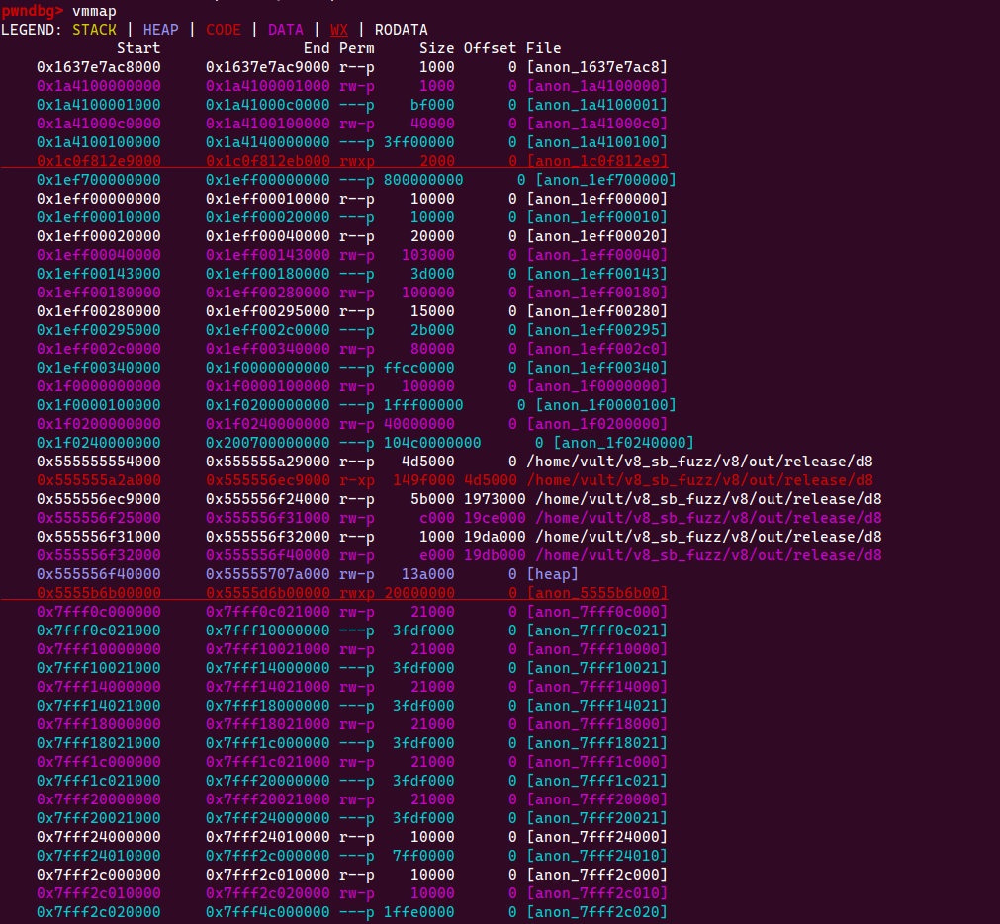

# Table of content

- [References](#references)
- [Setup](#setup)
- [Unicorn fuzzer](#unicorn-fuzzer)
    - [Dumpper](#Dumpper)
    - [Run sample fuzz](#Run-sample-fuzz)

# References

- https://github.com/search?q=repo%3Aunicorn-engine%2Funicorn%20tcg_out32&type=code


# Setup 

1. Install v8, depot_tools+AFLplusplus

- Remember changing UID:GID in Dockerfile before building


```bash
# install depot_tools
# Conditional git clone if the directory is empty
# RUN mkdir -p /home/vult/depot_tools && \
#     [ "$(ls -A /home/vult/depot_tools)" ] || git clone https://chromium.googlesource.com/chromium/tools/depot_tools.git /home/vult/depot_tools
# ENV PATH="/home/vult/depot_tools:${PATH}"

# # install AFLplusplus
# # Conditional git clone if the directory is empty
# # AFLplusplus version 4.10a
# RUN mkdir -p /home/vult/AFLplusplus && \
#     [ "$(ls -A /home/vult/AFLplusplus)" ] || (\
#     git clone https://github.com/AFLplusplus/AFLplusplus.git /home/vult/AFLplusplus && \
#     cd /home/vult/AFLplusplus && \
#     git checkout ca0c9f6d1797bac121996c3b2ac50423f6e67b8f)
```

2. run dockerfile: `sudo docker compose build && sudo docker compose run v8 zsh`


3. Build AFL++ and v8 release+debug

```bash
cd AFLplusplus
make distrib
sudo make install

```

4. Unicornafl building

```bash
mkdir build
cd build
cmake .. -DCMAKE_BUILD_TYPE=Release -DUCAFL_NO_LOG=on # disable logging for the maximum speed
make
```


# Unicorn fuzzer

Blogs:
    - https://eternalsakura13.com/2020/03/18/unicorn_learn/
    - https://hackernoon.com/afl-unicorn-part-2-fuzzing-the-unfuzzable-bea8de3540a5

## Dumpper

```bash
source /home/vult/v8_sb_fuzz/AFLplusplus/unicorn_mode/helper_scripts/unicorn_dumper_pwndbg.py
```

Example 1:




**Harness**

- C: https://github.com/AFLplusplus/AFLplusplus/blob/stable/unicorn_mode/samples/c/harness.c
- Python: https://github.com/AFLplusplus/AFLplusplus/blob/stable/unicorn_mode/samples/python_simple/simple_test_harness.py
- Unicorn-fuzz: https://github.com/unicorn-engine/unicorn/blob/master/tests/fuzz/fuzz_emu_x86_64.c
- https://github.com/domenukk/unicornafl
- https://github.com/kirasys/unicorn-fuzzer
- samples test: https://github.com/unicorn-engine/unicorn/blob/d4b92485b1a228fb003e1218e42f6c778c655809/samples/sample_x86.c#L1322
- translate: https://github.com/qemu/qemu/commit/84abdd7d271c2df69a9d394be093efd885da7a4c
- prompts for asking questions: https://github.com/f/awesome-chatgpt-prompts/tree/main


**Git**

```bash
# reset after `git add`
git reset -- AFLplusplus/unicorn_mode/samples/c/UnicornContext_20240704_110015/

```


### Run sample fuzz

`/home/vult/v8_sb_fuzz/AFLplusplus/unicorn_mode/samples/c`

```bash
AFL_DEBUG=1 afl-fuzz -U -m none -i sample_inputs/ -o fuzz_out1 -- ./harness @@
```

I'm working on folder `/home/vult/AFLplusplus/unicorn_mode/samples/c` of docker v8

Building steps:

```bash
# building inside docker
rm harness && make harness

# running outside docker
CONTEXT_DIR=UnicornContext_20240704_121555 ./harness -t out/default/crashes/id:000000,sig:01,src:000000,time:353,execs:371,op:havoc,rep:16

# show debug
 UNICORN_DEBUG=1 CONTEXT_DIR=UnicornContext_20240704_121555 ./harness -t out/default/crashes/id:000000,sig:01,src:000000,time:353,execs:371,op:havoc,rep:16

```

**snapshot_blob.bin**

```
Sandbox testing mode is enabled. Write to the page starting at 0x3d9042d22000 (available from JavaScript as `Sandbox.targetPage`) to demonstrate a sandbox bypass.
Failed to open startup resource '/home/vult/v8_sb_fuzz/AFLplusplus/unicorn_mode/samples/c/snapshot_blob.bin'.


#
# Safely terminating process due to error in , line 0
# The following harmless error was encountered: Failed to deserialize the V8 snapshot blob. This can mean that the snapshot blob file is corrupted or missing.
#
#
#
#FailureMessage Object: 0x7fffffffd9d0

```

```c++
// emulating 1 instruction
uc_err uc_emu_start(uc_engine *uc, uint64_t begin, uint64_t until,
                    uint64_t timeout, size_t count)
{}

/* main execution loop */
int cpu_exec(struct uc_struct *uc, CPUState *cpu)
{
    CPUClass *cc = CPU_GET_CLASS(cpu);
    int ret;
    // SyncClocks sc = { 0 };

    if (cpu_handle_halt(cpu)) {
        return EXCP_HALTED;
    }
```

Can not `jmp`

```js
    0x555556ca2223: mov eax, 2
    0x555556ca2228: mov rdi, rbx
    0x555556ca222b: mov qword ptr [rsp + 0x10], rcx
=== tlb_index: mmu_idx: 2, addr: 7fffffffd610 ===
=== tlb_index: mmu_idx: 2, addr: 7fffffffd610 ===
    0x555556ca2230: mov rsi, r8
    0x555556ca2233: jmp 0x555556b04740
=== tlb_index: mmu_idx: 2, addr: 555556b04740 ===
=== tlb_index: mmu_idx: 2, addr: 555556b04740 ===
//....
=== tlb_index: mmu_idx: 2, addr: 7fffffffd3e0 ===
=== tlb_index: mmu_idx: 2, addr: 7fffffffd3d8 ===
=== tlb_index: mmu_idx: 2, addr: 7fffffffd3d8 ===
=== tlb_index: mmu_idx: 2, addr: 28 ===
=== tlb_index: mmu_idx: 2, addr: 28 ===
=== tlb_index: mmu_idx: 2, addr: 0 ===
=== tlb_index: mmu_idx: 2, addr: 0 ===
=== tlb_index: mmu_idx: 2, addr: 28 ===
=== tlb_index: mmu_idx: 2, addr: 28 ===
>>> invalid memory accessed, STOP !!
=== uc_exit_invalidate_iter, uc->invalid_error: 6 ===
=== tlb_index: mmu_idx: 2, addr: 7f5556c190ff ===
=== tlb_index: mmu_idx: 2, addr: 7f5556c190ff ===
=== tlb_index: mmu_idx: 2, addr: 7f5556c19000 ===
=== tlb_index: mmu_idx: 2, addr: 7f5556c19000 ===
=== tlb_index: mmu_idx: 2, addr: 7f5556c190ff ===
=== tlb_index: mmu_idx: 2, addr: 7f5556c190ff ===
```

Try logging `jmp`

```js
$$$$$$$$$$$ gen_goto_tb: pc=0x555556ca2202, tb_num=0
########## jump to another page eip=0x555556ca2202
    0x555556ca1ef0: push rbp
    0x555556ca1ef1: mov rbp, rsp
    0x555556ca1ef4: push 0x22
    0x555556ca1ef6: sub rsp, 8
    0x555556ca1efa: jmp 0x555556ca2202
$$$$$$$$$$$ gen_goto_tb: pc=0x555556b04740, tb_num=0
########## jump to another page eip=0x555556b04740
    0x555556ca2202: movsx rcx, byte ptr [r12 + r9 + 3]
    0x555556ca2208: movsx r9, byte ptr [r12 + r9 + 2]
    0x555556ca220e: mov rcx, qword ptr [rdx + rcx*8]
    0x555556ca2212: mov rdx, qword ptr [rdx + r9*8]
    0x555556ca2216: mov rbp, qword ptr [rbp]
    0x555556ca221a: add rsp, 0x18
    0x555556ca221e: push rdx
    0x555556ca221f: push qword ptr [rsp + 8]
    0x555556ca2223: mov eax, 2
    0x555556ca2228: mov rdi, rbx
    0x555556ca222b: mov qword ptr [rsp + 0x10], rcx
    0x555556ca2230: mov rsi, r8
    0x555556ca2233: jmp 0x555556b04740
$$$$$$$$$$$ gen_goto_tb: pc=0x555556b0474a, tb_num=0
######### jump to same page: we can use a direct jump eip=0x555556b0474a
$$$$$$$$$$$ gen_goto_tb: pc=0x555556b047b6, tb_num=1
######### jump to same page: we can use a direct jump eip=0x555556b047b6
$$$$$$$$$$$ gen_goto_tb: pc=0x555556b04765, tb_num=0
// ... 
######### jump to same page: we can use a direct jump eip=0x555555c47fd9
$$$$$$$$$$$ gen_goto_tb: pc=0x555555c47feb, tb_num=1
######### jump to same page: we can use a direct jump eip=0x555555c47feb
$$$$$$$$$$$ gen_goto_tb: pc=0x555555c48360, tb_num=0
########## jump to another page eip=0x555555c48360
$$$$$$$$$$$ gen_goto_tb: pc=0x555555c4838f, tb_num=0
######### jump to same page: we can use a direct jump eip=0x555555c4838f
$$$$$$$$$$$ gen_goto_tb: pc=0x555555c4840f, tb_num=1
######### jump to same page: we can use a direct jump eip=0x555555c4840f
>>> invalid memory accessed, STOP !!
=== uc_exit_invalidate_iter, uc->invalid_error: 6 ===
[2]    851779 abort (core dumped)  CONTEXT_DIR=UnicornContext_20240704_121555 ./harness -t 

```

Dump PC:

```js
##### disas_insn s->pc: 555555c4837a
##### disas_insn s->pc: 555555c48383
##### disas_insn s->pc: 555555c48387
##### disas_insn s->pc: 555555c48389
>>> invalid memory accessed, STOP !!
=== uc_exit_invalidate_iter, uc->invalid_error: 6 ===
[3]    854534 abort (core dumped)  CONTEXT_DIR=UnicornContext_20240704_121555 ./harness -t 
```

Flow opcodes:

```js
##### disas_insn s->pc: 0x555555c4837a
	 b: 0x64
	 b: 0x48
	 b: 0x8b
##### disas_insn s->pc: 0x555555c48383
	 b: 0x48
	 b: 0x89
##### disas_insn s->pc: 0x555555c48387
	 b: 0x85
##### disas_insn s->pc: 0x555555c48389
	 b: 0xf
	0xf -- b: 0x184
		b: 0x184, tval: 0x55c4840f, next_eip: 0x55c4838f
>>> invalid memory accessed, STOP !!
=== uc_exit_invalidate_iter, uc->invalid_error: 6 ===
[3]    855733 abort (core dumped)  CONTEXT_DIR=UnicornContext_20240704_121555 ./harness -t 
```

Reading QEMU code~~: https://github.com/qemu/qemu/blob/7914bda497f07965f15a91905cd7ed9eaf1c1092/target/i386/cpu-dump.c
x86_cpu: https://github.com/qemu/qemu/blob/7914bda497f07965f15a91905cd7ed9eaf1c1092/target/i386/cpu.c#L8044
Following unicorn qemu: https://github.com/unicorn-engine/unicorn/blob/master/qemu/tcg/tcg-op.c

Error:

```js
    0x555556ca1efa: jmp 0x555556ca2202
    0x555556ca2202: movsx rcx, byte ptr [r12 + r9 + 3]
    0x555556ca2208: movsx r9, byte ptr [r12 + r9 + 2]
    0x555556ca220e: mov rcx, qword ptr [rdx + rcx*8]
    0x555556ca2212: mov rdx, qword ptr [rdx + r9*8]
    0x555556ca2216: mov rbp, qword ptr [rbp]
    0x555556ca221a: add rsp, 0x18
    0x555556ca221e: push rdx
    0x555556ca221f: push qword ptr [rsp + 8]
    0x555556ca2223: mov eax, 2
    0x555556ca2228: mov rdi, rbx
    0x555556ca222b: mov qword ptr [rsp + 0x10], rcx
    0x555556ca2230: mov rsi, r8
    0x555555c48389: invalid

222 uc->invalid_error = 6

// log 
 insn_idx=8 ---- 0000555555c48371 0000000000000011
 1:  ext32u_i64 r12,rdx  sync: 0  dead: 0

 insn_idx=9 ---- 0000555555c48374 0000000000000011
 1:  mov_i64 r14,rsi mem_base=0x555557393878   sync: 0  dead: 0 1

 insn_idx=10 ---- 0000555555c48377 0000000000000011
 1:  mov_i64 rbx,rdi mem_base=0x555557393878   sync: 0  dead: 0 1

 insn_idx=11 ---- 0000555555c4837a 0000000000000011
 1:  movi_i64 tmp2,$0x28
 2:  add_i64 tmp2,fs_base,tmp2  dead: 1 2
 3:  qemu_ld_i64 tmp0,tmp2,leq,2  dead: 1
 4:  ld_i32 tmp11,env,$0xfffffffffffffff0
 5:  movi_i32 tmp12,$0x0
 6:  brcond_i32 tmp11,tmp12,lt,$L0  dead: 0 1
 7:  mov_i64 rax,tmp0  sync: 0  dead: 1

 insn_idx=12 ---- 0000555555c48383 0000000000000011
 1:  movi_i64 tmp13,$0xffffffffffffffd0
 2:  add_i64 tmp2,rbp,tmp13  dead: 1 2
 3:  qemu_st_i64 rax,tmp2,leq,2  dead: 0 1
 4:  ld_i32 tmp11,env,$0xfffffffffffffff0  dead: 1
 5:  movi_i32 tmp12,$0x0
 6:  brcond_i32 tmp11,tmp12,lt,$L0  dead: 0 1

 insn_idx=13 ---- 0000555555c48387 0000000000000011
 1:  mov_i64 cc_dst,rdx mem_base=0x555557393878   sync: 0  dead: 1
 2:  discard cc_src
 3:  discard loc10

 insn_idx=14 ---- 0000555555c48389 0000000000000018
 1:  ext32u_i64 tmp0,cc_dst  dead: 1
 2:  movi_i32 cc_op,$0x18  sync: 0  dead: 0
 3:  movi_i64 tmp13,$0x0
 4:  brcond_i64 tmp0,tmp13,eq,$L1  dead: 0 1
 5:  goto_tb $0x0
 6:  movi_i64 tmp3,$0x555555c4838f
 7:  st_i64 tmp3,env,$0x80  dead: 0 1
 8:  exit_tb $0x7fffb79e1f00
 9:  set_label $L1
 10:  goto_tb $0x1
 11:  movi_i64 tmp3,$0x555555c4840f
 12:  st_i64 tmp3,env,$0x80  dead: 0 1
 13:  exit_tb $0x7fffb79e1f01
 14:  set_label $L0
 15:  exit_tb $0x7fffb79e1f03
222 uc->invalid_error = 6
```

Maybe it's missing `je` instruction

```js
code:
    0x555555c48389: 0f
    0x555555c4838a: 84
    0x555555c4838b: 80
    0x555555c4838c: 00
    0x555555c4838d: 00
    0x555555c48389: invalid
// ==========================================
pwndbg> x/2i 0x555555c48389
   0x555555c48389 <_ZN2v88internal11FactoryBaseINS0_7FactoryEE18HeapNumberToStringENS0_6HandleINS0_10HeapNumberEEEdNS0_15NumberCacheModeE+41>:	je     0x555555c4840f <_ZN2v88internal11FactoryBaseINS0_7FactoryEE18HeapNumberToStringENS0_6HandleINS0_10HeapNumberEEEdNS0_15NumberCacheModeE+175>
   0x555555c4838f <_ZN2v88internal11FactoryBaseINS0_7FactoryEE18HeapNumberToStringENS0_6HandleINS0_10HeapNumberEEEdNS0_15NumberCacheModeE+47>:	mov    rdi,rbx
```

`uc->invalid_error = 6` means:
This is setting an error code. In Unicorn Engine, error code 6 typically corresponds to UC_ERR_FETCH_UNMAPPED, which means the emulator tried to fetch instructions from unmapped memory.

```js
// =========
$$$$$$$ INDEX_op_exit_tb $$$$$$$
 $$$$$$$ 3333, ===== s->tb_ret_addr: 0x7fffb79c9018
$$$$$$$ INDEX_op_exit_tb $$$$$$$
 $$$$$$$ 3333, ===== s->tb_ret_addr: 0x7fffb79c9018
222 uc->invalid_error = 6
>>> invalid memory accessed, STOP !!
=== uc_exit_invalidate_iter, uc->invalid_error: 6 ===
```

Hereeeeee:

```js
static uint64_t inline
load_helper(CPUArchState *env, target_ulong addr, TCGMemOpIdx oi,
            uintptr_t retaddr, MemOp op, bool code_read,
            FullLoadHelper *full_load)
{
    uintptr_t mmu_idx = get_mmuidx(oi);
    uintptr_t index = tlb_index(env, mmu_idx, addr);
    CPUTLBEntry *entry = tlb_entry(env, mmu_idx, addr);
    target_ulong tlb_addr = code_read ? entry->addr_code : entry->addr_read;
    //...
}
// =======
/* helper signature: helper_ret_ld_mmu(CPUState *env, target_ulong addr,
 *                                     int mmu_idx, uintptr_t ra)
 */
static void * const qemu_ld_helpers[16] = {
    [MO_UB]   = helper_ret_ldub_mmu,
    [MO_LEUW] = helper_le_lduw_mmu,
    [MO_LEUL] = helper_le_ldul_mmu,
    [MO_LEQ]  = helper_le_ldq_mmu,
    [MO_BEUW] = helper_be_lduw_mmu,
    [MO_BEUL] = helper_be_ldul_mmu,
    [MO_BEQ]  = helper_be_ldq_mmu,
};
// ===========
uint64_t helper_le_ldq_mmu(CPUArchState *env, target_ulong addr,
                           TCGMemOpIdx oi, uintptr_t retaddr)
{
    printf("&&&&& helper_le_ldq_mmu  addr: %lx,  retaddr: %lx\n", addr, retaddr);
    return load_helper(env, addr, oi, retaddr, MO_LEQ, false,
                       helper_le_ldq_mmu);
}
// ===========
static void tcg_out_sib_offset(TCGContext *s, int r, int rm, int index,
                               int shift, intptr_t offset)
{
    // printf(" ###### tcg_out_sib_offset r=%d, rm=%d, index=%d, shift=%d, offset=%lx\n", r, rm, index, shift, offset);
    int mod, len;

    //...
}
// ===========
// https://github.com/unicorn-engine/unicorn/blob/d4b92485b1a228fb003e1218e42f6c778c655809/qemu/tcg/i386/tcg-target.inc.c#L1821
/*
 * Generate code for the slow path for a load at the end of block
 */
static bool tcg_out_qemu_ld_slow_path(TCGContext *s, TCGLabelQemuLdst *l)
{..}
// ===========
static void tcg_out_opc(TCGContext *s, int opc, int r, int rm, int x)
{
    int rex;

    if (opc & P_GS) {
        tcg_out8(s, 0x65);
    }
    if (opc & P_DATA16) {
        /* We should never be asking for both 16 and 64-bit operation.  */
        tcg_debug_assert((opc & P_REXW) == 0);
        tcg_out8(s, 0x66);
    }
    if (opc & P_SIMDF3) {
        tcg_out8(s, 0xf3);
    } else if (opc & P_SIMDF2) {
        tcg_out8(s, 0xf2);
    }
    //...
}
// ======= log ======
### tcg_out_qemu_ld_slow_path called, opc: 3
### tcg_out_qemu_ld_slow_path called, opc: 3
### tcg_out_qemu_ld_slow_path called, opc: 3
&&&&& helper_le_ldq_mmu  addr: 28,  retaddr: 7fffb79e21e9
 $$$$$$$$$ load_helper: memory might be still unmapped while reading or fetching bbbb
	### paddr: 28, op: 3, addr: 0x28
222 uc->invalid_error = 6
>>> invalid memory accessed, STOP !!

```

**Why is the address invalid?**

```js
&&&&& helper_le_ldq_mmu  addr: 28,  retaddr: 7fffb79e21e9
 $$$$$$$$$ load_helper: memory might be still unmapped while reading or fetching bbbb
	### paddr: 28, op: 3, addr: 0x28
```